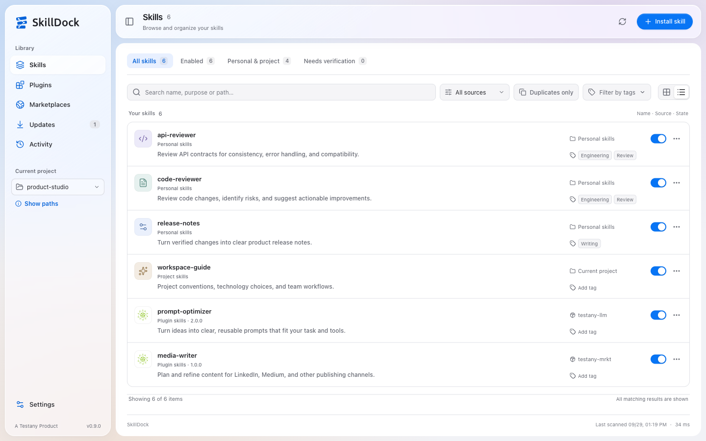
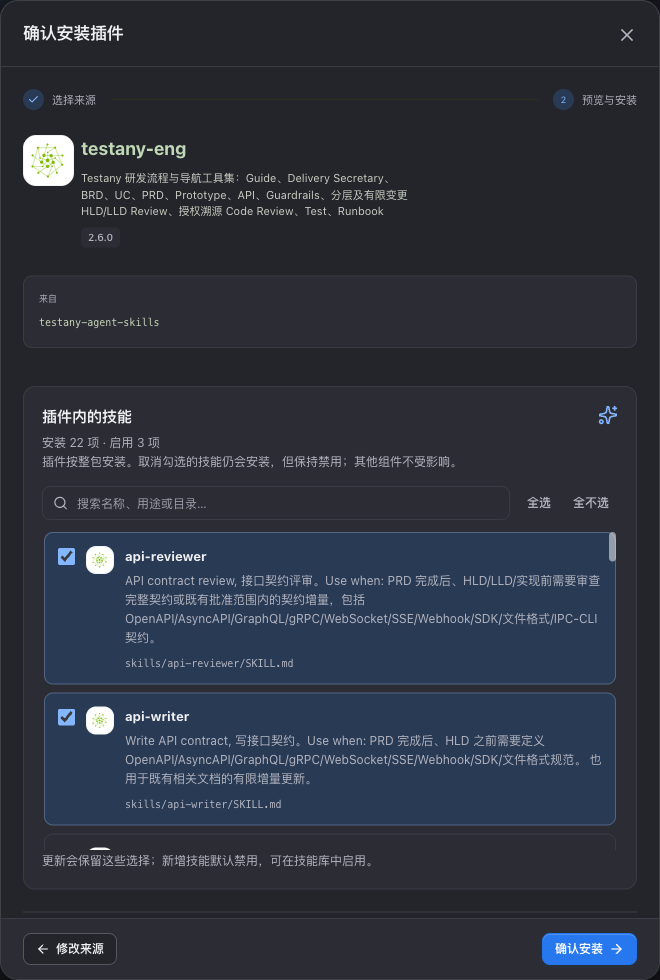
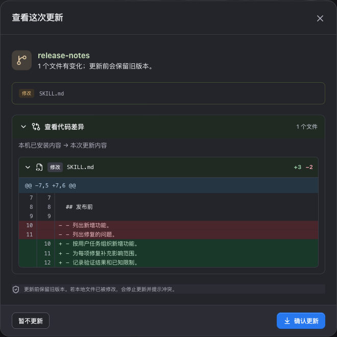

<div align="center">

<picture>
  <source media="(prefers-color-scheme: dark)" srcset="assets/readme/brand-dark.svg">
  
</picture>

<h3>A clearer home for your Codex and Claude skills.</h3>

<p>Browse, install, organize, and update skills, plugins, and marketplaces.<br>
Open it in Codex or Claude; both share one local instance.</p>

<p>
  
  
  <a href="LICENSE"></a>
</p>

<p><strong><a href="#install--open">Get started</a></strong> · <a href="#what-you-can-do">Explore features</a> · <a href="#tell-us-how-it-went">Give feedback</a> · <a href="README.md">简体中文</a></p>

<sub>A <a href="https://testany.io">Testany</a> Product</sub>

</div>

<br>

<picture>
  <source media="(prefers-color-scheme: dark)" srcset="assets/readme/library-dark-en.png">
  
</picture>

<p align="center"><sub>Actual product UI · Isolated example data · Follows your GitHub light or dark theme</sub></p>

## Install & open

**Send this to Codex on your Mac:**

```text
Install the standalone SkillDock plugin from https://github.com/TestAny-io/testany-agent-skills and open its skill management panel.
```

This installs the standalone **`skilldock`** plugin, with the `skill-manager` skill and graphical app entry. Other plugins and skills in the repository are separate choices.

Open **More / Explore → SkillDock** in Codex, then choose **Pin to sidebar**. The sidebar entry opens the full app in the main content area and starts its backend on demand.

Or open the browser panel from a new Codex task:

```text
$skill-manager Open the skill management panel
```

**In Claude (Claude Code or the Claude desktop app):**

```text
/plugin marketplace add TestAny-io/testany-agent-skills
/plugin install skilldock@testany-agent-skills
```

Start a new session (or run `/reload-plugins`), then open it with `/skilldock:skill-manager` or ask Claude to open SkillDock; it opens in Claude's built-in browser panel. Both sides open the same instance with the same data, and installing on one side is enough to manage the other.

<details>
<summary><strong>Requirements, a missing entry, or a broken command?</strong></summary>

- You need **macOS, Git, and a Codex CLI with plugin management support**.
- You need **Node.js 22.12 or later**. The launcher looks for one already on your Mac (the Node bundled with the Codex workspace, Homebrew, nvm and others) and saves its choice; if none is found, it shows installation guidance instead of downloading one. The first launch needs internet access to install dependencies.
- In Claude, you need Claude Code or the Claude desktop app; after updating SkillDock, run `/reload-plugins` in open sessions.
- If an installation or update leaves the old entry, icon, or UI, fully quit and reopen Codex. The native entry has been verified in desktop build `26.924.22138`; use the browser flow when your host does not expose it.
- If `codex` on your PATH fails, follow the [full installation guide](../../README.md#在-codex-中使用-skilldock) to check the desktop app CLI. An old npm wrapper may be broken. The detailed guide is maintained in Chinese and can be followed by Codex.
- Previously installed SkillDock with `testany-eng 2.4.0`? Use the [migration instructions](../../README.md#从旧版-testany-eng-迁移) to retain schedules, history, and source records.

</details>

## What you can do

| Find the right capability | Manage it through its lifecycle |
| :--- | :--- |
| **Search & tags** — Filter by name, purpose, source, status, and your own tags. | **Preview before installing** — See the skills inside a plugin and choose which to enable. |
| **Duplicate skills** — Filter matching names, then choose copies to keep or remove by path. | **Individual switches** — Toggle bundled skills separately; the plugin switch controls the whole package. |
| **Sources & locations** — Inspect project context, installation paths, and verifiable source and version records. | **Updates & diffs** — Follow check progress and review file changes before applying. |
| **Project switching** — Choose a saved Codex project, recent directory, or existing local folder. | **History & recovery** — Review operations and restore removed personal or project skills. |
| **Codex and Claude together** — One view lists the skills, plugins, and marketplaces of both sides, filterable by Agent. | **Managed per Agent** — Keep either side read-only or turn on management; changes go through that Agent's own command line and are read back. |

### See what a plugin includes before installing it

Click **Install plugin** and choose a local directory, Git repository, or connected Marketplace. The preview lists skill names, purposes, and paths. Select the capabilities you want to use.

**The whole plugin is installed; unchecked skills stay disabled.** Adjust the choices later, and keep them through plugin updates.

**Official Codex app plugins, such as Miro, are also searchable and installable here.** SkillDock uses the app's official identity to display its name, description, and logo while retaining the original plugin ID. Search under **Install plugin → Marketplace**, review the preview, then confirm installation. If account authorization is needed, continue on the official page and return to refresh the installation status. Browsing or previewing does not install anything.

Official app plugins are installed through the Codex CLI, with installation and account connection verified separately. The app metadata API does not expose the complete remote plugin component list, so these previews show the app description without individual skill selection. Entries without a verified app identity, or restricted by account policy, remain protected. Directory failures show a clear message while local skill management remains available.

<details>
<summary>See the plugin installation preview</summary>



<sub>Actual installation preview using isolated example data; no user skill library is modified. UI shown in Chinese.</sub>

</details>

### See what changes before you update

Connect a skill to a local or Git source; GitHub directory URLs can be pasted directly. Plugins with verified sources update as whole packages, including their bundled skills. Checks show progress, and file diffs stay collapsed until you want to inspect them.

<details>
<summary>See the file diff</summary>



<sub>Isolated example data. Reading the diff does not apply the update. UI shown in Chinese.</sub>

</details>

### Set a schedule. Close the app.

In **Updates → Configure schedule**, choose targets, an interval in hours, and whether to apply updates automatically. Claude skills and plugins can be scheduled too. Include **`skilldock` itself** to keep the app updated. When both sides have SkillDock at different versions, **Agent environments** offers a one-click update of the older side.

macOS starts an independent update task when needed, then the task exits. **Both SkillDock and Codex can stay closed.** Scheduling resumes after reboot and sign-in, with one catch-up for checks missed during sleep or offline periods.

<details>
<summary>Automatic update scope and operating conditions</summary>

- Only selected targets that support automatic application are updated. System and platform-managed items show their owner and available actions.
- The system checks whether work is due every five minutes. Runs can start about five minutes late in normal conditions; sleep, connectivity, and system scheduling can add delays. Failures and retry status appear on Updates.
- The user must be signed in and macOS must allow background tasks. Disabling the schedule removes the system task.
- After a self-update, an already running SkillDock service restarts, reconnects, and moves to the newest version on either side. Codex may still need a restart to refresh its entry or cached UI; in Claude, run `/reload-plugins`.
- While Claude management is off or Claude's command line is unavailable, scheduled Claude targets pause; this does not count as a failure.
- Local clones are not automatically pulled with Git. Update the clone before refreshing the installed copy.
- Older schedules migrate when the newer background-task implementation first runs. Updating plugin files alone may require opening the new version once.

</details>

## Try these first

1. **Check your project.** Select the directory you are working in from the sidebar.
2. **Organize a few skills.** Add a tag, or turn on “Duplicates only” to compare copies by path.
3. **Check for updates.** Review the source and diff, then schedule the targets you want to maintain.

Switch between Chinese, English, and Japanese. Choose light, dark, or system appearance, with an option to reduce transparency.

## Frequently asked questions

<details>
<summary>Will SkillDock change my Claude (or Codex)?</summary>

Only while that side is managed. When SkillDock first sees an Agent, the side where SkillDock is installed is managed and the other is read-only; a read-only side is only read. Before you turn management on in **Agent environments**, SkillDock lists the places it may write. Installing, toggling, uninstalling, and updating in Claude go through Claude's own command line and are read back; objects synced from claude.ai or managed by your organization are not changed. Turning management off does not undo changes already made.

</details>

<details>
<summary>How do I go back to an older version?</summary>

SkillDock 0.11 migrates its data directory to a new format. To return to 0.10.x, give the older version a separate data directory (`SKILLDOCK_STATE_DIR`), or keep 0.11.x. SkillDock 0.10.3 does not take over 0.11 data and asks you to update; 0.10.2 and earlier refuse to start or fail to start, without rewriting your data.

</details>

<details>
<summary>Can I install a marketplace with duplicate versions or strict:false?</summary>

Yes. When both the entry and `plugin.json` declare a version, SkillDock uses the manifest version and shows a compatibility notice without blocking installation or updates. `strict:false` is also valid when only the manifest declares components. Escaping paths, dangling links, and actual component conflicts still block the operation. See the [compatibility rules and validation scope](skills/skill-manager/references/marketplace-compatibility.md).

</details>

<details>
<summary>Can I install and update from a private Git repository?</summary>

SkillDock reuses Git credentials already configured on your machine, including private repositories you can access. There is no separate account sign-in inside SkillDock. First confirm that Git on the machine can access the repository. See the [private repository notes](skills/skill-manager/references/23-navigation-and-private-git.md).

</details>

<details>
<summary>Why are some sources, versions, or icons missing?</summary>

The available information depends on records left by the original installation. Declared package artwork is preferred, with default icons when it is unavailable. Personal skills with missing provenance can be connected to an update source. Copying files may not preserve the original repository or commit; SkillDock does not infer them from filenames or modification times.

</details>

<details>
<summary>Can every skill be updated or uninstalled separately?</summary>

Personal and project skills can be managed within verified directory and source boundaries. Bundled skills can be toggled individually, while updates and uninstallation apply to the whole plugin. System and host-managed content retains its management restrictions. Local edits, unknown sources, and restore conflicts are explained while existing content is preserved.

</details>

<details>
<summary>What about custom installation directories?</summary>

SkillDock uses the `CODEX_HOME` provided at launch and marketplaces registered with Codex. It does not search the entire disk. Version **0.9.1** fixes compatibility with relocated skills and plugin cache roots, and external skill links. See the [scope and verification record](skills/skill-manager/references/33-directory-compatibility.md).

</details>

## Tell us how it went

**Did installation work? What was useful? What was confusing?** A sentence or two is enough. English and Chinese are both welcome.

[Installation & usage help](https://github.com/TestAny-io/testany-agent-skills/discussions/categories/q-a) · [Ideas & trial feedback](https://github.com/TestAny-io/testany-agent-skills/discussions/categories/ideas) · [Report a bug](https://github.com/TestAny-io/testany-agent-skills/issues/new?template=bug-report.yml)

Include your SkillDock version, your Codex or Claude version, and reproduction steps when useful. Remove private paths and credentials from screenshots and logs. See the [support guide](../../.github/SUPPORT.md#english).

## Built by Testany

[Testany](https://testany.io) is building a software testing platform for human testers and AI testing agents. SkillDock is an open-source tool we built for everyday work. This repository also includes these independently installable plugins:

| Plugin | What it helps with |
| :--- | :--- |
| [testany-eng](../testany-eng/README.md) | Requirements, design, reviews, testing, and delivery preparation |
| [testany-llm](../testany-llm/README.md) | Prompt optimization |
| [testany-mrkt](../testany-mrkt/README.md) | Content creation across marketing channels |
| [testany-bot](../testany-bot/README.md) | Authoring, orchestrating, running, and diagnosing tests through Testany MCP |

**Bring your agents’ testing work onto the platform:** [Meet Testany](https://testany.io) · [Platform docs](https://docs.testany.io) · [Contact the team](mailto:engineering@testany.io)

## Version, license, and development

Distributed through this GitHub repository. Current version: **0.11.0**. [Changelog](../../CHANGELOG.md) · [AGPL-3.0-only](LICENSE) · [Third-party notices](skills/skill-manager/THIRD_PARTY_NOTICES.md). Other plugins follow their respective licenses.

See the [application README](skills/skill-manager/assets/app/README.md) for development, launch, and verification commands.

<details>
<summary>Design and implementation records</summary>

Cross-Agent (0.11, in Chinese): [PRD](skills/skill-manager/references/34-cross-agent-prd.md) · [HLD](skills/skill-manager/references/35-cross-agent-hld.md) · [API contract](skills/skill-manager/references/36-cross-agent-api-contract.md) · [Implementation plan](skills/skill-manager/references/37-cross-agent-implementation-plan.md)

[Native entry](skills/skill-manager/references/30-native-app.md) · [Desktop interface](skills/skill-manager/references/31-desktop-interface.md) · [Brand & icons](skills/skill-manager/references/32-provider-icons.md) · [Directory compatibility](skills/skill-manager/references/33-directory-compatibility.md)

[Sources & diffs](skills/skill-manager/references/20-source-links-and-diff.md) · [Duplicate management](skills/skill-manager/references/21-duplicate-selection.md) · [Progress & tags](skills/skill-manager/references/22-progress-and-tags.md) · [Background updates](skills/skill-manager/references/24-background-updates.md) · [Skill activation choices](skills/skill-manager/references/28-plugin-skill-selection.md)

</details>
