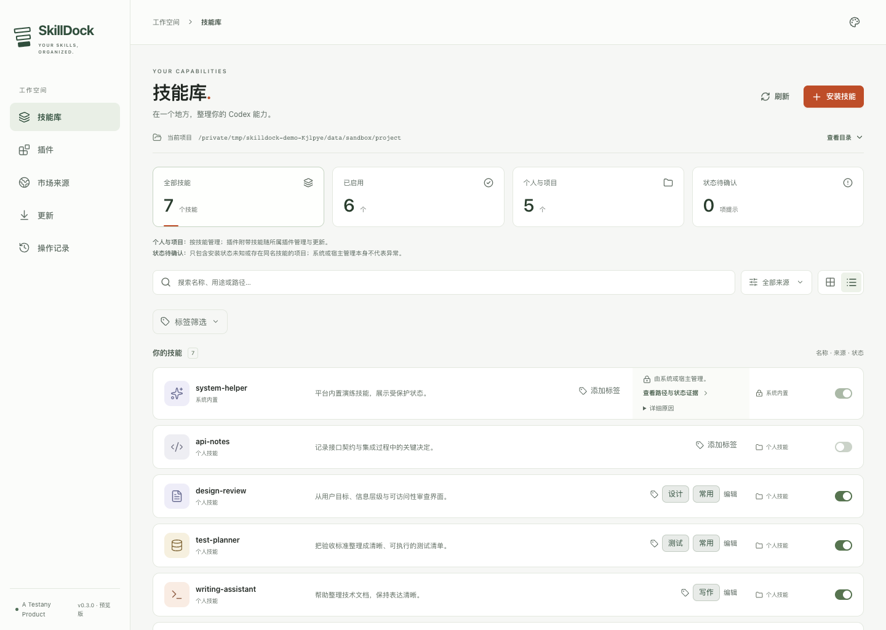

# SkillDock

**在 Codex 里，用图形界面整理你的 skills 和 plugins。**

A Testany Product · macOS + Codex · 中文 / English / 日本語 · 深色 / 浅色主题

[English](README.en.md) · [立即安装](#安装并打开) · [反馈与建议](#告诉我们你的使用体验) · [Testany 的其他插件](../../README.md#选择适合你的插件) · [了解 Testany](https://testany.io)

技能越装越多，来源、版本和同名副本也越来越难分清。SkillDock 把技能库、插件、市场来源和更新放在一个面板里，在 Codex 右侧浏览器中打开。



*SkillDock 0.3.0 实际界面，使用隔离的示例数据。*

## 可以帮你做什么

| 遇到的问题 | 在 SkillDock 中怎么处理 |
| --- | --- |
| 装过哪些技能、现在从哪里加载？ | 按项目查看技能、插件、安装路径与可发现的来源信息 |
| 技能太多，难以找到？ | 给 skills / plugins 添加自己的标签，再搜索、筛选 |
| 有几个同名技能，想保留其中一份？ | 按实际安装路径选择保留或移除；从操作记录恢复已移除的副本 |
| 不知道更新改了什么？ | 检查更新时查看进度，展开文件 diff，再决定是否应用 |
| 不想反复手动检查？ | 选择更新目标和以小时为单位的周期，按需开启自动应用；插件内技能随整个插件更新 |
| 来源在 GitHub 私仓？ | 复用本机已配置的 Git 凭据；关联来源时可直接粘贴 GitHub 目录链接 |

来源信息取决于原安装方式留下的记录；无法识别时，可以手动关联更新源。受宿主权限或系统保护限制的条目，会显示相应的操作限制。

## 安装并打开

**安装独立 `skilldock` 插件，只添加 `skill-manager` 一个应用入口。** 研发、AI、营销和 Testany 测试插件可另行按需安装。

将下面这句话复制到 macOS 上的 Codex：

```text
请从 https://github.com/TestAny-io/testany-agent-skills 安装独立的 SkillDock 插件，并打开技能管理面板。
```

需要 Git 和支持 plugin 管理的 Codex CLI。无需先手动 clone，也无需预装全局 Node.js/npm；启动器会选择或准备运行环境。首次启动需要联网准备依赖，可能需要稍等。

安装后，在新的 Codex 任务中输入：

```text
$skill-manager 打开技能管理面板
```

安装或启动遇到问题，查看[完整安装说明、CLI 回退和目录排查](../../README.md#在-codex-中使用-skilldock)。曾使用 testany-eng 2.4.0 内置旧版的用户，先看[迁移说明](../../README.md#从旧版-testany-eng-迁移)，接续更新计划、历史和来源记录。

## 第一次打开，先试这三件事

1. **确认项目。** 看一眼“当前项目”，用“切换项目”选中你真正要管理的工作目录。
2. **整理技能。** 为常用 skill 加一个标签，按标签筛选；如果有同名技能，展开查看每份安装路径。
3. **看看更新。** 在“更新”中点击“全部检查”，查看进度和可展开的变更 diff，再选择要更新的目标。

需要定时更新时，在“更新”里配置周期、目标，并明确选择是否“自动应用”。把 `skilldock` 自身加入计划后，也可以自动更新应用并重启重连。

启用计划后，macOS 会按需启动独立更新任务，完成后退出；关闭 SkillDock 网页服务和 Codex 不影响计划。电脑重启并登录后自动恢复，休眠或离线错过的检查会补做一次；任务每五分钟判断是否到期，实际运行可能晚于设定时间最多约五分钟。失败会记录原因并退避重试。更新页显示真实后台状态，若 macOS 禁止后台运行，需要恢复系统权限。关闭计划会移除系统任务。旧版已启用的计划在首次启动 0.4.0 时自动迁移，更新后的自动重启也会完成迁移；仅更新了插件文件、尚未运行新版时，才需手动启动一次。本地 clone 来源不会被自动 `git pull`。

## 告诉我们你的使用体验

中文和 English 都欢迎，尤其想听到三件事：**安装是否顺利、哪项功能最有用、哪一步让你困惑。** 一两句话就能开始，不需要先写完整报告。

- [安装 / 使用求助](https://github.com/TestAny-io/testany-agent-skills/discussions/categories/q-a)
- [建议 / 试用感受](https://github.com/TestAny-io/testany-agent-skills/discussions/categories/ideas)
- [报告故障](https://github.com/TestAny-io/testany-agent-skills/issues/new?template=bug-report.yml) · [反馈指南](../../.github/SUPPORT.md)

## 来自 Testany

[Testany](https://testany.io) 面向人类测试人员与 AI 测试 Agent 构建软件测试平台。SkillDock 是我们为日常使用做的开源工具，同一个仓库里还有：

- [testany-eng](../testany-eng/README.md)：需求、设计、评审、测试与交付准备。
- [testany-llm](../testany-llm/README.md)：提示词优化。
- [testany-mrkt](../testany-mrkt/README.md)：多平台营销内容创作。
- [testany-bot](../testany-bot/README.md)：通过 Testany MCP 编写、编排、执行与诊断平台测试。

想把 Agent 的测试工作接到平台上？[了解 Testany](https://testany.io) · [查看使用文档](https://docs.testany.io) · [联系团队](mailto:engineering@testany.io)。

## 版本、许可与开发

当前版本 **0.4.0**，通过 Git 仓库分发。[变更记录](../../CHANGELOG.md) · [AGPL-3.0-only](LICENSE) · [第三方许可](skills/skill-manager/THIRD_PARTY_NOTICES.md)。仓库中其他现有 skills 的 MIT 许可不变。

开发、启动与验证命令见[应用 README](skills/skill-manager/assets/app/README.md)。实现边界与验证记录：[种子反馈](skills/skill-manager/references/19-seed-feedback.md)、[来源链接与 diff](skills/skill-manager/references/20-source-links-and-diff.md)、[同名技能管理](skills/skill-manager/references/21-duplicate-selection.md)、[更新进度与标签](skills/skill-manager/references/22-progress-and-tags.md)、[导航与私仓](skills/skill-manager/references/23-navigation-and-private-git.md)、[独立后台更新](skills/skill-manager/references/24-background-updates.md)。
