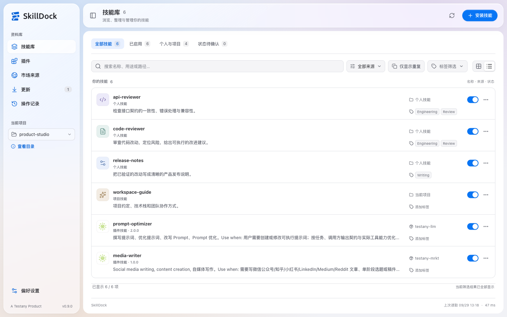

<div align="center">

<picture>
  <source media="(prefers-color-scheme: dark)" srcset="assets/readme/brand-dark.svg">
  
</picture>

<h3>给 Codex 的技能库，一个清晰的管理界面。</h3>

<p>浏览、安装、整理和更新 skills、plugins 与 Marketplace。<br>
在 Codex 里打开，让常用能力各就其位。</p>

<p>
  
  
  <a href="LICENSE"></a>
</p>

<p><strong><a href="#安装并打开">开始使用</a></strong> · <a href="#可以帮你做什么">功能一览</a> · <a href="#告诉我们你的使用体验">反馈建议</a> · <a href="README.en.md">English</a></p>

<sub>A <a href="https://testany.io">Testany</a> Product</sub>

</div>

<br>

<picture>
  <source media="(prefers-color-scheme: dark)" srcset="assets/readme/library-dark-zh.png">
  
</picture>

<p align="center"><sub>实际产品界面 · 隔离示例数据 · 图片随 GitHub 深浅色主题切换</sub></p>

## 安装并打开

**把下面这句话发给 macOS 上的 Codex：**

```text
请从 https://github.com/TestAny-io/testany-agent-skills 安装独立的 SkillDock 插件，并打开技能管理面板。
```

安装的是独立 **`skilldock`** 插件，包含 `skill-manager` 与图形应用入口。仓库里的其他 plugin / skills 按需另装。

安装后，从 Codex 的 **More / Explore → SkillDock** 打开，再选 **Pin to sidebar** 固定。点击侧栏入口即可在主内容区使用完整应用，后台会按需启动。

也可以在新的 Codex 任务中打开浏览器面板：

```text
$skill-manager 打开技能管理面板
```

<details>
<summary><strong>安装要求、入口不见了，或命令报错？</strong></summary>

- 需要 **macOS、Git，以及支持 plugin 管理的 Codex CLI**。
- 无需预装全局 Node.js/npm；启动器会选择或准备运行环境。首次启动需要联网准备依赖。
- 安装或更新后入口、图标或界面仍是旧的，先完全退出并重新打开 Codex。原生入口已在桌面版 `26.924.22138` 验证；未提供该入口的宿主版本可用上述浏览器方式。
- PATH 中的 `codex` 不可用时，按[完整安装说明](../../README.md#在-codex-中使用-skilldock)检查桌面应用内 CLI；不要把损坏的旧 npm wrapper 当成可用命令。
- 曾随 `testany-eng 2.4.0` 安装旧版 SkillDock？按[迁移说明](../../README.md#从旧版-testany-eng-迁移)保留已有计划、历史与来源记录。

</details>

## 可以帮你做什么

| 找到想要的能力 | 管理它的整个使用过程 |
| :--- | :--- |
| **搜索与标签** — 按名称、用途、来源、状态和自定义标签筛选。 | **安装前先看清** — 预览插件包含的技能，选择要启用的项。 |
| **同名副本** — “仅显示重复”集中列出重名技能，再按路径选择保留或移除。 | **逐项启禁** — 独立开关插件内的技能，插件总开关仍控制整个包。 |
| **来源与位置** — 查看项目、安装位置，以及能够核实的来源和版本。 | **更新与 diff** — 跟踪检查进度，展开文件差异，再决定是否应用。 |
| **项目切换** — 选择已有 Codex 项目、最近目录或本地文件夹。 | **操作记录与恢复** — 查看每次操作结果，恢复已移除的个人或项目技能。 |

### 安装一个插件，先知道会得到什么

在插件页点 **安装插件**，从本地目录、Git 仓库或已连接的 Marketplace 选择来源。安装预览会列出技能名称、用途与路径；勾选你准备使用的能力。

**插件整包安装，未勾选的技能保持禁用。** 安装后仍可逐项调整，插件更新会保留选择。

**Codex 官方目录中的应用插件（例如 Miro）也可以从这里查找和安装。** SkillDock 按官方应用身份补全名称、介绍和 Logo，保留插件的原始 ID。点击 **安装插件 → Marketplace** 搜索，预览后确认安装；需要账号连接时，继续前往官方页面授权，再回到 SkillDock 刷新安装状态。只浏览或预览不会安装插件。

官方应用插件使用 Codex CLI 安装，安装与账号连接分别核实。当前官方应用接口不提供完整远程插件组件清单，因此这类预览展示应用介绍，不提供安装前的逐项技能选择。无法可靠关联应用身份或账号策略不允许安装的条目会保留限制；目录读取失败时会给出提示，本地技能管理仍可使用。

<details>
<summary>查看插件安装预览</summary>


<sub>隔离示例环境中的真实安装预览；不会操作用户的技能库。</sub>

</details>

### 更新之前，看得见变化

技能可以关联本地或 Git 来源；GitHub 目录链接直接粘贴即可。可核实来源的插件按整个包更新，随包技能一起升级。检查时显示进度，变更详情默认折叠，想深看时再展开 diff。

<details>
<summary>查看文件变更与代码差异</summary>


<sub>隔离示例数据；查看差异不会立即应用更新。</sub>

</details>

### 设好更新计划，平时可以关掉应用

在 **更新 → 配置计划** 中选择目标、以小时为单位的周期，以及是否自动应用。把 **`skilldock` 自身**加入计划，也能更新应用。

启用后，由 macOS 按需启动独立更新任务，完成后退出。**SkillDock 和 Codex 都可以关闭**；电脑重启并登录后继续执行，休眠或离线错过的检查会补做一次。

<details>
<summary>自动更新的范围和运行条件</summary>

- 只处理你选中的、支持自动应用的目标。系统内置或平台托管项会显示所属管理器和可用操作。
- 系统每五分钟判断任务是否到期；通常可能比计划时间晚约五分钟，睡眠、离线或系统调度也会延后执行。失败原因与重试状态可在“更新”页查看。
- 运行依赖用户登录与 macOS 允许后台任务。关闭计划会移除该系统任务。
- 自身更新后，已运行的 SkillDock 服务会重启、重连；Codex 中的入口或缓存 UI 可能仍需重启 Codex 才刷新。
- 本地 clone 来源不会被自动 `git pull`；先更新 clone，再刷新安装副本。
- 旧版计划在第一次运行支持独立后台任务的新版时迁移；若只更新了插件文件，仍需打开一次新版完成迁移。

</details>

## 第一次打开，先试这三件事

1. **确认项目。** 在左侧“当前项目”中选中你正在工作的目录。
2. **整理一组技能。** 加一个标签，或开启“仅显示重复”，按路径处理同名副本。
3. **检查一次更新。** 查看来源与 diff，再把希望持续维护的目标加入计划。

中文、English、日本語可随时切换；支持浅色、深色、跟随系统，以及减少透明度。

## 常见问题

<details>
<summary>第三方 marketplace 重复声明版本，或使用 strict:false，能安装吗？</summary>

可以。市场条目与 `plugin.json` 同时声明版本时，以 `plugin.json` 为准，并显示兼容性提示；提示不会阻止安装或更新。`strict:false` 且组件只在 manifest 声明也是合法组合。来源越界、悬空链接和真正的组件冲突仍会阻止操作。详见[兼容规则与验证范围](skills/skill-manager/references/marketplace-compatibility.md)。

</details>

<details>
<summary>能从私有 Git 仓库安装和更新吗？</summary>

可以复用本机已经配置好的 Git 凭据，包括有权限的私有仓库。SkillDock 不提供单独的账号登录；先确保当前机器能通过 Git 访问对应仓库。详见[私仓支持与边界](skills/skill-manager/references/23-navigation-and-private-git.md)。

</details>

<details>
<summary>为什么有些来源、版本或图标没有显示？</summary>

这些信息取决于原安装方式留下的记录。应用优先读取提供者声明的包内图标，缺失时使用默认图标；没有可靠来源记录的个人技能可手动关联更新源。普通复制安装不一定保留原始仓库或 commit，SkillDock 不会用文件名或修改时间猜测。

</details>

<details>
<summary>所有技能都能单独更新、卸载吗？</summary>

个人和项目技能在可核实的目录与来源范围内管理。插件附带技能可逐项启禁，但更新和卸载按整个插件处理；系统或宿主管理的内容保留相应限制。已有本地修改、来源不明或恢复位置冲突时，应用会提示具体原因并保留现有内容。

</details>

<details>
<summary>自定义安装目录支持到什么程度？</summary>

应用使用启动时的 `CODEX_HOME` 和 Codex 已登记的 Marketplace，不会全盘搜索任意目录。**0.9.1** 修复了迁移 skills / 插件缓存根、外部技能链接等兼容性问题。支持边界及验证见[目录兼容性记录](skills/skill-manager/references/33-directory-compatibility.md)。

</details>

## 告诉我们你的使用体验

**安装顺利吗？哪项功能最有用？哪一步让你困惑？** 一两句话就能开始，中文和 English 都欢迎。

[安装与使用求助](https://github.com/TestAny-io/testany-agent-skills/discussions/categories/q-a) · [建议与试用感受](https://github.com/TestAny-io/testany-agent-skills/discussions/categories/ideas) · [报告 Bug](https://github.com/TestAny-io/testany-agent-skills/issues/new?template=bug-report.yml)

附上 SkillDock 版本、Codex 版本和复现步骤会更容易定位；截图与日志请去掉私人路径和凭据。详见[反馈指南](../../.github/SUPPORT.md)。

## 来自 Testany

[Testany](https://testany.io) 为人类测试人员与 AI 测试 Agent 构建软件测试平台。SkillDock 是我们为日常工作做的开源工具；同一仓库也提供这些可独立安装的插件：

| 插件 | 用来做什么 |
| :--- | :--- |
| [testany-eng](../testany-eng/README.md) | 需求、设计、评审、测试与交付准备 |
| [testany-llm](../testany-llm/README.md) | 提示词优化 |
| [testany-mrkt](../testany-mrkt/README.md) | 多平台营销内容创作 |
| [testany-bot](../testany-bot/README.md) | 通过 Testany MCP 编写、编排、执行与诊断测试 |

**让 Agent 的测试工作接入平台：** [了解 Testany](https://testany.io) · [使用文档](https://docs.testany.io) · [联系团队](mailto:engineering@testany.io)

## 版本、许可与开发

通过 GitHub 仓库分发，当前版本为 **0.10.2**。[变更记录](../../CHANGELOG.md) · [AGPL-3.0-only](LICENSE) · [第三方声明](skills/skill-manager/THIRD_PARTY_NOTICES.md)。其他插件遵循各自的许可证。

开发、启动与验证命令见[应用 README](skills/skill-manager/assets/app/README.md)。

<details>
<summary>设计与实现记录</summary>

[原生入口](skills/skill-manager/references/30-native-app.md) · [界面设计](skills/skill-manager/references/31-desktop-interface.md) · [品牌与图标](skills/skill-manager/references/32-provider-icons.md) · [目录兼容性](skills/skill-manager/references/33-directory-compatibility.md)

[来源与 diff](skills/skill-manager/references/20-source-links-and-diff.md) · [同名技能管理](skills/skill-manager/references/21-duplicate-selection.md) · [进度与标签](skills/skill-manager/references/22-progress-and-tags.md) · [后台更新](skills/skill-manager/references/24-background-updates.md) · [技能启用选择](skills/skill-manager/references/28-plugin-skill-selection.md)

</details>
