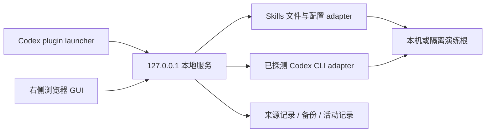

# SkillDock 工程设计 · v0.1

> 第三轮 UAT 已移除产品 Sandbox。本文保留对应阶段历史；涉及演练入口的步骤不再适用。当前产品、工程边界和验收步骤以 [第三轮整改交付](14-uat-round3-delivery.md) 为准。


本轮依据：[PRD](01-product-requirements.md)、[产品审查](01-product-review.md)、[界面设计](02-interface-design.md)、[本机能力](00-local-capabilities.md)。用户已授权实现初版，UAT 待验收。本文合并 HLD 与 LLD 的明确分区，API wire 类型以 `../assets/app/shared/contracts.ts` 为唯一事实源。

## HLD：边界与选型

新模块完全位于 skill-manager；不改变其他 skills 的执行流程。Guardrails trigger check：`no_trigger`，仓库 AGENTS 与发现规则仍为 authority；下列本地 HTTP/文件操作约束仅适用本 app，不提升为全仓标准。

采用 React + TypeScript + Vite 前端、Node 22 本地 HTTP 服务。无既有前端可复用；系统字体与 lucide 图标保证离线渲染。后端使用 Node 文件/进程 API、YAML 与 TOML 解析库；不引入数据库或云端服务。依赖锁定于 package-lock.json。



运行时仅绑定 IPv4 loopback；同源静态页面与 API。每次服务启动生成请求 token，由同源 session API 给前端；写请求要求正确 Host、Origin（如果发送）、JSON Content-Type 和自定义 token header，不返回跨源 CORS 授权。GET 同样限制 Host 与跨站请求。任意内容以文本呈现，不执行技能脚本/HTML。CLI 使用 argv 和 shell:false，拒绝含凭证 URL 与任意命令输入；只允许白名单子命令。

本机模式：只扫描已知用户根、当前项目层级的 skills、系统根和 plugin cache；独立用户/当前项目 skill 可管理，系统/托管/无法证实的资源只读。CLI installed 状态为首选证据；cache 仅补充内容并去重 latest/symlink。使用者指定其他来源用于导入，不触发全盘扫描。

演练模式：所有数据根、配置、Git 来源和历史在应用独立 state 目录下；与本机严格分离。内含足够代表性的技能与一个本地市场，真实文件操作覆盖全部独立 skill 生命周期。显式 fixture CLI 或演练 adapter 只能作用演练根，结果标注演练。

## LLD：模块与契约

Manifest：`profile: local-web-app`；Core=模块/状态/流程；Add-ons=HTTP API、Storage、CLI integration、Recovery、Testing。应用目录：

```
app/
  shared/contracts.ts       # 请求/响应类型
  server/                  # HTTP、状态扫描、CLI、文件事务、演练fixtures
  src/                     # React GUI 与样式
  tests/                   # Node integration / browser acceptance
  package.json
  README.md
```

HTTP API（详细字段见共享契约）：

- `GET /api/session` → `{token}`。
- `GET /api/state?mode=local|sandbox` → Snapshot。
- `GET /api/skill?mode=...&id=...` → `{skill,content}`；id 必须命中当前已发现对象，不接受任意文件路径。
- `POST /api/actions` → ActionResult。用户先预览安装，提交 previewId；更新先检查得到预览，再确认；写操作结束后前端重新 GET state。
- 错误：非 2xx `{error:{code,message}}`；400 参数，403 访问/管理边界，404 未发现，409 冲突/忙碌/陈旧预览，422 不支持/格式，500 执行失败。不得将失败表示为成功 toast。

进程级写操作互斥；读请求可并行。每个操作只绑定一个 mode、id 和来源。前端环境切换取消旧请求的 UI 应用，旧操作结果只能留在原环境记录，不串到新环境。

## 文件事务与配置

技能身份由逻辑路径稳定散列；真实路径用于别名去重与边界检查，不能用名称唯一定位。系统根和托管缓存优先保护，路径规范化后再判断归属。悬空链接可列示；移除受支持用户根里的链接时只移动链接自身。

配置采用 TOML 结构化解析，保留无关字段与注释的最小补丁；遇到无法安全编辑的语法返回不支持，禁止误写。修改前捕获 SHA-256、备份原字节，写入前再次检查；同目录临时文件 + 原子 rename，保留模式。技能开关只编辑 skills.config，插件开关只编辑相应 plugins 条目。持久化成功需读回；提示新会话生效，不声称运行中的 Codex 已重新加载。

安装：来源预览 → 验证 SKILL.md/frontmatter、路径和链接 → 暂存 → 确认来源指纹未变化、目标不存在 → 原子移动 → 记录来源/安装指纹。Git 来源固定于预览得到的 commit，不自动执行依赖或 hooks；ref/subpath 与来源分开存储。导入拒绝越界 symlink 和特殊文件，限制大小与文件数。应用自身/系统目录不可作为写目标。

更新：只对明确 provenance 的独立技能开放；比较来源指纹、已安装指纹和当前指纹。当前有本地改动则拒绝覆盖；预览显示新增/修改/移除文件；提交前再次核验源和目标；先保存旧目录再安装候选；失败尽力恢复并真实记录失败。来源离线不代表无更新。

移除：将独立技能或链接移入 quarantine，记录原位置与内容指纹；恢复前检查原位置未被占用。更新也可恢复到前版，拒绝覆盖更新后的新改动。配置与 provenance 操作要么成功完成，要么保留可恢复备份与明确终态，不能吞掉部分失败。

CLI adapter：候选顺序为显式环境变量、已知本机 plugin-appserver、可工作 PATH；验证 --version 和 help 能力，不修改损坏 wrapper。复用已核对的 plugin add/remove/list、marketplace add/list/upgrade/remove。标准输出只提取白名单字段；错误去除敏感路径以外的凭证信息。设置合理超时与输出限制。插件安装/卸载后用 list 验证；无需认证时可完成，需用户连接服务时明确提示。未探测到独立 plugin update 时不伪造该能力。

## 可操作性矩阵

| 对象 | 查看 | 启禁 | 安装/移除 | 更新 |
|---|---|---|---|---|
| 独立用户/当前项目 skill | 是 | 配置按路径 | 导入/可恢复移除 | 有 provenance 才支持 |
| 系统 skill | 是 | 初版保护 | 初版保护 | 宿主维护 |
| 已核实安装的本地 marketplace plugin | 是 | 配置按包 | CLI 能力允许时 | 市场刷新不冒充包更新 |
| 远程托管/cache-only | 是并标明证据 | 无可靠入口则禁用控件 | 无可靠入口则禁用控件 | 宿主维护 |
| marketplace | 是 | 不适用 | 支持的CLI/演练来源 | Git refresh |

## 测试设计与需求映射

| 需求 | 实现边界 | 验证 |
|---|---|---|
| 001 | scanner/CLI mapping | 多根、重名、别名、cache-only、部分失败 |
| 002 | React 页面/抽屉 | 1440/720/390px，键盘、搜索、空/错/加载 |
| 003 | TOML transaction | 启禁往返、注释保留、并发冲突、系统保护 |
| 004 | staged import | 本地和本地Git fixture，重名、变更预览、越界链接 |
| 005 | quarantine | 删除/恢复、symlink目标保留、占用冲突 |
| 006 | CLI/catalog adapters | fake CLI argv/JSON、超时、读回失败、市场fixture |
| 007 | provenance | 来源变化、本地变化、更新/恢复、无来源/离线 |
| 008 | journal | 成功/失败终态、恢复能力、环境隔离 |
| 009 | HTTP/path guards | 错token/Origin/Host、任意路径读取、系统写、HTML文本 |
| 010 | launcher/build | typecheck、build、tests、真实本机只读清单、演练E2E |

Node 测试只针对临时fixture；UI测试使用演练模式完成有副作用链路。真实本机 smoke 仅读取清单/正文，不切换本机开关或刷新远程源。验证报告记录命令、结果、截图、环境和未覆盖范围。CLI 本机只读成功不能等同真实插件卸载已测试。

## 启动与运维

Node >=22，首次 npm ci 后 npm run build；npm start 运行构建产物与API，默认端口 4771，支持自定义端口与 state dir。launcher 从自身目录定位 app，检查依赖/构建与健康状态，输出实际 URL；宿主有打开面板工具时由 skill 使用。只记录本服务启动的 PID，停止不结束用户其他进程。state 默认在用户独立 SkillDock 数据目录，权限仅本用户；不写插件缓存作为运行数据目录。初版不注册系统自启动。
