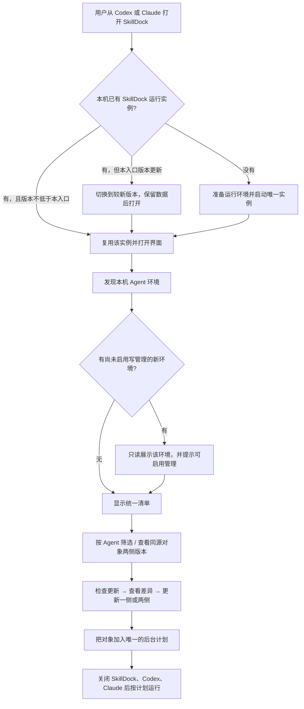
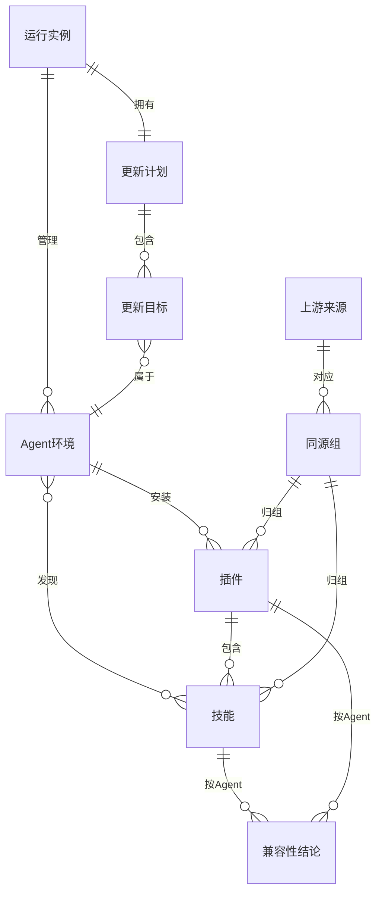

# PRD: SkillDock 跨 Agent 管理（Codex + Claude）

> **文档版本**: 0.11
> **状态**: 已批准（产品 Owner：用户；0.2 版 2026-10-07 整体批准；0.3～0.11 为 Owner 批准的有限修订）
> **作者**: Claude（起草）；产品 Owner：用户
> **创建日期**: 2026-10-07
> **最后更新**: 2026-10-10

<!-- TRACEABILITY-METADATA:BEGIN -->
```yaml
schema:
  name: testany-traceability
  version: "1.0.0"
  profile: prd-profile-v1
artifact:
  id: PRD-SKILLDOCK-002
  type: PRD
  title: SkillDock 跨 Agent 管理（Codex + Claude）
  status: approved
  owners:
    - product.user
    - engineering.claude
  created_at: "2026-10-07"
  updated_at: "2026-10-08"
  source_documents:
    - PRD-SKILLDOCK-001
    - BRIEF-SDX-001
    - EVID-SDX-001
    - BRIEF-SDX-002
    - BRIEF-SDX-003
    - BRIEF-SDX-004
    - BRIEF-SDX-005
    - BRIEF-SDX-006
    - BRIEF-SDX-007
    - BRIEF-SDX-008
    - BRIEF-SDX-009
    - BRIEF-SDX-010
entities:
  requirements:
    - id: REQ-SDX-001
      class: functional
      title: 发现本机 Agent 环境
      statement: SkillDock 必须识别本机已安装的 Codex 与 Claude，显示每个环境实际使用的配置根、技能根与插件根；安装 SkillDock 的 Agent 默认启用管理，另一侧新发现的环境默认只读，用户启用后才允许写操作。
      priority: P0
      status: approved
      scope: in
      acceptance_criteria:
        - 只装 Codex、只装 Claude、两者都装三种机器上，环境页分别正确显示已发现的环境，未安装的不显示为可用。
        - 自定义 CODEX_HOME、CLAUDE_CONFIG_DIR、CLAUDE_CODE_PLUGIN_CACHE_DIR 时，显示并使用实际生效的位置。
        - 未启用写管理的环境中，安装、更新、启禁、移除入口均不可用并说明原因；启用后需读回才显示已启用。
        - 从 Claude 安装的用户首次打开时 Claude 已启用管理；从 Codex 安装的用户首次打开时 Codex 已启用、Claude 为只读。
      source_refs:
        - artifact_id: BRIEF-SDX-001
          note: 三种安装场景
    - id: REQ-SDX-002
      class: functional
      title: Claude 技能与插件清单
      statement: SkillDock 必须展示 Claude 的个人技能、项目技能、已安装插件及其技能、已添加的 marketplace，包括来源、版本、安装范围、启用状态与启用状态的决定来源。
      priority: P0
      status: approved
      scope: in
      acceptance_criteria:
        - 清单包含 ~/.claude/skills、当前项目中按 Claude 发现规则可见的 .claude/skills、已安装插件（含其技能）和 marketplace，与 Claude 自身插件列表读回结果一致。
        - 插件显示 marketplace、已安装版本、安装范围（user / project / local）、启用状态；被更高优先级来源覆盖时显示覆盖来源。
        - marketplace 显示自动更新开关的实际值（含默认值）与上次刷新时间；桌面应用会话整体禁用自动更新时一并说明。
        - 组织托管与 claude.ai 同步的插件标为受保护，不提供写操作。
      source_refs:
        - artifact_id: EVID-SDX-001
          note: Claude 插件文件布局、作用域与同步插件
    - id: REQ-SDX-003
      class: functional
      title: 统一视图与 Agent 标识
      statement: 技能库、插件、更新与记录页必须能按全部 / Codex / Claude 筛选，每个对象标明所属 Agent；同一真实文件被两个 Agent 发现时显示为一个对象、两个归属。
      priority: P0
      status: approved
      scope: in
      acceptance_criteria:
        - 每个对象都显示 Agent 标识，筛选结果与标识一致。
        - 通过链接被两个 Agent 共用的同一技能目录只出现一次，并标明两个归属；对其更新或移除前提示会同时影响两边。
        - 只有一个已启用环境时，界面不出现多余的 Agent 切换。
      source_refs:
        - artifact_id: BRIEF-SDX-001
    - id: REQ-SDX-004
      class: functional
      title: Claude 插件更新与差异预览
      statement: SkillDock 必须为 Claude 插件（包括自动更新默认关闭的第三方 marketplace）检查可用更新，应用前展示版本与文件差异，经 Claude 官方插件机制完成更新并读回结果。
      priority: P0
      status: approved
      scope: in
      acceptance_criteria:
        - 第三方 marketplace 自动更新关闭时，SkillDock 仍能检查出新版本并显示当前版本与可用版本。
        - 应用前可查看逐文件差异；用户取消则不发生任何写入。
        - 更新后读回 Claude 记录的已安装版本；与预期不符时显示失败而非完成。
        - 区分“磁盘已更新”与“已打开的会话需重载才生效”。
        - SkillDock 不代为更新的插件类型（command 来源、带 headersHelper 的条目、claude.ai 同步或组织托管的插件）显示原因与手动途径，不显示为可加入计划。
      source_refs:
        - artifact_id: EVID-SDX-001
          note: 第三方 marketplace 默认关闭自动更新；GUI 更新无差异预览
    - id: REQ-SDX-005
      class: functional
      title: Claude 独立技能的来源追踪与更新
      statement: SkillDock 必须支持把独立技能从本地目录或 Git 来源安装到 Claude 个人或项目技能目录，记录来源，为可证明来源的已有技能建立关联，并按来源检查和更新。
      priority: P0
      status: approved
      scope: in
      acceptance_criteria:
        - 安装前预览元数据与目标位置；目标已存在时拒绝覆盖。
        - 已有技能只有在内容可与来源核对一致时才自动关联；否则由用户确认关联。
        - 更新前展示差异；本地内容被修改过时阻止覆盖并说明。
        - 移除进入可恢复区，可从记录恢复；链接只移除链接本身。
      source_refs:
        - artifact_id: EVID-SDX-001
          note: Claude 个人 / 项目技能没有来源记录与更新路径
        - artifact_id: PRD-SKILLDOCK-001
          note: REQ-SD-004、REQ-SD-005、REQ-SD-007 的 Codex 同类行为
    - id: REQ-SDX-006
      class: functional
      title: 跨 Agent 后台定时更新
      statement: 每台电脑只有一个 SkillDock 更新计划，可同时包含 Codex 与 Claude 的更新目标；在 SkillDock 界面、Codex、Claude 全部关闭时仍按计划运行。
      priority: P0
      status: approved
      scope: in
      acceptance_criteria:
        - 计划中的每个目标显示所属 Agent；两侧目标在同一次运行中按目标逐个执行并分别记录结果。
        - 关闭 SkillDock 界面、Codex 与 Claude 后，到期计划仍会执行；休眠或关机错过的周期在下次登录后只补做一次。
        - 某个 Agent 被卸载或不可用时，其目标暂停并显示原因，不反复报错，也不影响另一侧目标。
        - 本机只存在一个 SkillDock 后台计划任务。
      source_refs:
        - artifact_id: EVID-SDX-001
          note: Claude 自动更新仅在交互会话中运行；桌面定时任务需应用打开且电脑唤醒
        - artifact_id: PRD-SKILLDOCK-001
          note: REQ-SD-014
    - id: REQ-SDX-007
      class: functional
      title: 单实例与版本收敛
      statement: 无论从 Codex 还是 Claude 打开，本机都只运行一个 SkillDock 服务；两侧装有不同 SkillDock 版本时，以较新版本运行，较旧入口仍能打开或明确提示更新入口；较旧版本不得接管或改写较新版本的数据。为此在 0.11.0 之前先发布 0.10.3 过渡版。
      priority: P0
      status: approved
      scope: in
      acceptance_criteria:
        - 先后从两个 Agent 打开，复用同一服务与同一份数据；不出现第二个服务进程或第二个后台任务。
        - 两侧 SkillDock 版本不同时，实际运行的是较新版本，界面显示运行版本及各入口版本。
        - 较旧版本不得写入较新格式的数据；无法兼容时只读并提示更新。
        - 一侧更新 SkillDock 后自动切换到新版本，保留计划、历史、项目、语言与主题。
        - 在 0.11.0 之前先发布 0.10.3 过渡版。0.10.3 起的入口与后台任务遇到较新版本的数据或运行实例时，不接管、不改写数据、不停用或注销后台计划，并明确提示更新本侧 SkillDock。
        - 0.11.0 检测到任一 Agent 中仍有低于 0.10.3 的 SkillDock 安装时，不迁移、不写入新格式数据，先引导把该侧更新到 0.10.3 或更高（提供一键更新）。
        - 同一 Agent 内从较新版本回退到较旧版本时，较旧版本不接管数据目录。
      source_refs:
        - artifact_id: BRIEF-SDX-001
          note: 两份代码版本不一致的问题
        - artifact_id: BRIEF-SDX-004
          note: Owner 不接受过渡期限制，要求先发布 0.10.3 过渡版
        - artifact_id: BRIEF-SDX-010
          note: 旧版启动器删除记录后的残留归入 Q8；门槛不通过时 0.10.3 自更新退避
    - id: REQ-SDX-008
      class: functional
      title: Claude 中的打开入口
      statement: Claude 用户必须能在 Claude 桌面应用 Code 标签页中通过 SkillDock 技能打开完整界面；Codex 专用的原生入口不得在 Claude 中以报错形式出现。
      priority: P0
      status: approved
      scope: in
      acceptance_criteria:
        - 在 Claude Code 标签页请求打开 SkillDock，后台按需启动，界面在内置浏览器面板中打开；不支持时给出可点击链接。
        - 提供查看状态与停止服务的方式，停止服务不关闭后台更新计划。
        - 从 Claude 安装 SkillDock 后，Claude 的插件错误列表中没有来自 SkillDock 的条目。
      source_refs:
        - artifact_id: EVID-SDX-001
          note: 第三方 MCP App 界面在 Code 标签页不渲染；内置浏览器可打开本机 SkillDock 页面
    - id: REQ-SDX-009
      class: non_functional
      title: 运行环境：扫描本机 Node，找不到时引导安装
      statement: SkillDock 在本机扫描可用的 Node.js，找到即自动选用并保存路径、后续复用，失效时重新扫描；找不到时以 macOS 对话框引导用户安装，不自动下载运行环境；两侧共用同一选择与运行目录。
      priority: P0
      status: approved
      scope: in
      acceptance_criteria:
        - 本机已有满足要求的 Node.js 时，首次打开自动选用并保存其路径，设置中可见；之后打开直接复用，不再扫描。
        - 保存的 Node.js 被删除或不再满足要求时，下次打开自动重新扫描并更新保存值。
        - 本机没有可用的 Node.js 时，弹出 macOS 对话框，提供“打开 Node.js 下载页”“重新检测”“取消”；不下载任何运行环境；用户安装后点“重新检测”即可继续。
        - 两侧都装时共用同一保存的选择与运行目录，第二个入口不重复准备。
        - 0.10.x 已在用的 Codex 自带 Node 与已下载的 SkillDock 私有 Node 仍作为扫描对象，升级用户无需另装。
        - 首次构建需要联网下载依赖时事先说明；断网失败不影响已运行的旧服务与数据。
      source_refs:
        - artifact_id: BRIEF-SDX-001
          note: 运行环境的三种场景
        - artifact_id: PRD-SKILLDOCK-001
          note: 18-codex-node-runtime 现有专用运行时
        - artifact_id: BRIEF-SDX-003
          note: Owner 决定改为扫描本机 Node、找不到时引导安装
    - id: REQ-SDX-010
      class: functional
      title: 同源跟踪（两边都跟上）
      statement: 对来自同一上游来源的技能或插件，SkillDock 必须并列展示 Codex 与 Claude 各自的安装版本与最新版本，并提供“也装到另一侧”和“两边都更新到最新”，由各 Agent 自己的安装机制执行。
      priority: P1
      status: approved
      scope: in
      acceptance_criteria:
        - 同一 marketplace 插件或同一 Git 来源技能在两侧的安装显示为一组，列出两侧版本与最新版本。
        - “两边都更新到最新”逐侧执行并分别读回；一侧失败不回滚另一侧，结果分别显示。
        - 执行过程不在两个 Agent 的目录之间复制文件。
        - 目标侧的兼容性结论不允许时，“也装到另一侧”不可用并显示原因。
      source_refs:
        - artifact_id: BRIEF-SDX-001
          note: 用户同意“同步到另一边”，改述为两边跟踪同一上游
      dependencies:
        - REQ-SDX-011
    - id: REQ-SDX-011
      class: functional
      title: 兼容性推断与用户确认
      statement: SkillDock 必须根据可得证据为每个技能或插件给出对各 Agent 的兼容性结论并展示依据，按结论限制可用操作，允许用户逐对象确认或否定，且来源身份变化后用户确认失效。
      priority: P1
      status: approved
      scope: in
      acceptance_criteria:
        - 每个对象对每个 Agent 显示四种结论之一（已声明支持 / 可能可用 / 无法判断 / 不兼容）及其依据。
        - 结论为“无法判断”的对象安装到该 Agent 需要逐个确认，且不进入批量“也装到另一侧”。
        - 结论为“不兼容”的对象不能安装到该 Agent。
        - 用户确认保存在本机并标为“用户确认”；上游来源或安装身份变化后失效并重新判断。
      source_refs:
        - artifact_id: BRIEF-SDX-001
          note: 技能规范不要求声明支持哪个 Agent
    - id: REQ-SDX-012
      class: functional
      title: 写入边界
      statement: SkillDock 对 Claude 的写操作默认仅限当前用户范围；不得改写组织托管设置、claude.ai 同步插件或凭证，写入项目共享设置必须由用户逐次明确选择。
      priority: P0
      status: approved
      scope: in
      acceptance_criteria:
        - 默认操作只影响当前用户；写入项目共享设置（.claude/settings.json，通常纳入版本库）需在确认框中逐次单独勾选，显示将写入的文件与改动，并说明会影响所有协作者。
        - 托管设置与同步插件在界面中只读。
        - 页面与记录中不出现 token、密码等凭证；外部网页无法触发有效写操作。
      source_refs:
        - artifact_id: EVID-SDX-001
          note: Claude enabledPlugins 的六级来源与托管设置
        - artifact_id: PRD-SKILLDOCK-001
          note: REQ-SD-009
    - id: REQ-SDX-013
      class: functional
      title: 跨 Agent 的产品文案
      statement: SkillDock 的产品定位改为跨 Agent；界面、README、技能说明与徽标不再只写 Codex，按已启用的 Agent 显示相关提示；中文、英文、日文同步。
      priority: P0
      status: approved
      scope: in
      acceptance_criteria:
        - 只启用 Claude 时，界面中不出现要求使用 Codex 的提示；只启用 Codex 时保持现有表述。
        - 三种语言的新增文案完整，无中英混排。
        - README 首屏定位、徽标与安装说明同时覆盖 Codex 与 Claude。
      source_refs:
        - artifact_id: BRIEF-SDX-001
    - id: REQ-SDX-014
      class: functional
      title: 兼容性声明约定（作者侧）
      statement: 为本仓库及愿意配合的作者提供一个 SkillDock 可读取、符合 Agent Skills 规范的“支持哪些 Agent”声明方式；SkillDock 将其作为最高优先级证据。
      priority: P2
      status: approved
      scope: in
      acceptance_criteria:
        - 声明方式不引入 Agent Skills 规范之外的 frontmatter 字段，不导致 Claude 或 Codex 加载、打包、上传失败。
        - 本仓库插件按约定补充声明后，SkillDock 对其结论为“已声明支持”。
      source_refs:
        - artifact_id: BRIEF-SDX-001
      dependencies:
        - REQ-SDX-011
    - id: REQ-SDX-015
      class: functional
      title: Claude 插件启禁
      statement: SkillDock 第一版即可启用或停用 Claude 插件（默认当前用户范围，逐次确认后可写项目共享范围），并读回实际生效状态。
      priority: P0
      status: approved
      scope: in
      acceptance_criteria:
        - 启禁后读回实际生效状态；被项目、本地或托管设置覆盖而未生效时如实显示覆盖来源。
        - 托管强制启用或组织要求的同步插件不提供停用。
      source_refs:
        - artifact_id: EVID-SDX-001
        - artifact_id: BRIEF-SDX-002
          note: Q1 第一版就做
    - id: REQ-SDX-016
      class: functional
      title: Claude 侧能力对等
      statement: SkillDock 0.10.2 对 Codex 提供的能力，在 Claude 环境中默认同样提供；仅当与 Claude 原生行为冲突时按原生语义调整，或平台不支持时不提供，并在界面说明原因。
      priority: P0
      status: approved
      scope: in
      acceptance_criteria:
        - 第 5.6 节对照表中标为“提供”的每项能力，在只启用 Claude 的环境中可完成并读回。
        - 标为“按原生语义调整”的每项，确认框或详情中显示对应的原生规则（安装范围、依赖插件、移除 marketplace 会卸载的插件、卸载会删除的持久数据、技能可见性档位）。
        - 标为“不提供”或“不适用”的每项，在 Claude 对象上不出现可点击入口，并显示原因。
        - 写操作前重新读取 Claude 的状态；发现用户在 Claude 界面中做过的改动时停止并提示，不覆盖。
        - 同一插件已被 Claude 自身更新到最新时，SkillDock 计划记为无需更新，不重复安装。
      source_refs:
        - artifact_id: BRIEF-SDX-002
          note: 已有功能不在 Claude 下关闭，除非与原生能力冲突
        - artifact_id: PRD-SKILLDOCK-001
    - id: REQ-SDX-017
      class: functional
      title: 从 Claude 安装 SkillDock
      statement: 只装 Claude 的用户必须能从 Claude 桌面应用的插件界面安装 SkillDock，安装只添加 SkillDock 入口；README 提供 Claude 的安装、打开与更新说明。
      priority: P0
      status: approved
      scope: in
      acceptance_criteria:
        - 在 Claude 桌面应用中添加本仓库 marketplace 后，可在插件浏览器中找到并安装 SkillDock，安装后其技能出现在 Claude 中。
        - 安装 SkillDock 不会安装或启用仓库中的其他插件。
        - 中英文 README 有 Claude 安装、打开与更新 SkillDock 的说明，全程不要求用户使用终端。
        - 仓库 marketplace 中仅支持 Codex 的插件，在 Claude 中明确标注仅支持 Codex，或不出现在 Claude 的可安装列表中。
      source_refs:
        - artifact_id: BRIEF-SDX-002
          note: Q2 本期面向只装 Claude 的用户分发
  risks:
    - id: RISK-SDX-001
      title: 一次错误更新同时影响两个 Agent
      statement: 同一上游的问题版本经“两边都更新”或共同计划同时写入 Codex 与 Claude，扩大受影响范围。
      status: proposed
      scope: in
      level: high
      likelihood: medium
      impact: 两个日常 Agent 同时失去可用技能
      source_refs:
        - artifact_id: BRIEF-SDX-001
    - id: RISK-SDX-002
      title: Claude 内部文件格式变化
      statement: Claude 的插件记录文件属于实现细节而非公开契约，版本升级可能改变格式或位置，导致清单或更新判断错误。
      status: proposed
      scope: in
      level: high
      likelihood: medium
      impact: 清单错误或更新失败
      source_refs:
        - artifact_id: EVID-SDX-001
    - id: RISK-SDX-003
      title: 两侧 SkillDock 版本错配
      statement: Codex 与 Claude 各自安装的 SkillDock 版本不同，旧版本误接管服务或写坏新格式数据。
      status: proposed
      scope: in
      level: high
      likelihood: high
      impact: 数据损坏或计划重复执行
      source_refs:
        - artifact_id: BRIEF-SDX-001
    - id: RISK-SDX-004
      title: 没有 Node.js 的用户需先安装
      statement: 只装 Claude 且本机没有可用 Node.js 的用户，必须先按引导安装 Node.js 才能使用 SkillDock；扫描遗漏非常规安装位置时也会误报为没有。
      status: proposed
      scope: in
      level: medium
      likelihood: medium
      impact: 无法打开 SkillDock
      source_refs:
        - artifact_id: BRIEF-SDX-001
    - id: RISK-SDX-005
      title: 兼容性误判
      statement: 推断把实际不可用的技能判为可能可用，或把可用的判为不兼容。
      status: proposed
      scope: in
      level: medium
      likelihood: medium
      impact: 安装后无效或阻止正当操作
      source_refs:
        - artifact_id: BRIEF-SDX-001
    - id: RISK-SDX-006
      title: 宿主补齐能力后价值收缩
      statement: Claude 后续加入差异预览、后台更新或在 Code 标签页支持第三方 MCP App，使部分需求失去意义或需要改换入口。
      status: proposed
      scope: in
      level: low
      likelihood: medium
      impact: 部分功能重复
      source_refs:
        - artifact_id: EVID-SDX-001
    - id: RISK-SDX-007
      title: Windows 上的 Claude 用户不被覆盖
      statement: Claude 桌面应用支持 Windows，而 SkillDock 后台调度仅支持 macOS。
      status: proposed
      scope: out
      level: medium
      likelihood: high
      impact: Windows 用户无法使用
      source_refs:
        - artifact_id: EVID-SDX-001
    - id: RISK-SDX-008
      title: 与 Claude 原生管理并行产生冲突
      statement: 用户同时在 Claude 界面与 SkillDock 中操作，或 Claude 自身更新了插件，导致 SkillDock 基于过期状态写入或重复更新。
      status: proposed
      scope: in
      level: medium
      likelihood: medium
      impact: 设置被覆盖或重复安装
      source_refs:
        - artifact_id: BRIEF-SDX-002
  must_not_regress:
    - id: MR-SDX-001
      title: Codex-only 用户行为不变
      statement: 未启用 Claude 管理时，Codex 的清单、操作、原生入口、后台更新与 0.10.2 一致。例外（Owner 2026-10-07 决定）：运行环境统一改为扫描本机 Node、找不到时引导安装；Codex 自带 Node 与已下载的私有 Node 仍是扫描对象。
      status: approved
      scope: in
      priority: P0
      source_refs:
        - artifact_id: PRD-SKILLDOCK-001
    - id: MR-SDX-002
      title: 已有计划与数据无损迁移
      statement: 升级后已有的更新计划、目标绑定、历史、来源记录、项目、语言与主题保留，原本未启用的计划不会被开启。
      status: approved
      scope: in
      priority: P0
      source_refs:
        - artifact_id: PRD-SKILLDOCK-001
    - id: MR-SDX-003
      title: 不覆盖本地修改
      statement: 任何手动或后台更新都不覆盖被本地修改过的内容，冲突跳过并记录。
      status: approved
      scope: in
      priority: P0
      source_refs:
        - artifact_id: PRD-SKILLDOCK-001
  external_behaviors: []
  decisions: []
  flows: []
  test_cases: []
relations:
  - id: REL-SDX-001
    type: derived_from
    from: REQ-SDX-001
    to: BRIEF-SDX-001
    status: active
  - id: REL-SDX-002
    type: derived_from
    from: REQ-SDX-002
    to: EVID-SDX-001
    status: active
  - id: REL-SDX-003
    type: derived_from
    from: REQ-SDX-003
    to: BRIEF-SDX-001
    status: active
  - id: REL-SDX-004
    type: derived_from
    from: REQ-SDX-004
    to: EVID-SDX-001
    status: active
  - id: REL-SDX-005
    type: derived_from
    from: REQ-SDX-005
    to: EVID-SDX-001
    status: active
  - id: REL-SDX-006
    type: derived_from
    from: REQ-SDX-005
    to: PRD-SKILLDOCK-001
    status: active
  - id: REL-SDX-007
    type: derived_from
    from: REQ-SDX-006
    to: EVID-SDX-001
    status: active
  - id: REL-SDX-008
    type: derived_from
    from: REQ-SDX-006
    to: PRD-SKILLDOCK-001
    status: active
  - id: REL-SDX-009
    type: derived_from
    from: REQ-SDX-007
    to: BRIEF-SDX-001
    status: active
  - id: REL-SDX-010
    type: derived_from
    from: REQ-SDX-008
    to: EVID-SDX-001
    status: active
  - id: REL-SDX-011
    type: derived_from
    from: REQ-SDX-009
    to: BRIEF-SDX-001
    status: active
  - id: REL-SDX-035
    type: derived_from
    from: REQ-SDX-009
    to: BRIEF-SDX-003
    status: active
  - id: REL-SDX-036
    type: derived_from
    from: MR-SDX-001
    to: BRIEF-SDX-003
    status: active
  - id: REL-SDX-041
    type: derived_from
    from: REQ-SDX-007
    to: BRIEF-SDX-004
    status: active
  - id: REL-SDX-042
    type: derived_from
    from: REQ-SDX-007
    to: BRIEF-SDX-005
    status: active
  - id: REL-SDX-043
    type: derived_from
    from: REQ-SDX-007
    to: BRIEF-SDX-006
    status: active
  - id: REL-SDX-044
    type: derived_from
    from: REQ-SDX-007
    to: BRIEF-SDX-007
    status: active
  - id: REL-SDX-045
    type: derived_from
    from: REQ-SDX-007
    to: BRIEF-SDX-008
    status: active
  - id: REL-SDX-046
    type: derived_from
    from: REQ-SDX-007
    to: BRIEF-SDX-009
    status: active
  - id: REL-SDX-037
    type: derived_from
    from: RISK-SDX-006
    to: REQ-SDX-004
    status: active
    note: Claude 若补齐差异预览或后台更新，该需求的增量价值收缩
  - id: REL-SDX-038
    type: derived_from
    from: RISK-SDX-006
    to: REQ-SDX-008
    status: active
    note: Code 标签页若支持第三方 MCP App，入口方式需调整
  - id: REL-SDX-039
    type: derived_from
    from: RISK-SDX-007
    to: REQ-SDX-006
    status: active
    note: 后台计划仅支持 macOS
  - id: REL-SDX-040
    type: derived_from
    from: RISK-SDX-007
    to: REQ-SDX-017
    status: active
    note: Windows 上的 Claude 用户无法从 Claude 安装使用
  - id: REL-SDX-012
    type: derived_from
    from: REQ-SDX-010
    to: BRIEF-SDX-001
    status: active
  - id: REL-SDX-013
    type: depends_on
    from: REQ-SDX-010
    to: REQ-SDX-011
    status: active
  - id: REL-SDX-014
    type: derived_from
    from: REQ-SDX-011
    to: BRIEF-SDX-001
    status: active
  - id: REL-SDX-015
    type: derived_from
    from: REQ-SDX-012
    to: EVID-SDX-001
    status: active
  - id: REL-SDX-016
    type: derived_from
    from: REQ-SDX-012
    to: PRD-SKILLDOCK-001
    status: active
  - id: REL-SDX-017
    type: derived_from
    from: REQ-SDX-013
    to: BRIEF-SDX-001
    status: active
  - id: REL-SDX-018
    type: depends_on
    from: REQ-SDX-014
    to: REQ-SDX-011
    status: active
  - id: REL-SDX-019
    type: derived_from
    from: REQ-SDX-015
    to: EVID-SDX-001
    status: active
  - id: REL-SDX-020
    type: derived_from
    from: RISK-SDX-001
    to: REQ-SDX-010
    status: active
  - id: REL-SDX-021
    type: derived_from
    from: RISK-SDX-002
    to: REQ-SDX-002
    status: active
  - id: REL-SDX-022
    type: derived_from
    from: RISK-SDX-003
    to: REQ-SDX-007
    status: active
  - id: REL-SDX-023
    type: derived_from
    from: RISK-SDX-004
    to: REQ-SDX-009
    status: active
  - id: REL-SDX-024
    type: derived_from
    from: RISK-SDX-005
    to: REQ-SDX-011
    status: active
  - id: REL-SDX-025
    type: derived_from
    from: MR-SDX-001
    to: PRD-SKILLDOCK-001
    status: active
  - id: REL-SDX-026
    type: derived_from
    from: MR-SDX-002
    to: PRD-SKILLDOCK-001
    status: active
  - id: REL-SDX-027
    type: derived_from
    from: MR-SDX-003
    to: PRD-SKILLDOCK-001
    status: active
  - id: REL-SDX-028
    type: derived_from
    from: REQ-SDX-012
    to: BRIEF-SDX-002
    status: active
  - id: REL-SDX-029
    type: derived_from
    from: REQ-SDX-013
    to: BRIEF-SDX-002
    status: active
  - id: REL-SDX-030
    type: derived_from
    from: REQ-SDX-015
    to: BRIEF-SDX-002
    status: active
  - id: REL-SDX-031
    type: derived_from
    from: REQ-SDX-016
    to: BRIEF-SDX-002
    status: active
  - id: REL-SDX-032
    type: derived_from
    from: REQ-SDX-016
    to: PRD-SKILLDOCK-001
    status: active
  - id: REL-SDX-033
    type: derived_from
    from: REQ-SDX-017
    to: BRIEF-SDX-002
    status: active
  - id: REL-SDX-034
    type: derived_from
    from: RISK-SDX-008
    to: REQ-SDX-016
    status: active
waivers: []
```
<!-- TRACEABILITY-METADATA:END -->

---

## 1. 文档信息

### 1.1 基本信息

| 属性 | 值 |
|------|-----|
| PRD 编号 | PRD-SKILLDOCK-002 |
| 所属产品 | SkillDock（独立 `skilldock` 插件） |
| 优先级 | P0 / P1 / P2 按需求分列 |
| 预计版本 | 0.11.0（minor，Owner 2026-10-07 决定；当前 0.10.2） |
| PRD 基线版本 | 0.9，已批准（HLD 基于此版本） |
| 最后同步日期 | 2026-10-08 |
| 上游基线 | [PRD-SKILLDOCK-001](01-product-requirements.md)（本文只新增跨 Agent 部分，不改写其中需求） |

### 1.2 修订历史

| 版本 | 日期 | 变更内容 | 作者 |
|------|------|----------|------|
| 0.1 | 2026-10-07 | 初稿：整理 2026-10-07 关于 Claude 桌面版适配、跨 Agent 架构、运行环境和兼容性推断的讨论 | Claude |
| 0.2 | 2026-10-07 | 纳入 Owner 意见：能力对等原则（新增 REQ-SDX-016 与 5.6 对照表）；从 Claude 安装（新增 REQ-SDX-017）；Q1–Q6 决定（REQ-SDX-015、013 升为 P0，允许逐次确认写入项目共享设置，版本 0.11.0，不做独立应用）；新增 RISK-SDX-008 | Claude |
| 0.2 | 2026-10-07 | 产品 Owner（用户）批准本版本；需求与回归保护条目状态改为 approved；风险条目保持 proposed，交测试策略阶段评估 | 用户 / Claude |
| 0.3 | 2026-10-07 | 有限修订（Owner 批准）：运行环境改为“扫描本机 Node → 保存路径复用 → 找不到时弹窗引导安装”，不再自动下载；规则对 Codex 与 Claude 统一（REQ-SDX-009、MR-SDX-001 例外说明、RISK-SDX-004、2.2、2.3、4.2、5.5.3、8.2、8.3、AC-009）；marketplace 拆分维持只做标注；补齐 RISK-SDX-006、007 的追溯关系（仅元数据） | 用户 / Claude |
| 0.4 | 2026-10-08 | 有限修订（Owner 批准）：不接受 0.10.x 旧入口的过渡期限制，REQ-SDX-007 增加“先发布 0.10.3 过渡版”“0.11.0 遇到低于 0.10.3 的安装先引导更新”“回退时旧版不接管”三条验收；7.3、9.1、AC-007 同步。另记录：差异预览范围保持 AC-004 原文（npm、archive 来源也提供差异）；TeamDesk 处于 PoC，本轮不处理其在 Claude 中的行为 | 用户 / Claude |
| 0.5 | 2026-10-08 | 有限修订（Owner 批准）：登记已知残留——用户主动回退到 0.10.2 或更早版本时，旧入口只保证不接管、不改写数据，无法给出更新提示（7.3、12 Q8）；7.4 的仓库发布改为“先发布 0.10.3，再发布 0.11.0”；按 Owner “用户体验优先”的指示，登记跨侧更新时旧入口进程需重启才能转交的剩余情形（7.3、12 Q9） | 用户 / Claude |
| 0.6 | 2026-10-08 | 有限修订（Owner 批准）：按 HLD 第 4 轮评审，把 7.3 与 Q9 的“同一侧自动转交”收窄为设计实际能做到的范围——Codex 侧仍在运行的 0.10.2 原生入口进程与 0.10.3 入口自动转交（包括一键更新另一侧之后）；Claude 侧仍加载 0.10.2 及更早代码的旧会话需重载插件 | 用户 / Claude |
| 0.7 | 2026-10-08 | 有限修订（Owner 批准）：按 HLD 第 5 轮评审与 Owner 选择的方案 B，改写 7.3 与 Q9：Codex 侧仍在运行的 0.10.2 原生入口进程在 Codex 侧只有 0.10.3 时也不再报错，而是转交给 0.10.3，由它交还新实例或提示更新本侧；明确 BRIEF-SDX-007 的“关口”指发布关口 | 用户 / Claude |
| 0.8 | 2026-10-08 | 有限修订（Owner 批准）：按 HLD 第 6 轮评审，把 7.3 与 Q9 的“不再报错”改为有前提的表述，并登记已知残留——Codex 面板仍运行 0.10.2 代码、Codex 侧只有 0.10.3、实例未运行且本机找不到可启动的 0.11 及以上安装（或被调用的较新启动器失败）时，面板只能显示 0.10.2 的固定错误，重启 Codex 后由 0.10.3 提示更新本侧；BRIEF-SDX-008 补记“启动较新的安装” | 用户 / Claude |
| 0.9 | 2026-10-08 | 有限修订（Owner 批准）：按 API 契约首轮评审登记两条已知残留并记录 Owner 决定——旧版 0.10.x 启动器删除启动记录后，仍打开着的 0.10.2 面板调用自身旧启动器而显示固定错误，归入 Q8，由 0.11 及以上版本补写记录；另一侧仍有低于 0.10.3 的安装、0.11.0 迁移门槛不通过时旧版自更新反复重试，新增 Q10（0.10.3 加退避，0.10.2 登记为残留）；7.3 同步。BRIEF-SDX-009 补记“或被调用的较新启动器失败”；新增 BRIEF-SDX-010（同时补记此前的两项 Owner 决定：不单独写 LLD；过渡期实例运行中指定不同项目时改走新版启动器切换） 。同日按 HLD 第 11 轮核对做两处措辞修正（修订记录补记 BRIEF-SDX-010 的 (1)(2)；Q10 与 7.3 的“约每秒重试”限定为后台计划已启用时），未改需求 | 用户 / Claude |
| 0.10 | 2026-10-10 | 有限修订（Owner 批准）：按 HLD 第 25 轮评审登记一条已知残留（Q11）——SkillDock 首次检查之前对 Claude 插件做的本地修改识别不出，MR-SDX-003 对这部分不成立；被覆盖的内容可从 Claude 保留 14 天的旧版本目录或更新前副本找回（HLD 第 10 节 DG-R24-2） | Claude |
| 0.11 | 2026-10-10 | 有限修订（Owner 批准）：登记 Q12——只读一侧也提供 SkillDock 自身的一键更新，作为 REQ-SDX-001“启用后才写入”的例外（HLD DG-R24-1）；Q11 的找回途径改为“版本不为 `unknown` 的插件” | Claude |

### 1.3 来源文档

| ID | 内容 | 状态 |
|----|------|------|
| PRD-SKILLDOCK-001 | [SkillDock 产品需求 v0.2](01-product-requirements.md) 及其后续阶段记录 | 现行基线 |
| BRIEF-SDX-001 | 2026-10-07 用户与 Claude 的对话：Claude 桌面版用户是否需要 SkillDock、两个 Agent 都装时是否开两个进程、版本不一致是否要改做独立应用、三种安装场景的运行环境、技能规范没有 Agent 声明怎么办；用户同意把“同步到另一边”作为方向 | 讨论记录，未形成正式批准 |
| BRIEF-SDX-002 | 2026-10-07 产品 Owner（用户）评审意见：0.10.2 已有能力在 Claude 下不专门关闭，除非与原生能力冲突；Q1 第一版做 Claude 插件启禁；Q2 本期面向只装 Claude 的用户分发；Q3 允许逐次确认后写入项目共享 `.claude/settings.json`；Q4 minor；Q5 改为跨 Agent 表述；Q6 不做独立 Mac 应用 | Owner 决定 |
| BRIEF-SDX-003 | 2026-10-07 产品 Owner（用户）对运行环境与 HLD 待决项的决定：扫描本机 Node、找到即保存复用、找不到时弹窗引导安装；规则对 Codex 与 Claude 统一；marketplace 先只做标注 | Owner 决定 |
| BRIEF-SDX-004 | 2026-10-08 产品 Owner（用户）对 HLD 首轮评审决定点的回复：DG-01 选择“npm、archive 来源也下载到暂存区做差异”（AC-004 不变）；DG-02 不接受过渡期限制，要求先发布 0.10.3 过渡版再发布 0.11.0；DG-03 TeamDesk 仍在 PoC 阶段，本轮不处理 | Owner 决定 |
| BRIEF-SDX-005 | 2026-10-08 产品 Owner（用户）对 HLD 第二轮评审的回复：同意把“主动回退到 0.10.2 或更早版本时无法给出更新提示”登记为已知残留；要求修订后做第三轮独立评审 | Owner 决定 |
| BRIEF-SDX-006 | 2026-10-08 产品 Owner（用户）对 HLD 第三轮评审决定点 DG-R3-01 的回复：采用用户体验更好的处理方式。据此，同一侧更新后仍在运行的旧入口进程应自动转交给新版本；只有跨侧（例如 Claude 侧运行新版、Codex 面板仍加载 0.10.2 代码）无法转交，需重启 Codex 或重载插件，新版在一键更新另一侧后主动提示 | Owner 决定 |
| BRIEF-SDX-007 | 2026-10-08 产品 Owner（用户）对 HLD 第 4 轮评审决定点 DG-R4-01 的回复：同意把 Q9 收窄为如实表述并登记；要求在 HLD 中规定以兼容测试矩阵作为 0.10.3 与 0.11.0 的发布关口（按 Owner 所选选项原文“作为发布关口”），修订后再做第 5 轮独立评审 | Owner 决定 |
| BRIEF-SDX-008 | 2026-10-08 产品 Owner（用户）对 HLD 第 5 轮评审决定点 DG-R5-01 的回复：采用方案 B（Codex 侧只有 0.10.3 时，旧面板转交给 0.10.3，由它交还新实例或提示更新本侧），并按实际效果改写 Q9；要求修订 HLD 0.8、提交 PRD、做第 6 轮评审。（2026-10-08 补记：0.10.3 转交链中“调用并启动较新的安装”一步由作者在设计中加入，Owner 在第 6 轮评审后经 BRIEF-SDX-009 确认） | Owner 决定 |
| BRIEF-SDX-009 | 2026-10-08 产品 Owner（用户）对 HLD 第 6 轮评审的回复：同意登记“Codex 面板仍运行 0.10.2 代码、Codex 侧只有 0.10.3、实例未运行且找不到可启动的 0.11 及以上安装时，面板显示固定错误、重启后才提示更新”的残留，并修正 Q9 措辞（含转交链“启动较新的安装”一步）；要求先修 HLD 的 P2 并做增量复审，通过后批准并提交 （2026-10-08 补记：0.8 修订已把“或被调用的较新启动器失败”的情形写入 7.3 与 Q9，本条原文未逐字记录） | Owner 决定 |
| BRIEF-SDX-010 | 2026-10-08 产品 Owner（用户）的决定：(1) 不单独写 LLD，跨版本冻结面在 API 契约中定稿并评审；(2) 过渡期实例运行中、从 0.10.3 一侧指定了不同项目时，改走新版启动器切换；(3) 旧版启动器删除启动记录后 0.10.2 面板显示固定错误的情形归入 Q8，并由 0.11 自动补回记录；(4) 0.11.0 门槛不通过时旧版自更新反复重试：0.10.3 加退避，0.10.2 登记为已知残留 | Owner 决定 |
| EVID-SDX-001 | 2026-10-07 实测与只读核对：Claude 桌面版 2.19675.1 / Claude Code 2.1.288 界面截图、MCP App 探针日志、本机两侧插件版本、Claude 官方文档（见附录 A） | 证据 |

### 1.4 术语表

| 术语 | 定义 |
|------|------|
| Agent | 会加载技能与插件的 AI 编程宿主。本文指 Codex（桌面版与 CLI）与 Claude（Claude 桌面应用的 Code 标签页、Claude Code CLI） |
| Agent 环境 | 某个 Agent 在本机的一套配置：配置根、技能根、插件缓存、marketplace 记录与官方管理命令 |
| 上游来源 | 技能或插件的发布位置：marketplace + 插件名，或 Git 仓库 + 子路径，或本地目录 |
| 同源对象 | 两个 Agent 中来自同一上游来源的安装 |
| 兼容性结论 | SkillDock 对“某对象能否在某 Agent 中正常使用”的判断：已声明支持 / 可能可用 / 无法判断 / 不兼容 |
| 入口 | 用户打开 SkillDock 的方式：Codex 原生侧栏、Codex 浏览器面板、Claude 内置浏览器面板、普通浏览器链接 |
| 运行实例 | 本机唯一的 SkillDock 后台服务及其数据目录 |

---

## 2. 背景与目标

### 2.1 业务背景

SkillDock 0.10.2 只管理 Codex：服务只建立 Codex 一个本机环境，扫描 Codex 的技能根与插件缓存，通过 Codex CLI 执行插件操作，入口是 Codex 的原生侧栏或浏览器面板。

很多用户以 Claude 桌面应用为主力 Agent。2026-10-07 的评估结论是：Claude 桌面应用已经覆盖插件浏览、按范围安装、marketplace 管理、插件启停与移除、手动更新；SkillDock 在 Claude 侧最大的增量在**更新**这条线上（见下表）。同时，0.10.2 已有的能力在 Claude 侧照样提供，保持两个 Agent 的使用体验一致，只在与 Claude 原生能力冲突或平台不支持时例外（BRIEF-SDX-002）。缺口如下：

| 缺口 | 证据 |
|------|------|
| 在桌面应用中，插件自动更新整体处于关闭状态（官方 marketplace 也不例外）；即使在终端里使用，第三方 marketplace 也默认关闭 | 本机观察：桌面应用拉起 Code 标签页会话时注入 `DISABLE_AUTOUPDATER`（用户 shell 配置与 settings 中均无此项）；官方文档：该变量会关闭整个插件自动更新并隐藏开关；第三方 marketplace 默认关闭。用户截图中 Manage marketplaces 也没有自动更新开关 |
| 自动更新只在交互会话中运行：发出第一条消息后随机延迟最多 10 分钟才执行，应用关闭时不运行 | 官方文档 “When auto-update runs” |
| 桌面版定时任务需应用打开且电脑唤醒，并且每次都会启动一个 Claude 会话，不适合做轻量更新器 | 官方文档 “How scheduled tasks run” |
| 更新前看不到差异 | 用户截图：插件详情只有 Update 按钮 |
| 个人技能（`~/.claude/skills`）与项目技能（`.claude/skills`）没有来源记录，也没有更新途径 | 官方文档中技能目录无来源 / 更新机制；用户截图 |
| 插件内的单个技能不能单独开关 | 官方文档：`skillOverrides` 不作用于插件技能 |
| 第三方 MCP App 界面在 Code 标签页不渲染，SkillDock 的 Codex 原生入口无法直接复用 | 探针日志：Claude Code 2.1.288 初始化未声明 MCP Apps 扩展，未读取 `ui://` 资源 |

本机实例：同一台电脑、同一个上游（`testany-agent-skills` marketplace），Codex 中 testany-eng 是 **2.7.1**（与仓库 main 一致），Claude 中是 **2.5.0**（2026-09-27 安装后未再更新；该 marketplace 的自动更新开关未设置，按默认为关闭，而且桌面应用会话本身已禁用插件自动更新，见上表第一行）。

### 2.2 产品目标

1. **成为跨 Agent 的“更新守护”**：一台电脑、一个 SkillDock、一个计划，让 Codex 与 Claude 中的技能和插件都能被追踪来源、预览差异、在后台按计划更新。
2. **能力对等，原生优先**：0.10.2 对 Codex 已有的能力在 Claude 侧默认同样提供；与 Claude 原生行为冲突时按原生语义调整；平台不支持的能力（插件内单技能开关）不伪造，并说明原因。
3. **两个 Agent 都装的用户只需维护一次**：同一上游在两侧的版本并列可见，一次操作让两边都跟上。
4. **任何安装组合都能顺畅用**：只装 Codex、只装 Claude、两者都装，本机已有 Node.js 时自动选用，没有时清楚引导安装；本机始终只有一个 SkillDock 在运行。

### 2.3 成功指标

SkillDock 没有遥测；以下指标在 UAT 与种子用户自愿提供的本机记录中度量。

| 指标 | 目标值 | 数据来源 | 度量方式 |
|------|--------|----------|----------|
| 同源版本一致率 | 加入计划的同源插件，在一个计划周期 + 24 小时内两侧都达到上游最新版本的比例 ≥ 95% | SkillDock 本机更新记录 | UAT 机器上统计计划内同源对象的两侧版本 |
| Claude-only 首次可用时间 | 干净 macOS 账户（已装满足要求的 Node.js、已联网）从安装 SkillDock 到看到清单 ≤ 3 分钟；没有 Node.js 时，打开后 10 秒内出现安装引导 | UAT 计时 | 记录硬件与网络条件，3 次取中位数 |
| 单实例 | 先后从两个入口打开后，服务进程数 = 1，后台计划任务数 = 1 | 系统进程与后台任务列表 | UAT 与自动化测试读回 |
| 越界写入 | 0 次：覆盖本地修改、写入“不兼容”Agent、改写托管或项目共享设置而未经用户逐次选择 | 自动化测试 + 本机操作记录 | 测试断言；UAT 后检查记录 |
| Codex-only 回归 | 0 项：现有 Node 与浏览器回归全部通过 | 现有测试集 | CI / 本地测试结果 |

### 2.4 业务现状

#### 当前流程

| 场景 | 现状 |
|------|------|
| 只用 Codex | SkillDock 提供完整清单、安装、启禁、移除恢复、更新差异、macOS 后台定时更新 |
| 只用 Claude | 不能使用 SkillDock：没有 Claude 适配，也没有 Claude 入口。仓库的 Claude marketplace 清单已列出 `skilldock`，但该插件只有 Codex manifest，在 Claude 中的行为未经验证 |
| 两个都用 | SkillDock 只看得到 Codex 一侧；Claude 一侧靠用户自己记得去点更新，版本会漂移（见 2.1 实例） |

#### 业务变更

| 变更项 | 变更前 | 变更后 |
|--------|--------|--------|
| 管理范围 | 仅 Codex | Codex 与 Claude，按用户启用 |
| Claude 侧能力 | 无 | 与 0.10.2 对 Codex 的能力对等（见 5.6） |
| 安装来源 | 仅从 Codex 安装 | 另可从 Claude 桌面应用安装 |
| 打开入口 | Codex 原生侧栏 / Codex 浏览器面板 | 另增 Claude 内置浏览器面板入口 |
| 后台更新 | 计划只含 Codex 目标 | 一个计划包含两侧目标 |
| 版本视角 | 单侧安装版本 | 同源对象两侧版本并列 |
| 兼容性 | 不判断（只服务 Codex） | 对每个对象给出各 Agent 的兼容性结论 |

#### 影响范围

| 影响对象 | 影响描述 |
|----------|----------|
| 用户群体 | 新增 Claude-only 与双 Agent 用户；Codex-only 用户行为不变（MR-SDX-001） |
| 现有流程 | 现有更新计划、绑定与历史迁移后保留（MR-SDX-002） |
| 上下游系统 | 新增对 Claude 配置目录与 Claude 官方插件命令的读写；仓库发布需同时声明 Claude 侧插件组件 |

### 2.5 相关能力识别

| 已有能力 | 能力范围 | 与本需求匹配度 | 能力差距 | 建议方向 | 来源 |
|----------|---------|--------------|---------|---------|------|
| 多环境服务结构 | 服务按“环境”组织数据和请求，目前只有 local（Codex）一个环境，测试时另有 sandbox | 部分匹配 | 环境只描述 Codex；扫描根、插件缓存、CLI 适配器都写死为 Codex | 建议扩展：Claude 作为另一类环境 | `assets/app/server/service.mjs`（createService 中的 environments） |
| 单实例与写锁 | 启动器所有权记录、健康检查核实、跨进程写锁 | 部分匹配 | 身份按 Codex 配置根与插件安装位置确定；Claude 入口启动时如何识别为同一实例未定义 | 建议扩展 | `server/process-lock.mjs`；[17-self-update-restart](17-self-update-restart.md) |
| 与宿主无关的数据目录 | 默认 `~/.local/share/skilldock`，运行目录与插件缓存分离 | 完全匹配 | 无 | 建议复用 | `server/service.mjs`、`server/runtime.mjs`；SKILL.md“启动与打开” |
| macOS 独立后台更新 | LaunchAgent 定时唤起 worker，关闭 Codex 与面板仍运行，补做一次 | 部分匹配 | 目标与锁绑定在 Codex 根上；需容纳 Claude 目标 | 建议扩展 | [24-background-updates](24-background-updates.md)、`server/background.mjs` |
| 专用 Node 运行时 | 无 Node 时下载固定版本并校验摘要 | 部分匹配 | 发现顺序以 Codex 自带 Node 为先；Claude-only 场景未验证 | 建议复用并补验证 | [18-codex-node-runtime](18-codex-node-runtime.md)、`server/toolchain.mjs` |
| 来源追踪、差异预览、本地修改保护 | 独立技能与插件的来源记录、逐文件 diff、冲突跳过 | 完全匹配（逻辑层） | 写入目标只支持 Codex 路径 | 建议复用 | [20-source-links-and-diff](20-source-links-and-diff.md)、`server/preview-diff.mjs`、`server/sources.mjs` |
| Claude marketplace 语义解析 | 按 Claude marketplace 规则解析第三方 manifest 与 strict 模式 | 部分匹配 | 只用于在 Codex 中安装，不读取 Claude 的安装记录 | 建议复用 | [marketplace-compatibility](marketplace-compatibility.md) |
| 自定义目录与链接 | 自定义 CODEX_HOME、根目录链接、单技能链接按真实路径识别 | 部分匹配 | 未覆盖 Claude 的配置目录变量 | 建议扩展到 Claude | [33-directory-compatibility](33-directory-compatibility.md) |
| Codex 原生入口 | MCP App 在 Codex 侧栏显示完整界面 | 不匹配（对 Claude） | Claude Code 标签页不渲染第三方 MCP App | Claude 侧改用内置浏览器面板 | [30-native-app](30-native-app.md)；EVID-SDX-001 探针 |
| Claude 桌面版插件 GUI | 浏览、按范围安装、marketplace 管理、启停、移除、手动更新 | 完全匹配（安装与启停） | 无差异预览、无后台更新、无独立技能来源 | 仅供参考：SkillDock 能力对等提供，遇到冲突以原生语义为准（见 5.6） | 官方文档 [Install and manage plugins](https://code.claude.com/docs/en/discover-plugins)；用户截图 |
| Claude 官方插件命令 | `claude plugin update / install / enable / disable`，读写与 GUI 相同的设置 | 部分匹配 | 不提供差异、计划与跨 Agent 视图 | 建议作为 Claude 侧写操作的执行途径（HLD 决定） | 同上 “Manage plugins from your shell” |

---

## 3. 范围

### 3.1 范围内

- Claude 环境发现与清单（REQ-SDX-001、002）。
- 跨 Agent 统一视图（REQ-SDX-003）。
- Claude 插件更新与差异预览、独立技能来源追踪与更新（REQ-SDX-004、005）。
- 一个计划覆盖两侧的后台更新（REQ-SDX-006）。
- 单实例、版本收敛、Claude 入口、三种场景的运行环境（REQ-SDX-007、008、009）。
- 同源跟踪与兼容性推断（REQ-SDX-010、011）。
- 写入边界与跨 Agent 文案（REQ-SDX-012、013）。
- Claude 插件启禁，第一版就做（REQ-SDX-015）。
- Claude 侧能力对等、从 Claude 安装 SkillDock（REQ-SDX-016、017）。
- P2：作者侧兼容性声明约定（REQ-SDX-014）。

### 3.2 范围外

- 独立 Mac 应用（`.app`）：Owner 决定不做（Q6）。SkillDock 继续以插件分发，入口在 Agent 内，版本不一致通过单实例与版本收敛解决。
- Claude 插件内单个技能的开关（平台不支持，不伪造）。
- Codex 官方目录应用插件在 Claude 中的对应物：Claude 的 connectors 在 claude.ai 管理，不在本机（见 5.6）。
- Claude 桌面应用 Chat / Cowork 标签页的技能与插件（其配置来自 claude.ai 账号，不是本机 `~/.claude`）。
- claude.ai 同步插件与组织托管插件的写操作（只读展示）。
- Windows 与 Linux（RISK-SDX-007）。
- 在两个 Agent 目录之间复制文件实现“同步”。
- 其他 Agent（Cursor、Gemini CLI 等）；环境模型需为后续扩展留余地，但本期不做。

### 3.3 已决定事项（Owner，2026-10-07）

- [x] 原则：0.10.2 已有能力在 Claude 下不专门关闭，除非与原生能力冲突（REQ-SDX-016）。
- [x] Q1 Claude 插件启禁第一版就做（REQ-SDX-015）。
- [x] Q2 本期就让只装 Claude 的用户从 Claude 安装 SkillDock（REQ-SDX-017）。
- [x] Q3 允许写入项目共享的 `.claude/settings.json`，每次逐项确认（REQ-SDX-012）。
- [x] Q4 作为 minor 版本发布：0.11.0。
- [x] Q5 产品定位改为跨 Agent 表述（REQ-SDX-013）。
- [x] Q6 不做独立 Mac 应用。

暂无新的待确认事项。HLD 阶段如发现原生冲突需要改变 5.6 对照表的结论，回到 Owner 确认。

---

## 4. 用户旅程

### 4.1 目标用户

| 用户 | 画像 | 本期价值 |
|------|------|----------|
| U1 Claude 主力用户 | 主要在 Claude 桌面应用 Code 标签页工作，装了第三方 marketplace 插件和若干个人技能，不常用终端 | 与 Codex 版一致的整套管理能力；第三方插件与个人技能能被追踪、预览、后台更新 |
| U2 双 Agent 用户 | Codex 与 Claude 都用，两边装了同一批插件 | 两侧版本一目了然，一个计划维护两边 |
| U3 Codex 主力用户 | 现有 SkillDock 用户 | 行为不变；需要时可开启 Claude 管理 |

### 4.2 前置条件

| 条件 | 说明 |
|------|------|
| macOS，当前用户已登录 | 后台计划属于当前登录用户 |
| 至少安装 Codex 或 Claude 之一 | 用于提供入口与被管理的环境 |
| Git 可用 | 与现有 Git 来源能力一致 |
| 本机有满足要求的 Node.js，或按引导安装 | SkillDock 扫描并选用本机 Node.js，不自动下载 |
| 首次构建时可联网 | 下载应用依赖 |

### 4.3 主流程



### 4.4 关键旅程

| Journey | 主流程 | 异常与恢复 |
|---------|--------|------------|
| J1 Claude 用户首次打开 | 在 Claude Code 标签页请求打开 → 准备运行环境 → 内置浏览器面板显示清单 → 看到 Claude 一侧的插件与技能 | 无网络：说明原因，保留重试；内置浏览器不可用：给出链接 |
| J2 双 Agent 用户启用 Claude 管理 | 从 Codex 打开 → 环境页提示发现 Claude → 用户启用 → 清单出现 Claude 对象 | 启用读回失败：保持只读并显示原因 |
| J3 两边都跟上 | 在更新页看到同源插件“Codex 2.7.1 / Claude 2.5.0 / 最新 2.7.1” → 查看差异 → “两边都更新到最新” → 两侧分别读回 | 一侧失败：另一侧结果保留，失败侧可单独重试 |
| J4 后台计划 | 把两侧目标加入计划 → 关闭所有应用 → 到期运行 → 下次打开查看两侧结果 | Agent 被卸载：目标暂停并说明；本地修改：跳过并记录 |
| J5 装到另一侧 | 某技能只在 Codex → 兼容性为“可能可用” → 用户确认后装到 Claude | “无法判断”需逐个确认；“不兼容”不可安装 |
| J6 只装 Claude 的用户安装 | 在 Claude 插件界面添加本仓库 marketplace → 安装 SkillDock → 在 Code 标签页请求打开 → 首次准备 → 显示清单 | 无网络：说明原因并可重试 |
| J7 版本错配 | 例：Codex 侧 SkillDock 0.11.0、Claude 侧 0.12.0 → 任一入口打开都运行 0.12.0 | 运行中的旧版发现新版：交接后重启，不重放写操作 |

### 4.5 异常流程

| 异常场景 | 处理方式 |
|----------|----------|
| 两个入口几乎同时首次启动 | 只有一个成功成为运行实例，另一个等待后复用 |
| 较旧入口打开时发现数据格式更新 | 只读打开并提示更新该入口的 SkillDock |
| Claude 内部记录文件不可读或格式未知 | 该环境清单降级为“无法确认”，禁用写操作，不猜测 |
| Claude 正在运行的会话 | 更新后提示“已打开的会话需重载才生效”，不声称已生效 |
| 插件启用状态被更高优先级设置覆盖 | 显示覆盖来源，不显示为 SkillDock 的设置已生效 |
| 同一技能目录被两侧共用 | 更新 / 移除前提示会同时影响两侧 |

---

## 5. 功能需求

### 5.1 环境页（REQ-SDX-001）

#### 5.1.1 功能描述

集中显示本机发现的 Agent 环境，以及每个环境是否已启用写管理。环境的启用与停用是对后续写操作的授权，不会改动该 Agent 自身的配置。安装 SkillDock 的那个 Agent 默认启用；另一侧新发现的环境默认只读。

#### 5.1.2 UI 布局

示例为从 Codex 安装 SkillDock、随后发现 Claude 的用户；从 Claude 安装的用户看到的状态正好相反。

```
┌──────────────────────────────────────────────────────────┐
│ 设置 › Agent 环境                                          │
├──────────────────────────────────────────────────────────┤
│ ┌──────────────────────────────────────────────────────┐ │
│ │ [Codex 图标] Codex          已启用管理                  │ │
│ │ 配置根 ~/.codex · 技能 3 处 · 插件 12 个               │ │
│ │ [查看路径]                                             │ │
│ └──────────────────────────────────────────────────────┘ │
│ ┌──────────────────────────────────────────────────────┐ │
│ │ [Claude 图标] Claude        只读                        │ │
│ │ 配置根 ~/.claude · 技能 2 处 · 插件 4 个               │ │
│ │ 启用后可更新插件与技能、加入后台计划                    │ │
│ │ [启用管理]  [查看路径]                                 │ │
│ └──────────────────────────────────────────────────────┘ │
└──────────────────────────────────────────────────────────┘
```

#### 5.1.3 交互规格

| 元素 | 交互 | 结果 |
|------|------|------|
| 启用管理 | 点击 | 确认框说明会写入哪些位置与影响范围；确认后读回成功才显示“已启用管理” |
| 停用管理 | 点击 | 该环境回到只读；计划中该环境的目标暂停并说明 |
| 查看路径 | 点击 | 展开实际使用的配置根、技能根、插件缓存及其来源（默认值 / 环境变量） |

#### 5.1.4 状态说明

| 状态 | 条件 | UI 表现 |
|------|------|---------|
| 已启用管理 | 用户已启用且读回成功 | 正常显示全部操作 |
| 只读 | 新发现、未启用 | 清单可看，写操作禁用并提示 |
| 无法确认 | 配置不可读或格式未知 | 显示原因，禁用写操作 |
| 未安装 | 未发现该 Agent | 不显示卡片；只有一个环境时隐藏 Agent 切换 |

### 5.2 统一清单（REQ-SDX-002、003）

#### 5.2.1 功能描述

在现有技能库、插件、Marketplace 页中加入 Agent 维度：顶部筛选“全部 / Codex / Claude”，每个对象带 Agent 标识。Claude 插件额外显示安装范围与启用状态的决定来源；marketplace 显示自动更新开关的实际值与上次刷新时间。

#### 5.2.2 数据展示

| 字段 | 说明 | 格式 |
|------|------|------|
| Agent | 对象所属的 Agent，一个对象可同时属于两个 | 标识 + 名称 |
| 安装范围 | Claude 插件：user / project / local；Codex 沿用现有 | 标签 |
| 启用状态来源 | 决定当前启用状态的设置层级 | “由项目设置启用”等文字 |
| 自动更新（marketplace） | Claude 中该 marketplace 的自动更新实际值；桌面应用会话整体禁用自动更新时一并说明 | 开 / 关（默认）+ 说明 |
| 保护状态 | 托管、同步、系统内置 | 锁形标识 + 原因 |

### 5.3 更新页（REQ-SDX-004、005、006、010）

#### 5.3.1 功能描述

更新页按上游来源分组。同源对象在一行内并列两侧安装版本与最新版本；可以对单侧或两侧执行更新，也可以加入后台计划。计划只有一个，目标逐个标明所属 Agent。

#### 5.3.2 UI 布局

```
┌──────────────────────────────────────────────────────────────────┐
│ 更新        [全部 ▼]  [检查全部]                                   │
├──────────────────────────────────────────────────────────────────┤
│ 来源                    Codex     Claude    最新     操作           │
│ testany-eng             2.7.1     2.5.0 ●   2.7.1   [查看差异]      │
│ @testany-agent-skills                                [两边都更新]    │
│                                                      ☑ 加入计划      │
│ ──────────────────────────────────────────────────────────────── │
│ my-review-skill         —         1.2 ●     1.3     [查看差异]      │
│ github.com/acme/skills                               [更新 Claude]   │
│                                                      [也装到 Codex]  │
├──────────────────────────────────────────────────────────────────┤
│ 后台计划：每 12 小时 · 目标 5 个（Codex 3 / Claude 2）              │
│ 后台任务：已注册 · 上次运行 10:40 成功 · 下次 22:40                 │
└──────────────────────────────────────────────────────────────────┘
```

#### 5.3.3 交互规格

| 元素 | 交互 | 结果 |
|------|------|------|
| 查看差异 | 点击 | 按侧显示逐文件差异；两侧当前版本不同则分别显示 |
| 两边都更新 | 点击 | 确认框列出两侧目标与版本；逐侧执行并分别读回；结果分别显示 |
| 更新 Claude / 更新 Codex | 点击 | 只更新该侧 |
| 也装到另一侧 | 点击 | 按兼容性结论：可能可用需确认；无法判断需逐个确认并显示依据；不兼容不显示该按钮 |
| 加入计划 | 勾选 | 加入唯一计划，并记录目标所属 Agent |

#### 5.3.4 状态说明

| 状态 | 条件 | UI 表现 |
|------|------|---------|
| 有可用更新 | 任一侧低于最新 | 圆点标记落后的一侧 |
| 需重载 | Claude 磁盘已更新，已打开会话仍是旧版 | 提示“新会话生效，或在已打开的会话中重载插件” |
| 不由 SkillDock 更新 | Claude command 来源、headersHelper 条目、同步或托管插件 | 显示原因与手动途径，不可加入计划 |
| 本地已修改 | 内容与记录的来源不一致 | 阻止覆盖，提供查看差异 |
| 环境暂停 | 该 Agent 不可用或被停用管理 | 目标灰显并说明 |

### 5.4 兼容性结论（REQ-SDX-011、014）

#### 5.4.1 功能描述

Agent Skills 规范不要求技能声明支持哪个 Agent（`compatibility` 字段可选且为自由文本），Claude 插件 manifest 也没有宿主声明字段。SkillDock 按证据强弱给出结论，在详情中展示依据，并据此限制操作。

#### 5.4.2 证据分级（业务规则）

| 级别 | 证据 | 示例 |
|------|------|------|
| E1 作者声明 | 插件带有该 Agent 的专用 manifest；或作者按 REQ-SDX-014 约定声明了支持的 Agent | 只有 `.codex-plugin/plugin.json` 的插件：声明了 Codex，未声明 Claude |
| E2 宿主专属信号 | 技能或插件使用只有某 Agent 认识的字段、变量或工具 | Claude 专有 frontmatter 字段、`${CLAUDE_PLUGIN_ROOT}`、Codex 专有工具调用 |
| E3 自由文本 | `compatibility` 字段或说明中提及的产品名 | “Designed for Claude Code” |
| E4 纯规范技能 | 只有规范字段、没有任何宿主专属信号的 SKILL.md | 普通写作类技能 |

#### 5.4.3 结论与可用操作

| 结论 | 判定规则 | 允许的操作 |
|------|----------|------------|
| 已声明支持 | E1 声明支持该 Agent，或用户已确认可用 | 全部操作，可进入批量“两边都跟上” |
| 可能可用 | 无 E1；E4 纯规范技能，或 E3 提及该 Agent 且无相反信号 | 可安装，需确认；标注“作者未声明” |
| 无法判断 | 证据冲突或不足（如含未知宿主信号） | 逐个确认后才能安装，不进入批量 |
| 不兼容 | E1 只声明了其他 Agent 且含该 Agent 无法加载的组件，或 E2 显示依赖对方专有能力，或用户已标记不可用 | 不可安装到该 Agent，显示依据 |

规则补充：

- 用户可以对任一对象、任一 Agent 标记“可用”或“不可用”，标记以“用户确认”显示；来源身份或安装身份变化后标记失效。
- 已经安装在某 Agent 中的对象，不因结论变化被自动移除；只影响新的安装与“也装到另一侧”。
- 作者侧约定（REQ-SDX-014）必须符合 Agent Skills 规范：`metadata` 是字符串到字符串的映射，不能使用嵌套对象，也不能新增规范外的 frontmatter 字段（Claude 打包或上传遇到规范外字段会直接失败）。具体键名由 HLD 定。

### 5.5 Claude 中的入口（REQ-SDX-008）

#### 5.5.1 功能描述

Claude 用户在 Code 标签页通过 SkillDock 技能打开界面，界面显示在 Claude 内置浏览器面板中（2026-10-07 用户实测可打开本机 SkillDock 页面）。Claude 侧技能负责准备运行环境、启动或复用实例、给出地址；也提供状态与停止。

#### 5.5.2 交互规格

| 元素 | 交互 | 结果 |
|------|------|------|
| “打开 SkillDock” | 在 Code 标签页对话中请求 | 启动或复用实例，在内置浏览器面板打开；无法打开时给出可点击链接 |
| “SkillDock 状态” | 请求 | 显示运行实例、版本、地址与后台计划状态；不安装、不下载 |
| “停止 SkillDock” | 请求 | 只停止经核实的服务；不关闭后台计划 |

#### 5.5.3 状态说明

| 状态 | 条件 | UI 表现 |
|------|------|---------|
| 首次准备 | 首次打开或保存的 Node.js 失效 | 扫描并选用本机 Node.js，说明所用路径；构建需要联网时说明 |
| 缺少 Node.js | 扫描不到可用的 Node.js | 弹出 macOS 对话框引导安装（下载页 / 重新检测 / 取消），入口同时给出文字说明 |
| 复用 | 已有实例 | 直接打开 |
| 入口较旧 | 本入口版本低于运行实例 | 正常打开，并在界面提示可更新该入口 |

### 5.6 Claude 侧能力对照（REQ-SDX-016）

原则（Owner 2026-10-07）：0.10.2 对 Codex 提供的能力，在 Claude 环境中默认同样提供。例外只有两类：与 Claude 原生行为冲突时按原生语义调整；平台不支持时不提供，并说明原因。

| 0.10.2 能力 | Claude 环境 | 说明 |
|-------------|-------------|------|
| 搜索、标签、来源与位置、同名副本筛选与处理 | 提供 | 无冲突 |
| 项目切换 | 提供 | 项目决定 Claude 的项目技能与项目 / 本地范围设置 |
| 安装插件（本地目录、Git、已添加的 marketplace）与安装预览 | 提供，按原生语义调整 | 预览中选择 Claude 安装范围（user / project / local），列出会一并安装的依赖插件，并显示该插件是否带 Claude 专用 manifest |
| 安装时只勾选部分技能；插件内逐项启禁 | 不提供 | 平台不支持：Claude 的技能可见性设置不作用于插件技能。界面说明原因，插件整包启用 |
| 插件整包启禁 | 提供（REQ-SDX-015） | 显示被更高优先级设置覆盖的情况 |
| 独立技能启禁 | 提供，按原生语义调整 | Claude 的技能可见性有四档（开、仅名称、仅用户可调用、关）。SkillDock 显示实际档位，开关只在“开 / 关”之间切换；当前为中间档位时先确认再改 |
| 添加、刷新、移除 marketplace | 提供，按原生语义调整 | Claude 移除 marketplace 时会卸载从它安装的全部插件：确认框先列出这些插件 |
| 卸载插件 | 提供，按原生语义调整 | 经 Claude 官方机制卸载；确认框说明 Claude 默认会一并删除该插件的持久数据目录 |
| 独立技能的可恢复移除 | 提供 | 沿用现有可恢复区与恢复 |
| 更新检查、进度、diff、自动应用、计划 | 提供（REQ-SDX-004、005、006） | — |
| 本地 clone 来源不自动 git pull | 提供 | 同现有规则 |
| 操作记录与恢复 | 提供 | 记录标明 Agent |
| 把 `skilldock` 自身加入计划 / 自更新 | 提供 | 从 Claude 安装的 SkillDock 同样可以加入计划，更新后按 REQ-SDX-007 收敛 |
| Codex 官方目录中的应用插件（如 Miro） | 不适用 | Codex 专有概念；Claude 的 connectors 在 claude.ai 管理，不在本机 |
| 原生侧栏入口 | 改用内置浏览器面板（REQ-SDX-008） | Code 标签页不渲染第三方 MCP App |
| 私有 Git 仓库、第三方 marketplace 兼容规则、自定义目录与链接 | 提供 | 自定义目录扩展到 Claude 的配置变量 |
| 中英日、主题、减少透明度 | 提供 | 与入口无关 |
| 系统内置与托管保护 | 提供，按原生语义调整 | Claude 的组织托管设置与 claude.ai 同步插件只读 |

与 Claude 原生管理并行时的规则（RISK-SDX-008）：

- Claude 自身也可能更新插件（例如终端会话中开启了自动更新的 marketplace）。同一插件在 SkillDock 计划中时，以执行前读回的已安装版本为准；已经是最新则记为“无需更新”，不重复安装。
- 用户在 Claude 界面中的改动（启停、卸载、添加 marketplace）在 SkillDock 刷新后如实反映；SkillDock 执行写操作前重新读取，发现外部变化时停止并提示，不覆盖。

### 5.7 从 Claude 安装（REQ-SDX-017）

只装 Claude 的用户在 Claude 桌面应用中添加本仓库 marketplace，从插件浏览器（**+ → Plugins → Add plugin**）安装 SkillDock，然后在 Code 标签页请求打开（5.5）。安装只得到 SkillDock 入口，不附带仓库里的其他插件。中英文 README 分别给出 Codex 与 Claude 的安装、打开与更新说明，Claude 部分全程不要求使用终端。仓库 marketplace 中仅支持 Codex 的插件在 Claude 中要么明确标注，要么不出现在可安装列表中。

---

## 6. 数据概念

### 6.1 业务实体

| 实体 | 说明 | 关键属性 |
|------|------|----------|
| Agent 环境 | 一个 Agent 在本机的配置集合 | Agent 类型、配置根、技能根、插件缓存、管理状态（已启用 / 只读 / 无法确认） |
| 技能 | 带 SKILL.md 的目录；同一真实路径只算一个 | 名称、真实路径、入口路径、所属 Agent（可多个）、来源、兼容性结论 |
| 插件 | 某 Agent 中的安装单元 | Agent、marketplace、名称、版本、安装范围、启用状态及来源 |
| 上游来源 | 发布位置 | 类型（marketplace / Git / 本地）、标识、最新版本 |
| 同源组 | 两侧来自同一上游来源的安装集合 | 上游来源、各 Agent 的安装与版本 |
| 兼容性结论 | 对象对某 Agent 的判断 | 结论、证据列表、是否用户确认、确认时绑定的来源身份 |
| 更新计划 | 本机唯一 | 周期、是否自动应用、目标列表、后台任务状态 |
| 更新目标 | 计划中的单个对象 | Agent、对象、来源身份绑定、上次结果 |
| 运行实例 | 本机唯一 SkillDock 服务 | 运行版本、各入口版本、数据格式版本 |

### 6.2 实体关系



> 具体数据模型见 HLD。

---

## 7. 非功能需求

### 7.1 性能要求

| 场景 | 要求 |
|------|------|
| 双环境清单 | 两侧合计 200 个技能时，首屏清单可用 < 3 秒（与 PRD-SKILLDOCK-001 同口径，记录硬件与规模） |
| 本地搜索与筛选 | 反馈 < 100ms |
| 后台到期检查 | 未到期时不扫描技能、不联网（沿用现有行为） |

### 7.2 兼容性要求

| 平台 / 宿主 | 要求 |
|-------------|------|
| macOS | 支持 Apple Silicon；Intel 沿用现有声明范围 |
| Claude 桌面应用 / Claude Code | 以 EVID-SDX-001 版本为验证基线（桌面版 2.19675.1、Claude Code 2.1.288）；每次发布前复核附录 A 中的宿主事实 |
| Codex | 不低于 SkillDock 0.10.2 已验证的版本范围 |
| 自定义目录 | 支持 `CODEX_HOME`、`CLAUDE_CONFIG_DIR`、`CLAUDE_CODE_PLUGIN_CACHE_DIR` |

### 7.3 向后兼容要求

| 要求 | 说明 |
|------|------|
| 旧版本入口 | 较旧 SkillDock 入口不得接管或破坏较新实例与较新格式数据；无法兼容时只读并提示更新。0.11.0 之前先发布 0.10.3 过渡版，使旧版本也能识别较新数据并提示（REQ-SDX-007）。已知残留（Owner 知悉，BRIEF-SDX-005）：用户主动回退到 0.10.2 或更早版本时，旧入口只保证不接管、不改写数据，无法给出更新提示。按 Owner“用户体验优先”的指示（BRIEF-SDX-006、007、008）：Codex 侧仍在运行的 0.10.2 原生入口进程：Codex 侧已有 0.11.x 时直接转交使用；只有 0.10.3 时转交给 0.10.3，由它交还正在运行的新实例或启动本机较新的安装。以上在找得到可用的 0.11 及以上安装、且被调用的启动器成功时不报错。已知残留（BRIEF-SDX-009）：Codex 面板仍运行 0.10.2 代码、Codex 侧只有 0.10.3、实例未运行且本机找不到可启动的 0.11 及以上安装（或较新启动器失败）时，面板只能显示 0.10.2 的固定错误，重启 Codex 后由 0.10.3 提示更新本侧。0.10.3 入口按同样规则处理。Claude 侧仍加载 0.10.2 及更早代码的旧会话需重载插件才能恢复，新版主动提示。已知残留（BRIEF-SDX-010）：旧版 0.10.x 启动器（回退或在旧会话中执行）删除启动记录后，仍打开着的 0.10.2 面板调用自身旧启动器而显示固定错误，0.11 及以上版本补写记录后恢复（Q8）；另一侧仍有低于 0.10.3 的安装、0.11.0 迁移门槛不通过时，仍运行 0.10.2 的服务自更新在后台计划已启用时约每秒重试一次，0.10.3 起改为逐次延长等待（Q10）。以上由兼容测试矩阵在 0.10.3 写成后实测确认 |
| 现有数据 | 计划、绑定、历史、来源记录、项目、偏好无损迁移（MR-SDX-002） |
| 现有流程 | Codex-only 用户不启用 Claude 时行为不变（MR-SDX-001） |

### 7.4 发布要求

| 要求 | 说明 |
|------|------|
| 灰度策略 | 安装 SkillDock 的 Agent 默认启用管理；另一侧新发现的环境默认只读，用户启用后才写入 |
| 回滚能力 | SkillDock 自身更新失败保留旧版；对象更新沿用可恢复机制 |
| 功能开关 | 环境级“启用管理”即功能开关 |
| 仓库发布 | 合并 main 即发布：先发布 `skilldock` 0.10.3（过渡版，patch），再发布 0.11.0（minor）；每次同步 README / CHANGELOG |

### 7.5 可访问性要求

沿用现有要求：主要控件可键盘操作，720px 面板与 1440px 桌面无阻断性横向溢出；新增文案中英日完整。

---

## 8. 依赖与约束

### 8.1 已知约束

- Claude 的插件安装记录、marketplace 记录属于实现细节而非公开契约（RISK-SDX-002）；写操作优先通过 Claude 官方插件命令完成，读取结果需读回核对。
- Claude 已打开的会话保留已加载的插件版本，更新到磁盘不等于立即生效。
- Claude 的插件启用状态由六级设置合并决定（`--add-dir` / user / project / local / flag / managed）。SkillDock 默认写当前用户范围；写入项目共享设置需逐次确认（Q3），该文件通常纳入版本库，会影响所有协作者。
- Claude 原生语义需在界面上如实体现：移除 marketplace 会卸载从它安装的插件；卸载插件默认删除其持久数据目录；技能可见性有四档（见 5.6）。
- Code 标签页不渲染第三方 MCP App（EVID-SDX-001）；Claude 侧入口只能走内置浏览器面板或普通浏览器。
- 仓库规则：插件内的文档与资源变更也需要提升插件版本才能合并 main。

### 8.2 外部依赖

- Claude 桌面应用及其自带的 Claude Code 命令行。
- Codex 桌面应用 / Codex CLI（现有依赖）。
- macOS LaunchAgent（现有依赖）。
- 用户本机的 Node.js（已有或按引导安装）；Git；npm registry（首次构建）。

> 技术依赖详见 HLD。

### 8.3 给 HLD 的方案方向（建议，非决定）

以下来自 BRIEF-SDX-001 的讨论，供 HLD 评估；最终选型属于 HLD：

1. **插件只做入口与安装器，运行实例与宿主无关**：Codex 与 Claude 中的 SkillDock 插件只负责准备、启动或复用实例、打开界面；服务代码在共享数据目录下按版本存放，“当前版本”指向已安装的最新版本；入口与服务之间的约定带版本号，便于判断旧入口能否继续使用。
2. **运行环境的选择顺序**（已由 0.3 修订取代：改为扫描本机 Node、找不到时引导安装，见 REQ-SDX-009）：SkillDock 自带的固定版本 Node > 系统中满足版本要求的 Node > 宿主自带的 Node（仅 Codex 有可用的）；长期可评估打包为单一可执行文件，去掉 Node 依赖。
3. **Claude 侧写操作途径**：插件的安装、更新、启禁、卸载与 marketplace 操作通过 Claude 自带的命令行执行，不直接改写其记录文件；独立技能沿用现有文件事务与可恢复移除；独立技能的可见性写入 Claude 设置文件时只改对应条目。
4. **单一后台任务**：现有 LaunchAgent 与写锁从“按 Codex 根”改为“按运行实例”，计划目标携带 Agent。

---

## 9. 项目计划

### 9.1 里程碑

| 里程碑 | 目标日期 | 交付物 |
|--------|----------|--------|
| M0 PRD 评审与 HLD | 待定 | 本 PRD 批准版；HLD（实例与版本收敛、Claude 适配、能力对照落地、兼容性规则） |
| M0.5 0.10.3 过渡版 | 待定（须先于 0.11.0 发布） | 旧版本识别较新数据与运行实例：不接管、不改写、不停用计划，并提示更新（REQ-SDX-007） |
| M1 实例、运行环境与 Claude 入口 | 待定 | REQ-SDX-001、002、003、007、008、009、017 |
| M2 Claude 能力对等与更新 | 待定 | REQ-SDX-004、005、006、012、015、016 |
| M3 文案与 0.11.0 发布 | 待定 | REQ-SDX-013；全部 P0 验收与 UAT；`skilldock` 0.11.0 |
| M4 跨 Agent 跟踪（P1） | 待定 | REQ-SDX-010、011 |
| M5 作者侧声明（P2） | 待定 | REQ-SDX-014 |

### 9.2 资源分配

| 角色 | 人员 | 投入 |
|------|------|------|
| 产品 Owner / UAT | 用户 | 评审与验收 |
| 设计与实现 | 待定（Codex 或 Claude 会话） | 待定 |

---

## 10. 风险与缓解

| 风险 | 影响 | 概率 | 缓解措施 |
|------|------|------|----------|
| RISK-SDX-001 一次错误更新同时影响两侧 | 高 | 中 | 两侧更新逐侧执行与读回；计划按目标勾选，不默认把另一侧加入；差异预览；可恢复 |
| RISK-SDX-002 Claude 内部文件格式变化 | 高 | 中 | 写操作走官方命令；读取遇到未知格式即降级为“无法确认”并禁用写；发布前复核附录 A |
| RISK-SDX-003 两侧 SkillDock 版本错配 | 高 | 高 | 单实例、最新版本运行、数据格式版本检查、旧版只读 |
| RISK-SDX-004 没有 Node.js 的用户需先安装 | 中 | 中 | 扫描覆盖常见安装方式与版本管理器；对话框直达下载页并可重新检测；设置中可手动指定路径 |
| RISK-SDX-005 兼容性误判 | 中 | 中 | 展示依据；“无法判断”不进批量；用户确认可覆盖；已安装对象不自动移除 |
| RISK-SDX-006 宿主补齐能力后价值收缩 | 低 | 中 | 每次发布复核宿主能力；与宿主重叠的功能降级为只读或移除 |
| RISK-SDX-007 Windows Claude 用户不被覆盖 | 中 | 高 | 本期明确不支持；界面与 README 如实说明 |
| RISK-SDX-008 与 Claude 原生管理并行产生冲突 | 中 | 中 | 写操作前重新读取，发现外部改动即停止；执行前读回版本，已是最新不重装 |

---

## 11. 验收标准

### AC-001: 环境发现（REQ-SDX-001）
- [ ] 只装 Codex、只装 Claude、两者都装三种机器上，环境页显示正确。
- [ ] 自定义 `CODEX_HOME`、`CLAUDE_CONFIG_DIR`、`CLAUDE_CODE_PLUGIN_CACHE_DIR` 时显示并使用实际位置。
- [ ] 未启用管理的环境中写操作不可用并说明原因；启用后读回成功才显示已启用。
- [ ] 从 Claude 安装的用户首次打开时 Claude 已启用管理；从 Codex 安装的用户首次打开时 Codex 已启用、Claude 为只读。

### AC-002: Claude 清单（REQ-SDX-002）
- [ ] 个人技能、项目技能（按 Claude 的发现规则）、已安装插件（含技能）与 marketplace 齐全，与 Claude 自身列表读回一致。
- [ ] 插件显示 marketplace、版本、安装范围、启用状态及覆盖来源。
- [ ] marketplace 显示自动更新实际值（含默认）与上次刷新时间；桌面应用整体禁用自动更新时一并说明。
- [ ] 托管与同步插件无写操作入口。

### AC-003: 统一视图（REQ-SDX-003）
- [ ] 每个对象显示 Agent 标识，筛选正确。
- [ ] 两侧共用的同一技能目录只出现一次，更新或移除前提示同时影响两侧。
- [ ] 只有一个环境时不出现 Agent 切换。

### AC-004: Claude 插件更新（REQ-SDX-004）
- [ ] 第三方 marketplace 自动更新关闭时仍能检出新版本。
- [ ] 应用前可看逐文件差异；取消无写入。
- [ ] 更新后读回版本，不符即失败。
- [ ] 区分“磁盘已更新”与“会话需重载”。
- [ ] SkillDock 不代为更新的插件类型显示原因与手动途径，不可加入计划。

### AC-005: Claude 独立技能（REQ-SDX-005）
- [ ] 安装前预览，目标已存在拒绝覆盖。
- [ ] 来源可核对一致才自动关联，否则由用户确认。
- [ ] 更新前有差异；本地修改阻止覆盖。
- [ ] 移除可恢复；链接只移除链接。

### AC-006: 跨 Agent 后台更新（REQ-SDX-006）
- [ ] 计划目标显示所属 Agent，两侧结果分别记录。
- [ ] 关闭 SkillDock、Codex、Claude 后到期仍运行；错过的周期只补做一次。
- [ ] Agent 不可用时其目标暂停并说明，另一侧不受影响。
- [ ] 本机只有一个 SkillDock 后台计划任务。

### AC-007: 单实例与版本收敛（REQ-SDX-007）
- [ ] 先后从两侧打开只有一个服务进程、一份数据。
- [ ] 两侧版本不同时运行较新版本，界面显示运行版本与各入口版本。
- [ ] 旧版不写新格式数据，必要时只读并提示。
- [ ] 一侧更新 SkillDock 后切换到新版本并保留计划、历史、项目、语言与主题。
- [ ] 0.10.3 过渡版先于 0.11.0 发布；0.10.3 的入口与后台任务遇到较新数据或运行实例时不接管、不改写、不停用计划，并提示更新本侧。
- [ ] 0.11.0 遇到任一 Agent 中低于 0.10.3 的安装时不写新格式数据，先引导一键更新该侧。
- [ ] 同一 Agent 内回退到较旧版本时，旧版本不接管数据目录。

### AC-008: Claude 入口（REQ-SDX-008）
- [ ] Code 标签页请求打开后，界面在内置浏览器面板显示；不可用时给出链接。
- [ ] 可查看状态与停止服务；停止不关闭后台计划。
- [ ] 从 Claude 安装 SkillDock 后，插件错误列表与 `claude plugin list` 中没有 SkillDock 的错误。

### AC-009: 运行环境（REQ-SDX-009）
- [ ] 本机已有满足要求的 Node.js 时，首次打开自动选用并保存路径，设置中可见；之后直接复用。
- [ ] 保存的 Node.js 失效后，下次打开自动重新扫描并更新。
- [ ] 本机没有可用 Node.js 时弹出 macOS 对话框（下载页 / 重新检测 / 取消），不下载运行环境；安装后重新检测可继续。
- [ ] 两侧都装时共用同一选择与运行目录，第二个入口不重复准备。
- [ ] 0.10.x 用户已在用的 Codex 自带 Node 或已下载的私有 Node 仍被识别，升级后无需另装。
- [ ] 首次构建需要联网时事先说明；断网失败不影响已运行的服务与数据。

### AC-010: 同源跟踪（REQ-SDX-010）
- [ ] 同源对象成组显示两侧版本与最新版本。
- [ ] “两边都更新”逐侧执行与读回；一侧失败不回滚另一侧。
- [ ] 不在两侧目录之间复制文件。
- [ ] 目标侧结论不允许时“也装到另一侧”不可用并说明。

### AC-011: 兼容性（REQ-SDX-011）
- [ ] 每个对象对每个 Agent 显示结论与依据。
- [ ] “无法判断”需逐个确认且不进入批量。
- [ ] “不兼容”不可安装。
- [ ] 用户确认持久化，来源身份变化后失效。

### AC-012: 写入边界（REQ-SDX-012）
- [ ] 默认只影响当前用户；写入项目共享 `.claude/settings.json` 需逐次勾选，显示将写入的改动，并提示会影响所有协作者。
- [ ] 托管设置与同步插件只读。
- [ ] 页面与记录无凭证；外部网页无法触发有效写操作。

### AC-013: 文案（REQ-SDX-013）
- [ ] 只启用 Claude 时界面无“需要 Codex”的提示；只启用 Codex 时表述不变。
- [ ] 新增文案中英日完整，无混排。
- [ ] README 首屏定位、徽标与安装说明同时覆盖 Codex 与 Claude。

### AC-014: 作者侧声明（REQ-SDX-014，P2）
- [ ] 声明方式不引入规范外 frontmatter 字段，Claude 与 Codex 加载均不报错。
- [ ] 本仓库插件补充声明后结论为“已声明支持”。

### AC-015: Claude 插件启禁（REQ-SDX-015）
- [ ] 启禁后读回实际生效状态，被覆盖时显示覆盖来源。
- [ ] 托管强制启用与组织要求的同步插件不可停用。

### AC-016: Claude 侧能力对等（REQ-SDX-016）
- [ ] 5.6 中标为“提供”的每项能力，在只启用 Claude 的环境中可完成并读回。
- [ ] 标为“按原生语义调整”的每项，确认框或详情中显示对应的原生规则。
- [ ] 标为“不提供 / 不适用”的每项，在 Claude 对象上没有可点击入口，并显示原因。
- [ ] 写操作前重新读取；发现在 Claude 界面中做过的改动时停止并提示。
- [ ] 插件已被 Claude 自身更新到最新时，计划记为无需更新，不重复安装。

### AC-017: 从 Claude 安装（REQ-SDX-017）
- [ ] 在 Claude 桌面应用中添加本仓库 marketplace 后，可从插件浏览器安装 SkillDock，其技能出现在 Claude 中。
- [ ] 安装 SkillDock 不会安装或启用仓库中的其他插件。
- [ ] 中英文 README 有 Claude 的安装、打开与更新说明，全程不要求使用终端。
- [ ] 仅支持 Codex 的插件在 Claude 中有明确标注，或不出现在可安装列表中。

### 回归保护
- [ ] MR-SDX-001：未启用 Claude 时，现有 Node 与浏览器回归全部通过，原生入口与后台更新行为不变。
- [ ] MR-SDX-002：从 0.10.2 升级后，计划、绑定、历史、来源、项目、偏好保留；未启用的计划不被开启。
- [ ] MR-SDX-003：手动与后台更新都不覆盖本地修改。

---

## 12. 待澄清问题

| 编号 | 问题 | 提出人 | 状态 | 结论 |
|------|------|--------|------|------|
| Q1 | Claude 侧第一版写操作范围：只做更新，还是加上启禁？ | Claude | 已解决 | 第一版就做启禁（REQ-SDX-015 升为 P0） |
| Q2 | 本期是否面向只装 Claude 的用户分发？ | Claude | 已解决 | 是（REQ-SDX-017） |
| Q3 | 是否允许写入项目共享的 `.claude/settings.json`？ | Claude | 已解决 | 允许，每次逐项确认（REQ-SDX-012） |
| Q4 | 版本号与发布节奏 | Claude | 已解决 | minor，0.11.0 |
| Q5 | 产品定位文案是否改为跨 Agent | Claude | 已解决 | 改为跨 Agent（REQ-SDX-013 升为 P0） |
| Q6 | 是否需要独立 Mac 应用 | 用户 | 已解决 | 不做 |
| Q7 | 0.10.2 已有能力在 Claude 下是否关闭 | 用户 | 已解决 | 不关闭，除非与原生能力冲突（REQ-SDX-016、5.6） |
| Q8 | 主动回退到 0.10.2 或更早版本时，旧入口无法给出更新提示 | 评审 / 用户 | 已知悉 | 登记为已知残留；“不接管、不改写数据”仍须保证（BRIEF-SDX-005）。同类残留（BRIEF-SDX-010）：旧版 0.10.x 启动器删除启动记录后，仍打开着的 0.10.2 面板调用自身旧启动器而显示固定错误；0.11 及以上版本发现记录缺失即补写，之后恢复 |
| Q9 | 本侧或另一侧更新到 0.11.0 后，仍在运行旧代码的入口进程如何处理 | 评审 / 用户 | 已决定（0.8 加前提） | Codex 侧 0.10.2 原生入口进程：Codex 侧已有 0.11.x 时直接转交；只有 0.10.3 时转交给 0.10.3，由它交还新实例或启动本机较新的安装——在找得到可用的 0.11 及以上安装、且被调用的启动器成功时不报错。已知残留：实例未运行且本机找不到可启动的 0.11 及以上安装（或较新启动器失败）时，面板只能显示 0.10.2 的固定错误，重启 Codex 后由 0.10.3 提示更新本侧。0.10.3 入口同规则。Claude 侧仍加载 0.10.2 及更早代码的旧会话需重载插件，新版主动提示（BRIEF-SDX-006～009） |
| Q10 | 另一侧仍装有低于 0.10.3 的 SkillDock、0.11.0 迁移门槛不通过时，仍在运行的旧版服务自更新如何处理 | 评审 / 用户 | 已决定 | 0.10.3 的自更新失败后逐次延长等待（1 分钟起加倍，最长 30 分钟），出现新的待更新版本或安装变化时重来；0.10.2 无法修改，后台计划已启用时仍约每秒重试并刷新清单，登记为已知残留；用户从 0.11 入口打开时按门槛引导更新另一侧（BRIEF-SDX-010） |
| Q11 | SkillDock 首次检查之前对 Claude 插件做的本地修改能否识别 | 评审 / 用户 | 已知悉 | 登记为已知残留（用户，2026-10-10）：没有更新记录的插件以首次检查时的内容为基线，此前的本地修改识别不出，之后的更新照常进行。版本不为 `unknown` 的插件（含按提交或压缩包摘要算出版本的），旧版本目录由 Claude 保留 14 天；版本为 `unknown` 的，更新前 SkillDock 先复制一份；Claude 自身的自动更新同样会覆盖。MR-SDX-003 对首次检查之后的修改仍成立（HLD DG-R24-2） |
| Q12 | 只读一侧是否提供 SkillDock 自身的一键更新 | 评审 / 用户 | 已决定 | 提供（用户，2026-10-10）：只改动 SkillDock 本身，每次经用户确认、没有后台路径，与门槛处的一键更新一致（REQ-SDX-007 的版本收敛），作为 REQ-SDX-001“启用后才写入”的例外；停用管理的确认框写明这一例外（HLD DG-R24-1） |

---

## 附录 A：宿主事实与核验方式（EVID-SDX-001）

以下事实在 2026-10-07 核对，每次发布前需复核。

| 事实 | 依据 |
|------|------|
| Claude 桌面应用 Code 标签页的插件浏览、按范围安装、启停、移除、手动更新 | [Install and manage plugins](https://code.claude.com/docs/en/discover-plugins)；用户截图 |
| 第三方 marketplace 自动更新默认关闭；自动更新在交互会话发出第一条消息后、随机延迟最多 10 分钟运行；已打开的会话保留旧版本 | [Keep plugins updated](https://code.claude.com/docs/en/discover-plugins#keep-plugins-updated)、[When auto-update runs](https://code.claude.com/docs/en/plugins/loading#when-auto-update-runs) |
| 插件文件位于 `~/.claude/plugins`（可由 `CLAUDE_CODE_PLUGIN_CACHE_DIR` 改变），安装记录、marketplace 记录与缓存目录分开 | [Find plugins on disk](https://code.claude.com/docs/en/plugins/loading#find-plugins-on-disk) |
| 插件启用状态由六级来源合并决定；托管设置不可覆盖；claude.ai 同步插件以 `@synced` 出现 | [Find where a plugin is enabled](https://code.claude.com/docs/en/plugins/loading#find-where-a-plugin-is-enabled)、[Synced plugins](https://code.claude.com/docs/en/plugins/loading#synced-plugins) |
| 个人技能在 `~/.claude/skills`，项目技能在 `.claude/skills`；`skillOverrides` 不作用于插件技能 | [Skills](https://code.claude.com/docs/en/skills) |
| Claude 技能遵循 Agent Skills 开放规范；规范外字段会导致打包或上传失败 | 同上 |
| Agent Skills 规范：`compatibility` 可选、自由文本；`metadata` 为字符串到字符串映射 | [Agent Skills Specification](https://agentskills.io/specification) |
| Claude 插件 manifest 没有声明支持宿主的字段；`metadata` 为自由对象，Claude 不读取 | [Plugin manifest reference](https://code.claude.com/docs/en/plugins/manifest-reference) |
| 桌面版本地定时任务仅在应用运行且电脑唤醒时执行；错过的运行在 7 天内只补做最近一次 | [Desktop scheduled tasks](https://code.claude.com/docs/en/desktop-scheduled-tasks) |
| 内置浏览器面板可打开本机地址 | [Desktop: preview your app](https://code.claude.com/docs/en/desktop#preview-your-app)；用户 2026-10-07 截图（本机 SkillDock 页面） |
| Code 标签页不渲染第三方 MCP App：Claude Code 2.1.288 初始化只声明 roots 与 elicitation，未读取 `ui://` 资源，未回调 | 本机探针日志（项目 `skilldock-video-tools/claude-mcp-app-probe`，测试后已移入废纸篓） |
| 桌面应用拉起的 Claude Code 进程环境含 `DISABLE_AUTOUPDATER`，桌面应用主进程、用户 shell 配置、`~/.claude/settings.json` 的 env 均不含；文档说明该变量关闭整个插件自动更新、隐藏开关，除非另设 `FORCE_AUTOUPDATE_PLUGINS` | 本机进程环境只读核对（只检查变量是否存在）；[When auto-update runs](https://code.claude.com/docs/en/plugins/loading#when-auto-update-runs)。“桌面应用里插件从不自动更新”是按文档推出的结论，未单独观察更新行为 |
| 本机版本漂移：Codex testany-eng 2.7.1、skilldock 0.10.2；Claude testany-eng 2.5.0（2026-09-27 安装），`testany-agent-skills` marketplace 自动更新未设置、上次刷新 2026-09-27 | 本机插件目录与记录文件只读核对 |
| Claude 桌面应用在插件安装记录变化后会通知已打开的本地会话重载插件 | 本机应用日志观察（2026-09-27），非官方文档承诺；不作为产品承诺 |

未验证：从 Claude 安装当前 `skilldock`（只有 Codex manifest）时的实际行为；Intel Mac；受限网络下的首次构建。
