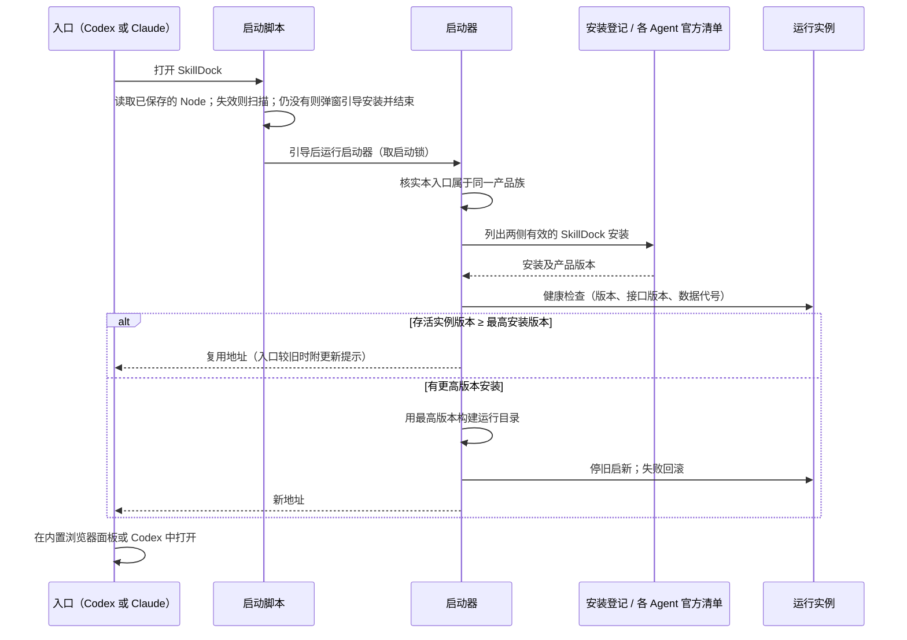
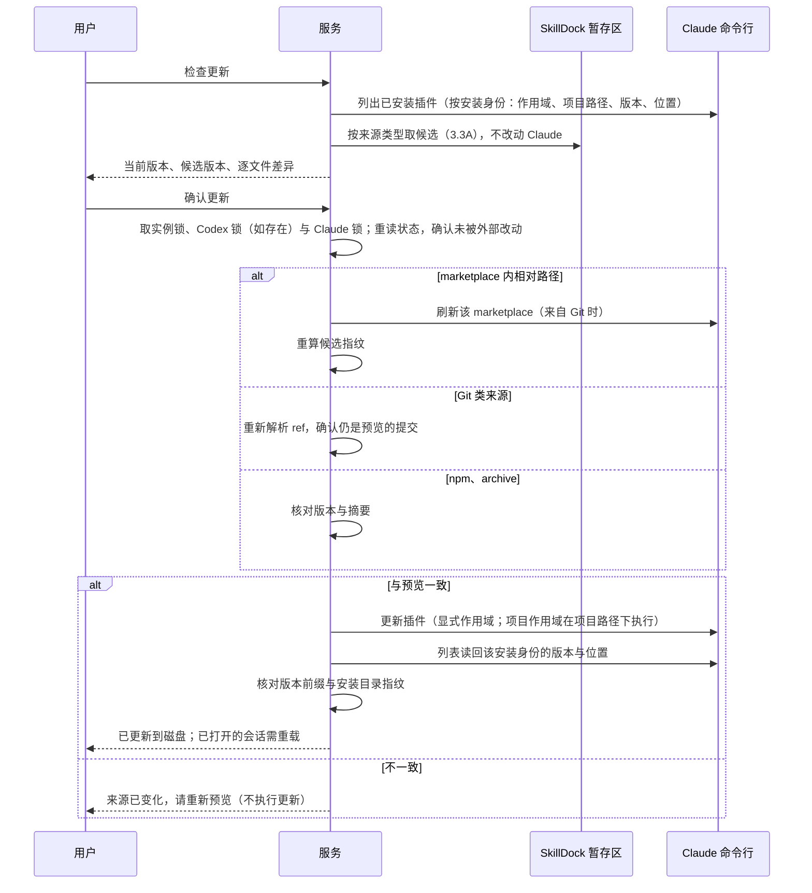
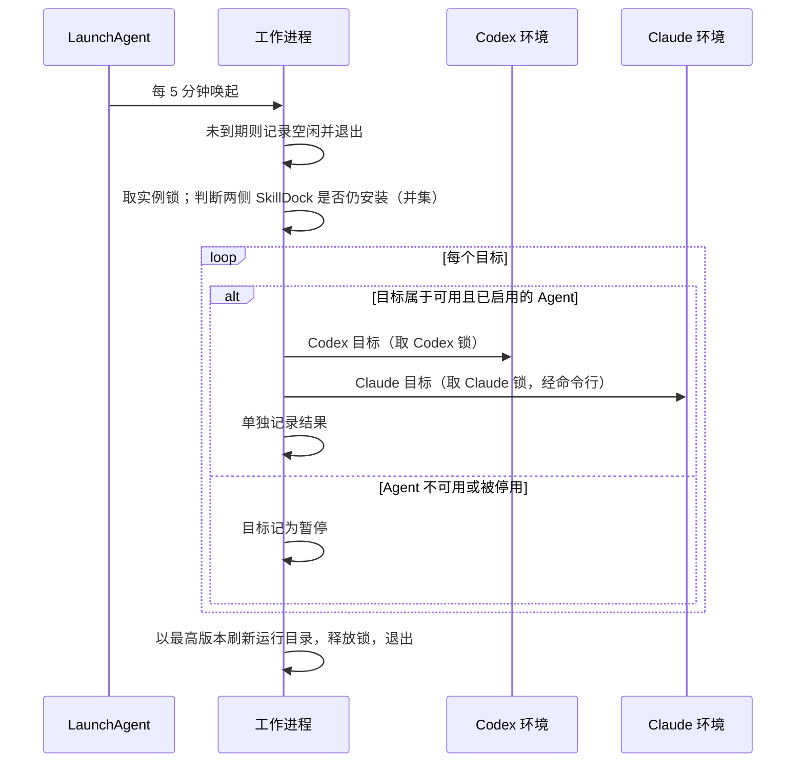
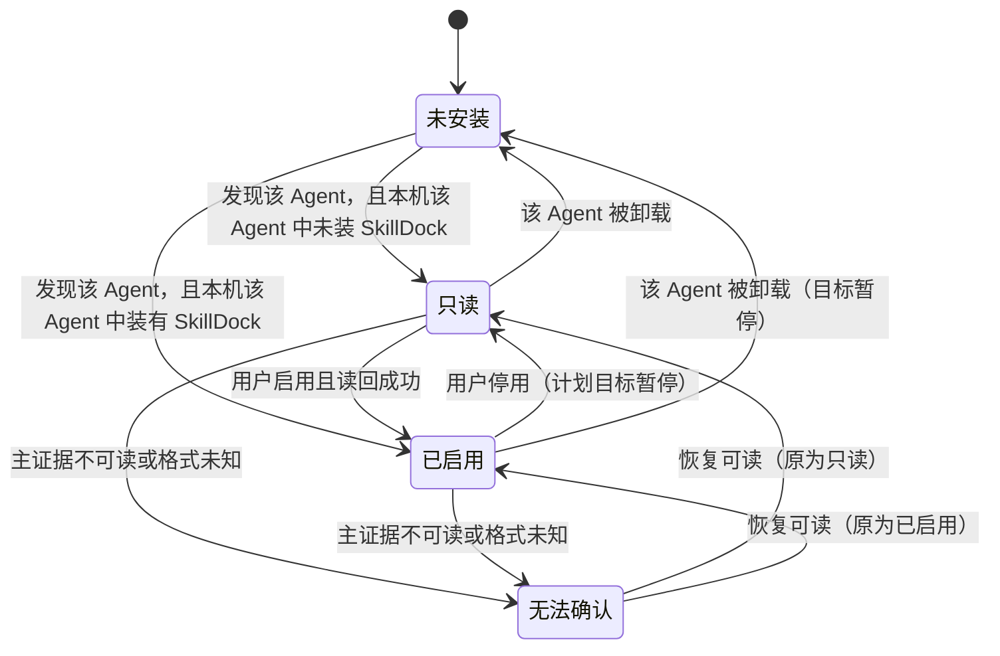
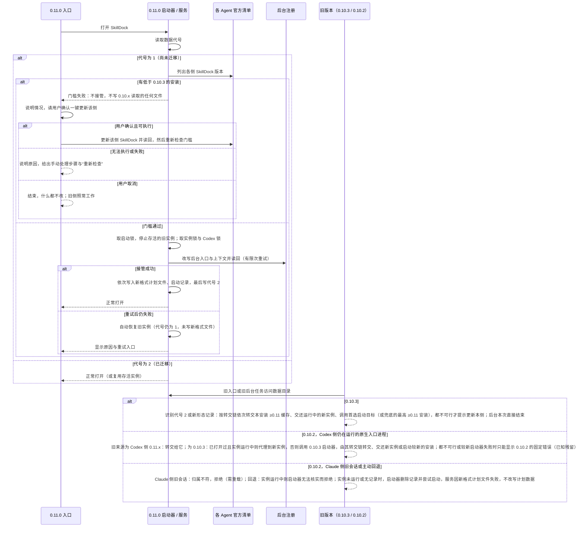

# SkillDock 跨 Agent 管理（Codex + Claude）技术设计

<!-- TRACEABILITY-METADATA:BEGIN -->
```yaml
schema:
  name: testany-traceability
  version: "1.0.0"
  profile: hld-profile-v1
artifact:
  id: HLD-SDX-001
  type: HLD
  title: SkillDock 跨 Agent 管理（Codex + Claude）技术设计
  status: approved
  owners:
    - engineering.claude
    - product.user
  created_at: "2026-10-07"
  updated_at: "2026-10-08"
  source_documents:
    - PRD-SKILLDOCK-002
entities:
  requirements: []
  risks: []
  must_not_regress: []
  external_behaviors: []
  decisions:
    - id: DEC-SDX-001
      title: 以 Agent 适配器扩展现有环境模型
      statement: 在服务现有的环境集合中，把“本机”拆为按 Agent 划分的环境；每个环境由发现根、配置存储、插件管理适配器和写锁组成，Codex 沿用现有实现，Claude 新增一套。
      status: approved
      scope: in
      decision: 保留 local / sandbox 的请求语义，在 local 内部按 Agent 组织环境；Codex 环境原样复用，Claude 环境新增适配器
      rationale: 现有服务已按环境组织扫描、边界与写入（service.mjs 的 environments），扩展该结构的改动面最小，并能保证只启用 Codex 时行为不变。
      source_refs:
        - artifact_id: PRD-SKILLDOCK-002
          note: REQ-SDX-001、MR-SDX-001
    - id: DEC-SDX-002
      title: API 契约只做向后兼容的增量
      statement: 对象与操作请求增加 Agent 维度，快照增加环境列表，健康检查增加应用版本、接口版本和数据代号；未声明支持多 Agent 的客户端只看到 Codex 对象。
      status: approved
      scope: in
      decision: 只新增字段与可选参数，不改变已有字段语义；客户端未声明多 Agent 时，读取结果只含 Codex 对象，写请求缺省视为 Codex
      rationale: 较新服务会被较旧的 Codex 原生界面通过 MCP 代理访问，增量兼容可避免旧界面误操作 Claude 对象。
      source_refs:
        - artifact_id: PRD-SKILLDOCK-002
          note: REQ-SDX-003、REQ-SDX-007
    - id: DEC-SDX-003
      title: Claude 写操作经官方命令行
      statement: Claude 插件与 marketplace 的安装、更新、卸载、启停、添加、刷新、移除全部通过 Claude 官方命令行的机器可读输出完成，不直接改写 Claude 的记录文件。
      status: approved
      scope: in
      decision: 使用 Claude 命令行（桌面应用自带或用户已安装）的白名单子命令，参数数组调用、不经过 shell，执行后读回
      rationale: 官方命令行与 GUI 写入同一套设置；Claude 的记录文件不是公开契约，直接改写会随版本失效（RISK-SDX-002）。
      source_refs:
        - artifact_id: PRD-SKILLDOCK-002
          note: REQ-SDX-004、REQ-SDX-015、REQ-SDX-016、8.3 第 3 条
    - id: DEC-SDX-004
      title: Claude 清单以官方列表为主证据
      statement: Claude 插件与 marketplace 清单以命令行列表输出为主证据，文件系统只作补充；格式未知或不可读时该环境降级为“无法确认”并禁用写操作。
      status: approved
      scope: in
      decision: 官方列表为准，缓存目录、marketplace 副本与设置文件只读补充，未知格式降级
      rationale: 列表输出已包含启用状态、作用域、版本与安装位置，比解析内部文件稳定。
      source_refs:
        - artifact_id: PRD-SKILLDOCK-002
          note: REQ-SDX-002
    - id: DEC-SDX-005
      title: 先在自有暂存区预览，应用前再核对
      statement: 检查更新时在 SkillDock 自己的暂存区取得候选内容并与已安装目录比较；应用前按来源类型再次核对候选（Git 来源重新解析提交，目录与 marketplace 来源重算指纹），一致才执行更新并读回版本与内容指纹。各来源规则见 DEC-SDX-026。
      status: approved
      scope: in
      decision: 检查阶段不改动 Claude；应用前核对，不一致即中止并要求重新预览；应用后按来源类型读回
      rationale: 保证“看到的就是要装的”，避免 marketplace 在预览后移动导致装入未预览的版本。
      source_refs:
        - artifact_id: PRD-SKILLDOCK-002
          note: REQ-SDX-004
    - id: DEC-SDX-006
      title: Claude 独立技能可见性写入设置文件
      statement: Claude 独立技能的启禁写入 Claude 设置中的技能可见性条目；个人技能写用户设置，项目技能默认写本地设置，写项目共享设置需逐次确认。
      status: approved
      scope: in
      decision: 结构化 JSON 补丁，只改对应条目，写前写后摘要核对、原子替换、读回
      rationale: Claude 没有修改技能可见性的命令行；结构化补丁可保留其他键，写前摘要核对只能缩小与 Claude 并发写入的冲突窗口（Claude 不使用 SkillDock 的锁），冲突时中止并提示。
      source_refs:
        - artifact_id: PRD-SKILLDOCK-002
          note: REQ-SDX-012、REQ-SDX-016（5.6 独立技能启禁）
    - id: DEC-SDX-007
      title: 数据目录归属放宽到同一产品族
      statement: 数据目录可被同一 marketplace 名与插件名的 SkillDock 安装接管，无论它位于 Codex 还是 Claude 的插件缓存；其他来源仍拒绝接管。
      status: approved
      scope: in
      decision: 归属键为“marketplace 名 + 插件名 + marketplace 来源标识（规范化的来源地址）”，安装必须位于已识别 Agent 的插件缓存并可核实；来源不一致、开发源码与其他 marketplace 继续拒绝
      rationale: 两个 Agent 的 SkillDock 是同一产品的不同入口，应共用实例；保留对陌生来源的拒绝，维持现有安全边界。
      source_refs:
        - artifact_id: PRD-SKILLDOCK-002
          note: REQ-SDX-007
    - id: DEC-SDX-008
      title: 以产品版本选择运行源（最新者运行）
      statement: 启动、重启、后台刷新时，从所有 Agent 中仍有效的 SkillDock 安装里选择产品版本最高者作为运行源；产品版本取自应用自身的版本号，而非宿主缓存目录名。
      status: approved
      scope: in
      decision: 较旧入口遇到不低于自身版本的运行实例时复用；任一 Agent 出现更高版本时走现有重启协调器切换
      rationale: Claude 对无 manifest 插件以提交摘要命名缓存目录，无法比较；应用版本号在两侧一致且可比较。现有原生入口已有“不降级”逻辑，可推广。
      source_refs:
        - artifact_id: PRD-SKILLDOCK-002
          note: REQ-SDX-007、8.3 第 1 条
    - id: DEC-SDX-009
      title: 数据代号与接口版本
      statement: 数据目录记录数据代号，健康检查公开应用版本、接口版本与数据代号；服务、后台任务、自更新协调器、原生入口与启动器在写前都检查代号，遇到更高代号只读并提示更新；后台刷新运行目录时不得切换到不支持当前代号的版本。
      status: approved
      scope: in
      decision: 引入数据代号与接口版本，覆盖全部写入方；无可用的兼容版本时暂停计划，不降级运行
      rationale: 防止某侧卸载较新版本后，较旧版本改写较新格式的数据。
      source_refs:
        - artifact_id: PRD-SKILLDOCK-002
          note: REQ-SDX-007、MR-SDX-002
    - id: DEC-SDX-010
      title: 实例锁加各 Agent 配置锁
      statement: 所有写操作先取实例级写锁，再按固定顺序取所涉 Agent 的配置锁；Codex 沿用现有配置根锁，Claude 使用同一模式的配置根锁。
      status: approved
      scope: in
      decision: 固定顺序“实例锁 → Codex 锁 → Claude 锁”；共享状态（计划、运行记录、后台状态、启动记录）的写入在 Codex 配置根存在时一律同时持有 Codex 锁；取锁不得创建任何 Agent 的根目录
      rationale: 保留与旧版本在 Codex 写入上的互斥，同时覆盖新增的 Claude 写入；固定顺序避免死锁。
      source_refs:
        - artifact_id: PRD-SKILLDOCK-002
          note: REQ-SDX-006、REQ-SDX-016
    - id: DEC-SDX-011
      title: 单一后台任务覆盖两个 Agent
      statement: 沿用按数据目录命名的唯一 LaunchAgent；计划目标携带 Agent；“SkillDock 是否仍安装”按所有 Agent 的并集判断；某 Agent 不可用时其目标暂停。
      status: approved
      scope: in
      decision: 一个计划、一个后台任务；目标按 Agent 分派执行并分别记录
      rationale: 现有后台任务已与宿主是否打开无关，只需把宿主判断从 Codex 扩展到两侧。
      source_refs:
        - artifact_id: PRD-SKILLDOCK-002
          note: REQ-SDX-006、8.3 第 4 条
    - id: DEC-SDX-012
      title: 运行环境：扫描本机 Node、保存复用、找不到时引导安装
      statement: 按固定顺序扫描本机 Node.js，选第一个通过核验的并把路径保存到 SkillDock 设置，之后复用、失效时重扫；扫描不到时以 macOS 对话框引导安装，不自动下载。规则对 Codex 与 Claude 统一。
      status: approved
      scope: in
      decision: 停用自动下载；扫描顺序为“显式指定 → 已保存 → Codex 工作区 → 已下载的私有 Node → 常见安装位置 → 版本管理器 → PATH”，应用包内 Node 只用于引导；弹窗不阻塞调用方，`native.sh` 与后台任务不弹窗；单一可执行文件不采用
      rationale: Owner 决定（PRD 0.3）；复用用户已有的工具链，SkillDock 不再下载并执行可执行文件；保留 Codex 自带与已下载的私有 Node 作为扫描对象，现有用户不退化。
      source_refs:
        - artifact_id: PRD-SKILLDOCK-002
          note: REQ-SDX-009（0.3 修订）、MR-SDX-001 例外说明
    - id: DEC-SDX-013
      title: Claude 分发不新增 manifest
      statement: skilldock 插件不新增 Claude manifest；Claude 以 marketplace 条目和默认目录加载技能与命令；Codex 专用 MCP 配置改名并由 Codex manifest 显式引用；技能说明改为宿主中立。
      status: approved
      scope: in
      decision: 遵守仓库“单一 manifest”规则，借默认目录在 Claude 中分发，避免 Claude 默认加载 Codex 原生入口
      rationale: 仓库校验器拒绝同一插件同时存在两份 manifest；Claude 默认加载插件根目录的 MCP 配置，而 Code 标签页不渲染第三方 MCP App。
      source_refs:
        - artifact_id: PRD-SKILLDOCK-002
          note: REQ-SDX-008、REQ-SDX-017
    - id: DEC-SDX-014
      title: 仅支持 Codex 的插件在 marketplace 条目中标注
      statement: 共享 marketplace 中仅支持 Codex 的插件，在条目说明中标注支持的 Agent；SkillDock 把“只有 Codex manifest”作为作者声明证据。
      status: approved
      scope: in
      decision: 本期以标注满足 REQ-SDX-017；为两宿主拆分 marketplace 文件作为后续选项，先验证 Codex 的读取优先级
      rationale: 两个宿主共用同一 marketplace 文件，标注是无需改变发现规则的最小改动。
      source_refs:
        - artifact_id: PRD-SKILLDOCK-002
          note: REQ-SDX-017
    - id: DEC-SDX-015
      title: 兼容性推断分两步落地
      statement: 0.11.0 只在安装预览中展示作者声明证据；完整的四级证据推断、结论、操作限制与用户确认在 P1 里程碑实现。
      status: approved
      scope: in
      decision: 0.11.0 交付证据展示，完整推断随 REQ-SDX-010、011 交付
      rationale: P0 的能力对等不依赖完整推断；先展示最强证据可降低误装，同时控制首个版本范围。
      source_refs:
        - artifact_id: PRD-SKILLDOCK-002
          note: REQ-SDX-011、REQ-SDX-014
    - id: DEC-SDX-016
      title: 同源对象的归组键
      statement: 插件以 marketplace 名加插件名归组，Git 来源技能以规范化仓库地址加子路径归组，本地来源以真实路径归组。
      status: approved
      scope: in
      decision: 采用上述归组键，ref 不参与归组
      rationale: 两侧通常从同名 marketplace 或同一仓库安装；ref 不同仍属同一上游，只是版本不同。
      source_refs:
        - artifact_id: PRD-SKILLDOCK-002
          note: REQ-SDX-010
    - id: DEC-SDX-017
      title: 能力对照表落为对象级能力标记
      statement: 5.6 对照表的每一行映射为 Claude 适配器的能力与原因；界面沿用现有的可操作标记与原因字段，不为 Claude 另写一套页面。
      status: approved
      scope: in
      decision: 复用对象的 canToggle、canRemove、canUpdate、reason 等字段表达对等、调整与不提供
      rationale: 现有界面已按这些字段显示入口与原因，复用可保证两侧体验一致。
      source_refs:
        - artifact_id: PRD-SKILLDOCK-002
          note: REQ-SDX-016
    - id: DEC-SDX-018
      title: 环境启用状态的默认值
      statement: 本机装有 SkillDock 的 Agent 默认启用管理，其他被发现的 Agent 默认只读；状态持久化在数据目录，启用前需读回验证。
      status: approved
      scope: in
      decision: 以 SkillDock 自身的安装分布决定默认启用
      rationale: 满足“从哪侧安装就管理哪侧”，并保证 Codex 现有用户不被动开始写 Claude。
      source_refs:
        - artifact_id: PRD-SKILLDOCK-002
          note: REQ-SDX-001
    - id: DEC-SDX-019
      title: 命令行调用的安全约束
      statement: Claude 命令行调用沿用 Codex 适配器的约束：白名单子命令、参数数组、不经过 shell、超时与输出上限、错误脱敏；从不自动接受 marketplace 声明的命令。
      status: approved
      scope: in
      decision: 不传递自动确认参数；需要接受命令的插件标为不由 SkillDock 更新
      rationale: 自动接受等于替用户执行第三方命令，超出 SkillDock 的授权边界。
      source_refs:
        - artifact_id: PRD-SKILLDOCK-002
          note: REQ-SDX-012
    - id: DEC-SDX-020
      title: Claude 独立技能复用现有文件事务
      statement: Claude 个人与项目技能的安装、来源关联、更新、可恢复移除与恢复，复用现有文件事务、来源记录与隔离区；来源记录按 Agent 分区保存。
      status: approved
      scope: in
      decision: 复用，不为 Claude 另建文件操作实现；写入目标增加 Claude 根，来源记录按 Agent 分区
      rationale: 现有事务已覆盖预览、指纹核对、原子移动、本地修改保护与恢复，并经过多轮回归；分区可避免两侧同名路径混淆。
      source_refs:
        - artifact_id: PRD-SKILLDOCK-002
          note: REQ-SDX-005、MR-SDX-003
    - id: DEC-SDX-027
      title: 跨版本兼容测试矩阵作为发布关口
      statement: 实现阶段必须定义并实现一套可执行的跨版本兼容测试矩阵：用已发布的 0.10.2 与将发布的 0.10.3 的真实代码，在隔离目录中对 0.11.x 写下的各种状态逐情形运行，断言“不接管、不改写计划数据、能转交时转交、该提示时提示”；矩阵通过是 0.10.3 与 0.11.0 合并发布的前提。
      status: approved
      scope: in
      decision: 以历轮评审与作者的实验脚本为种子，并按 3.13A 补齐维度（原生入口真实子进程、是否已打开过、有无 project.json、实例存活或未运行或 pid 失效、Codex 侧只有 0.10.3、旧来源所指缓存被删、installation 取值、0.10.3 转交链）；每个用例的期望结果从 PRD 与 HLD（含已登记残留）推出，期望结果表放在 API 契约附录并随契约评审；0.10.3 关口用按 5.4 手写的 0.11.x 样本，0.11.0 关口改用真实 0.11.0 写下的记录重跑；只要仍声明与 0.10.x 共存，之后每次发布都跑；只用预置运行目录与本地依赖，不联网
      rationale: 过渡期问题集中在与已冻结旧代码的组合情形，五轮推演每轮都发现新组合；把已知组合固化为可重复运行的回归用例，比继续纸面推演更可靠。矩阵不能替代：发现新维度（仍须逐条读冻结代码）、5.4 契约本身的设计评审、真实宿主行为（V13、V14、V17、V18）与产品决定。
      source_refs:
        - artifact_id: PRD-SKILLDOCK-002
          note: REQ-SDX-007、MR-SDX-002；Owner 要求以兼容测试矩阵作为关口（BRIEF-SDX-007）
    - id: DEC-SDX-021
      title: 先发布 0.10.3 过渡版
      statement: 0.10.3 不含跨 Agent 管理功能，只增加识别、交还、按记录调用已核实的较新安装的启动脚本与提示；它遇到数据代号 ≥2（无论有无启动记录）或 0.11.x 写入的启动记录时，从不自己接管，不改写计划、绑定、历史等数据，不停用或注销后台任务，并在解析工具链、下载 Node 或构建之前按“转交链”处理：①本安装（含 Claude 插件缓存，读缓存内应用版本、忽略废弃目录）中有支持代号 2 的最高版本缓存（≥0.11.0），就转交给它；②否则启动记录新字段中的“运行中的安装”对应的 ≥0.11.0 实例经核实在运行，就以退出码 0 交还给调用方，不改写启动记录；③否则调用新字段中“首选启动目标”的启动脚本（须属同一已核实来源、仍存在、未带废弃标记且 ≥0.11.0），不可用时改取各 Agent 中同一已核实来源、未带废弃标记的最高 ≥0.11.0 安装；④都不可行时提示“请把本侧 SkillDock 更新到 0.11 或更高”。0.10.3 不读取启动记录的旧来源与旧项目字段，转交时原样转发收到的 `--project`（没收到就不带），工作目录改用数据目录；只在转交链触发后只读“Claude 根目录记录”；提示由入口自身输出；同时修正 0.10.2 原生入口错误路径的导入缺陷。
      status: approved
      scope: in
      decision: 0.10.3 先于 0.11.0 合并发布；识别规则与 0.11.0 的数据代号和启动记录形态对齐
      rationale: Owner 不接受过渡期限制（PRD 0.4）；0.10.2 及更早代码无法修改，只能先发一个能识别新数据的版本，让大多数用户在 0.11.0 前完成过渡。
      source_refs:
        - artifact_id: PRD-SKILLDOCK-002
          note: REQ-SDX-007（0.4 修订）
    - id: DEC-SDX-022
      title: 0.11.0 的迁移门槛、接管顺序与启动记录
      statement: 0.11.0 在数据代号仍为旧值时先过门槛：只判断各 Agent 中是否装有低于 0.10.3 的 SkillDock（命令行不可用时用只读的缓存与安装记录兜底），有则不接管、不写任何旧版本会读取的文件，由入口引导一键更新该侧，一键更新不可执行或失败时给出手动处理步骤与重新检查。门槛通过后，先取与 0.10.x 共用的启动锁、再停掉存活的旧实例，然后在锁内接管后台注册（失败则自动恢复旧实例），再按“新格式计划文件 → 启动记录 → 数据代号 2”的顺序写入。启动记录中供 0.10.x 读取的旧字段：来源取 Codex 侧同一已核实来源中最高版本的 SkillDock 缓存（≥0.10.3），Codex 侧没有安装时取当前运行安装；installation 旧字段取与旧来源对应的 Codex 安装身份；项目字段取数据目录内由 0.11.x 创建并保持存在的固定子目录（与健康检查返回的项目不同），使 0.10.2 启动器无法核实实例，而 0.10.2 原生入口能以它为工作目录正常转交。Codex 侧缓存变化时在锁内刷新这些旧字段。0.11.0 自己停止时不删除启动记录。新格式计划文件迁移后必写、永不删除。
      status: approved
      scope: in
      decision: 门槛只看“是否存在低于 0.10.3 的安装”，并给出更新不可执行时的手动出路；接管与写入顺序固定，失败自动恢复；启动记录的旧字段按上述规则写（Owner“用户体验优先”）；回退防线以必写的新格式计划文件为主，辅以 0.10.3 的识别与“启动器无法核实实例”；对 0.10.2 冻结代码的兼容约束登记在 5.4，由兼容测试矩阵（DEC-SDX-027）把关；迁移只由 0.11.0 的启动器或服务执行
      rationale: 第 3～5 轮评审：只读打开、“清单无法确认即失败”与“更新不可执行即无路”都会让用户无路可走；Owner 选择用户体验更好的处理（PRD BRIEF-SDX-006～008）。评审实验证实：来源取同一 Codex 安装的较新缓存时，已加载的 0.10.2 原生进程会转交（第 3 轮 B、第 4 轮 L1、第 5 轮 E2、E7b）；项目字段与健康检查不一致时 0.10.2 启动器拒绝停止或接管（第 4 轮 K3），但该字段必须是存在的目录，否则首次打开的面板转交失败（第 5 轮 E1）；新格式计划文件使 0.10.2 服务启动失败且不改写计划数据（V16）。
      source_refs:
        - artifact_id: PRD-SKILLDOCK-002
          note: REQ-SDX-007（0.4 修订）、MR-SDX-002
    - id: DEC-SDX-023
      title: Claude 插件安装身份含作用域与项目路径
      statement: Claude 插件的安装身份为“Agent + 插件@marketplace + 作用域 + 项目路径（project 与 local 作用域）”；技能目录插件为“名称@skills-dir + 所在技能目录”。对象 ID、计划目标、绑定、读回与命令行调用（显式作用域、项目作用域时以项目路径为工作目录）都使用该身份。
      status: approved
      scope: in
      decision: 采用上述安装身份；命令行调用一律显式传作用域，不使用自动判断
      rationale: 实测同一插件可同时以 user 与 project 作用域安装且版本不同（评审复现）；不区分会导致更新、启停与读回指向错误的安装。
      source_refs:
        - artifact_id: PRD-SKILLDOCK-002
          note: REQ-SDX-002、004、015、016
    - id: DEC-SDX-024
      title: Claude 根目录持久化与进程环境白名单
      statement: Claude 配置根与插件缓存根在发现或启用时确定；门槛通过前只写入 0.10.2 不读取的新文件（其中的“Claude 根目录记录”仅供 0.10.3 在转交链触发后只读，格式随 0.10.3 冻结），迁移完成后再写入后台上下文；之后各入口与后台任务都使用保存值；服务与命令行子进程只继承白名单内的环境变量，剔除 Claude 与 Codex 的会话变量。
      status: approved
      scope: in
      decision: 根目录来源优先级为“SkillDock 设置中的显式指定 → 从 Claude 入口启动时记录的会话值 → 默认值”；新入口给出不同值时提示用户确认切换；进程环境按白名单构造
      rationale: 现有 Codex 设计已把配置根写入启动记录与后台上下文；只读当前进程环境会使结果取决于最先从哪个入口打开，并让会话凭据在长驻进程中残留。
      source_refs:
        - artifact_id: PRD-SKILLDOCK-002
          note: REQ-SDX-001、REQ-SDX-006、REQ-SDX-012
    - id: DEC-SDX-025
      title: Claude 侧从本地目录或 Git 安装插件
      statement: 来源带 Claude manifest 时，以技能目录插件方式放入目标技能目录，生命周期复用独立技能的来源追踪与隔离区，项目范围的启停默认用 local 作用域；来源没有 Claude manifest 时，与 Codex 侧现有做法一致，在数据目录生成 SkillDock 管理的本地 marketplace 再经命令行安装（只用 user、local 作用域），并规定清理与迁移。
      status: approved
      scope: in
      decision: 有 manifest 走技能目录插件；无 manifest 走 SkillDock 管理的本地 marketplace；兼容性结论为“不兼容”时不提供
      rationale: 实测技能目录插件无需 marketplace，也不在 Claude 设置中留下指向 SkillDock 数据目录的条目；无 manifest 的插件只能经 marketplace 加载，Codex 侧已有同类依赖并已发布。
      source_refs:
        - artifact_id: PRD-SKILLDOCK-002
          note: REQ-SDX-016（5.6 安装插件）
    - id: DEC-SDX-026
      title: 候选内容与读回规则按来源类型区分
      statement: Git 类来源以该提交的已跟踪文件为候选，应用前重新解析提交，读回时版本前缀须等于预览提交；本地目录 marketplace 以整个目录快照为候选；npm 与 archive 来源下载到暂存区生成差异；“是否需要更新”按内容指纹判断，不按版本字符串。
      status: approved
      scope: in
      decision: 采用按来源类型的候选与读回规则；指纹排除 Claude 的废弃标记与其依赖安装产生的目录
      rationale: 实测 Git 来源缓存恰为该提交的已跟踪文件，本地目录 marketplace 会复制被忽略与未跟踪文件；Owner 决定 npm、archive 也提供差异（PRD 0.4 记录）。
      source_refs:
        - artifact_id: PRD-SKILLDOCK-002
          note: REQ-SDX-004、MR-SDX-003
  flows:
    - id: FLOW-SDX-001
      title: 入口启动与版本收敛
      statement: 任一 Agent 的入口启动时，核实归属、发现所有 SkillDock 安装、选出最高版本，复用或切换运行实例。
      status: approved
      scope: in
      kind: system_flow
      source_refs:
        - artifact_id: PRD-SKILLDOCK-002
          note: REQ-SDX-007、REQ-SDX-008
    - id: FLOW-SDX-002
      title: Claude 插件更新（检查、预览、应用、读回）
      statement: 在暂存区取候选并生成差异，用户确认后刷新 marketplace、核对指纹、经命令行更新并读回版本与内容。
      status: approved
      scope: in
      kind: system_flow
      source_refs:
        - artifact_id: PRD-SKILLDOCK-002
          note: REQ-SDX-004
    - id: FLOW-SDX-003
      title: 跨 Agent 后台计划运行
      statement: 后台任务到期后取锁，判断各 Agent 可用性，按目标所属 Agent 分派执行，分别记录结果，最后刷新运行目录。
      status: approved
      scope: in
      kind: system_flow
      source_refs:
        - artifact_id: PRD-SKILLDOCK-002
          note: REQ-SDX-006
    - id: FLOW-SDX-004
      title: Agent 环境管理状态
      statement: 环境在未安装、只读、已启用、无法确认之间转换；启用需读回，停用使计划目标暂停。
      status: approved
      scope: in
      kind: state_transition
      source_refs:
        - artifact_id: PRD-SKILLDOCK-002
          note: REQ-SDX-001
    - id: FLOW-SDX-005
      title: 两边都更新到最新
      statement: 对同源组逐侧执行各自 Agent 的更新流程并分别读回，一侧失败不回滚另一侧。
      status: approved
      scope: in
      kind: system_flow
      source_refs:
        - artifact_id: PRD-SKILLDOCK-002
          note: REQ-SDX-010
    - id: FLOW-SDX-006
      title: 0.10.3 与 0.11.0 的共存与迁移
      statement: 0.11.0 首次运行时检查各侧版本，低于 0.10.3 则引导更新；随后在锁内接管后台注册、写入新数据代号与新形态启动记录；0.10.3 遇到新数据时只提示不写。
      status: approved
      scope: in
      kind: system_flow
      source_refs:
        - artifact_id: PRD-SKILLDOCK-002
          note: REQ-SDX-007（0.4 修订）
  test_cases: []
relations:
  - {id: REL-HSDX-001, type: refines, from: DEC-SDX-001, to: REQ-SDX-001, status: active}
  - {id: REL-HSDX-002, type: refines, from: DEC-SDX-001, to: PRD-SKILLDOCK-002, status: active, note: "MR-SDX-001"}
  - {id: REL-HSDX-003, type: refines, from: DEC-SDX-002, to: REQ-SDX-003, status: active}
  - {id: REL-HSDX-004, type: refines, from: DEC-SDX-002, to: REQ-SDX-007, status: active}
  - {id: REL-HSDX-005, type: refines, from: DEC-SDX-003, to: REQ-SDX-004, status: active}
  - {id: REL-HSDX-006, type: refines, from: DEC-SDX-003, to: REQ-SDX-015, status: active}
  - {id: REL-HSDX-007, type: refines, from: DEC-SDX-003, to: REQ-SDX-016, status: active}
  - {id: REL-HSDX-008, type: refines, from: DEC-SDX-004, to: REQ-SDX-002, status: active}
  - {id: REL-HSDX-009, type: refines, from: DEC-SDX-005, to: REQ-SDX-004, status: active}
  - {id: REL-HSDX-010, type: refines, from: DEC-SDX-005, to: PRD-SKILLDOCK-002, status: active, note: "MR-SDX-003"}
  - {id: REL-HSDX-011, type: refines, from: DEC-SDX-006, to: REQ-SDX-012, status: active}
  - {id: REL-HSDX-012, type: refines, from: DEC-SDX-006, to: REQ-SDX-016, status: active}
  - {id: REL-HSDX-013, type: refines, from: DEC-SDX-007, to: REQ-SDX-007, status: active}
  - {id: REL-HSDX-014, type: refines, from: DEC-SDX-008, to: REQ-SDX-007, status: active}
  - {id: REL-HSDX-015, type: refines, from: DEC-SDX-009, to: REQ-SDX-007, status: active}
  - {id: REL-HSDX-016, type: refines, from: DEC-SDX-009, to: PRD-SKILLDOCK-002, status: active, note: "MR-SDX-002"}
  - {id: REL-HSDX-017, type: refines, from: DEC-SDX-010, to: REQ-SDX-006, status: active}
  - {id: REL-HSDX-018, type: refines, from: DEC-SDX-010, to: REQ-SDX-016, status: active}
  - {id: REL-HSDX-019, type: refines, from: DEC-SDX-011, to: REQ-SDX-006, status: active}
  - {id: REL-HSDX-020, type: refines, from: DEC-SDX-012, to: REQ-SDX-009, status: active}
  - {id: REL-HSDX-021, type: refines, from: DEC-SDX-012, to: PRD-SKILLDOCK-002, status: active, note: "MR-SDX-001"}
  - {id: REL-HSDX-022, type: refines, from: DEC-SDX-013, to: REQ-SDX-008, status: active}
  - {id: REL-HSDX-023, type: refines, from: DEC-SDX-013, to: REQ-SDX-017, status: active}
  - {id: REL-HSDX-024, type: refines, from: DEC-SDX-013, to: REQ-SDX-013, status: active}
  - {id: REL-HSDX-025, type: refines, from: DEC-SDX-014, to: REQ-SDX-017, status: active}
  - {id: REL-HSDX-026, type: refines, from: DEC-SDX-015, to: REQ-SDX-011, status: active}
  - {id: REL-HSDX-027, type: refines, from: DEC-SDX-015, to: REQ-SDX-014, status: active}
  - {id: REL-HSDX-028, type: refines, from: DEC-SDX-016, to: REQ-SDX-010, status: active}
  - {id: REL-HSDX-029, type: refines, from: DEC-SDX-017, to: REQ-SDX-016, status: active}
  - {id: REL-HSDX-030, type: refines, from: DEC-SDX-018, to: REQ-SDX-001, status: active}
  - {id: REL-HSDX-031, type: refines, from: DEC-SDX-019, to: REQ-SDX-012, status: active}
  - {id: REL-HSDX-032, type: refines, from: FLOW-SDX-001, to: REQ-SDX-007, status: active}
  - {id: REL-HSDX-033, type: refines, from: FLOW-SDX-001, to: REQ-SDX-008, status: active}
  - {id: REL-HSDX-034, type: refines, from: FLOW-SDX-002, to: REQ-SDX-004, status: active}
  - {id: REL-HSDX-035, type: refines, from: FLOW-SDX-003, to: REQ-SDX-006, status: active}
  - {id: REL-HSDX-036, type: refines, from: FLOW-SDX-004, to: REQ-SDX-001, status: active}
  - {id: REL-HSDX-037, type: refines, from: FLOW-SDX-005, to: REQ-SDX-010, status: active}
  - {id: REL-HSDX-038, type: refines, from: DEC-SDX-002, to: REQ-SDX-013, status: active}
  - {id: REL-HSDX-039, type: refines, from: DEC-SDX-004, to: REQ-SDX-005, status: active}
  - {id: REL-HSDX-040, type: refines, from: DEC-SDX-020, to: REQ-SDX-005, status: active}
  - {id: REL-HSDX-041, type: refines, from: DEC-SDX-020, to: PRD-SKILLDOCK-002, status: active, note: "MR-SDX-003"}
  - {id: REL-HSDX-042, type: refines, from: DEC-SDX-021, to: REQ-SDX-007, status: active}
  - {id: REL-HSDX-043, type: refines, from: DEC-SDX-022, to: REQ-SDX-007, status: active}
  - {id: REL-HSDX-044, type: refines, from: DEC-SDX-022, to: PRD-SKILLDOCK-002, status: active, note: "MR-SDX-002"}
  - {id: REL-HSDX-045, type: refines, from: DEC-SDX-023, to: REQ-SDX-004, status: active}
  - {id: REL-HSDX-046, type: refines, from: DEC-SDX-023, to: REQ-SDX-015, status: active}
  - {id: REL-HSDX-047, type: refines, from: DEC-SDX-023, to: REQ-SDX-016, status: active}
  - {id: REL-HSDX-048, type: refines, from: DEC-SDX-023, to: REQ-SDX-002, status: active}
  - {id: REL-HSDX-049, type: refines, from: DEC-SDX-024, to: REQ-SDX-001, status: active}
  - {id: REL-HSDX-050, type: refines, from: DEC-SDX-024, to: REQ-SDX-006, status: active}
  - {id: REL-HSDX-051, type: refines, from: DEC-SDX-024, to: REQ-SDX-012, status: active}
  - {id: REL-HSDX-052, type: refines, from: DEC-SDX-025, to: REQ-SDX-016, status: active}
  - {id: REL-HSDX-053, type: refines, from: DEC-SDX-026, to: REQ-SDX-004, status: active}
  - {id: REL-HSDX-054, type: refines, from: DEC-SDX-026, to: PRD-SKILLDOCK-002, status: active, note: "MR-SDX-003"}
  - {id: REL-HSDX-055, type: refines, from: FLOW-SDX-006, to: REQ-SDX-007, status: active}
  - {id: REL-HSDX-056, type: refines, from: DEC-SDX-027, to: REQ-SDX-007, status: active}
  - {id: REL-HSDX-057, type: refines, from: DEC-SDX-027, to: PRD-SKILLDOCK-002, status: active, note: "MR-SDX-002"}
waivers: []
```
<!-- TRACEABILITY-METADATA:END -->

## 元信息

| 项目 | 内容 |
|------|------|
| 关联 PRD | [PRD-SKILLDOCK-002 v0.8（已批准）](34-cross-agent-prd.md) |
| API 契约 | `assets/app/shared/contracts.ts`（按 [工程设计](03-engineering-design.md) 的约定，wire 类型以该文件为唯一事实源；无独立 API 工件编号）。本文第 5 节只列契约增量范围与兼容约束，具体类型在实现阶段更新该文件 |
| 版本 | 1.1 |
| 作者 | Claude（起草） |
| 创建日期 | 2026-10-07 |
| 状态 | 已批准（产品 Owner：用户，2026-10-08）。历经 9 轮独立评审：第 6 轮（[报告](35-cross-agent-hld-review-r6.md)）对 v0.8 签发带条件的 HLD 准出证书，第 7 轮（[报告](35-cross-agent-hld-review-r7.md)）延续到 v0.9；v1.0 按第 7 轮 P2 修订并写入批准，第 8 轮（[报告](35-cross-agent-hld-review-r8.md)）核对后重新绑定；v1.1 修掉第 8 轮的 5 项 P2，并落地 Owner“不写 LLD”的决定，经第 9 轮核对改动行后重新绑定。证书条件见 11A |
| 目标版本 | `skilldock` 0.10.3（过渡版，先发布）→ 0.11.0 |

## PRD↔HLD 需求映射表

**本 HLD 覆盖范围**：PRD-SKILLDOCK-002 的全部需求（REQ-SDX-001～017）与回归保护（MR-SDX-001～003）。

| PRD 条目 | 验收要点 | HLD 章节 | 状态 |
|----------|---------|---------|------|
| REQ-SDX-001 环境发现 | 三种安装组合、自定义目录（各入口与后台一致）、默认启用规则 | 3.1、3.6、6.4 | ✓（0.4 补根目录持久化） |
| REQ-SDX-002 Claude 清单 | 技能、插件（含作用域与项目路径）、marketplace、启用来源、托管与同步只读 | 3.2、3.3 | ✓ |
| REQ-SDX-003 统一视图 | Agent 标识、同一真实文件只算一个 | 4.1、5.1 | ✓ |
| REQ-SDX-004 Claude 插件更新与差异 | 自动更新关闭也能检出、所有可代为更新的来源都有差异、读回、需重载 | 3.3、3.3A、6.2 | ✓（npm、archive 读回待 V11） |
| REQ-SDX-005 Claude 独立技能来源与更新 | 安装预览、关联来源、差异、可恢复移除 | 3.4 | ✓ |
| REQ-SDX-006 跨 Agent 后台计划 | 一个计划、关闭全部应用仍运行、Agent 不可用时暂停、与旧后台任务隔离 | 3.7、3.8、6.3、6.6 | ✓（launchd 下的 Claude 写入待 V13） |
| REQ-SDX-007 单实例与版本收敛 | 一个服务、最新者运行、旧版不接管不改写、0.10.3 先行、门槛期间旧入口不受影响、同侧旧进程自动转交、回退不写入 | 3.7、5.4、6.1、6.6 | ✓（带条件准出，见 11A） |
| REQ-SDX-008 Claude 入口 | 内置浏览器面板打开、状态与停止、无插件错误 | 3.9、6.1 | ✓（会话关闭后服务存活待 V14） |
| REQ-SDX-009 运行环境 | 扫描并保存本机 Node、失效重扫、找不到时弹窗引导、两侧共用 | 3.10、6.1 | ✓（弹窗在两种入口中的表现待 V12） |
| REQ-SDX-010 同源跟踪（P1） | 并列两侧版本、两边都更新 | 3.11、6.5 | ✓（M4） |
| REQ-SDX-011 兼容性推断（P1） | 四种结论、依据、操作限制、用户确认 | 3.12 | ✓（证据展示在 0.11.0，完整推断在 M4） |
| REQ-SDX-012 写入边界 | 默认当前用户、项目共享逐次确认、托管只读、无凭证、会话变量不残留 | 3.5、7.2 | ✓ |
| REQ-SDX-013 跨 Agent 文案 | 按启用的 Agent 显示、README 与规则文档覆盖两侧 | 4.3、8.4 | ✓ |
| REQ-SDX-014 作者侧声明（P2） | 规范内声明、本仓库补齐 | 3.12 | ✓（M5） |
| REQ-SDX-015 Claude 插件启禁 | 按安装身份启禁并读回、覆盖来源、托管不可停用 | 3.3 | ✓ |
| REQ-SDX-016 能力对等 | 5.6 对照表逐行落地（含本地目录与 Git 安装）、写前重读、不重复更新 | 3.3、3.5 | ✓ |
| REQ-SDX-017 从 Claude 安装 | 插件浏览器可装、只得到 SkillDock、仅 Codex 插件有标注 | 3.9、3.13、8.4 | ✓ |
| MR-SDX-001 Codex-only 不变 | 不启用 Claude 时行为与 0.10.2 一致（运行环境例外已批准）；门槛不因其他 Agent 无法确认而阻断 | 3.7、5.2、8.3 | ✓（带条件准出，见 11A） |
| MR-SDX-002 数据无损迁移 | 计划、绑定、历史、偏好保留；旧后台任务与回退不改写新数据 | 3.7、5.3、5.4、6.6 | ✓（带条件准出，见 11A） |
| MR-SDX-003 不覆盖本地修改 | 手动与后台更新均保护 | 3.3、3.3A、3.4 | ✓ |

首轮评审按人工核对把其中 7 项判为“部分覆盖”。0.4 版针对这些项补齐了设计，逐项对应见第 12 节；括号中的待测项不影响设计结论，在实现前补测。

## 1. 背景与目标

### 1.1 业务背景

见 PRD 第 2 节。简言之：Claude 桌面应用的插件自动更新在桌面会话中整体关闭，第三方 marketplace 默认也不更新；SkillDock 0.10.2 只管理 Codex。本设计让同一个 SkillDock 实例同时管理两个 Agent，并让 Claude 用户能直接安装和打开它。

### 1.2 技术目标

- 在不改变 Codex 现有行为的前提下，为服务增加 Claude 环境。
- 本机只运行一个 SkillDock 服务、只注册一个后台任务，无论从哪个 Agent 打开。
- 两侧装有不同 SkillDock 版本时，以最高版本运行，旧版本不写坏新格式数据。
- 任何安装组合下，本机已有 Node.js 即自动选用并保存，没有时清楚引导安装。
- 在仓库“单一 manifest”规则内，让 Claude 能从同一 marketplace 安装 SkillDock。

### 1.3 非功能目标

| 指标 | 目标值 | 来源 |
|------|--------|------|
| 双环境首屏清单 | 两侧合计 200 个技能 < 3 秒 | PRD 7.1 |
| 本地搜索与筛选 | < 100ms | PRD 7.1 |
| Claude-only 首次可用 | 已装 Node.js 的干净账户、已联网 ≤ 3 分钟；无 Node.js 时 10 秒内出现安装引导 | PRD 2.3 |
| 单实例 | 服务进程 1 个、后台任务 1 个 | PRD 2.3 |
| 越界写入 | 0 次 | PRD 2.3 |

### 1.4 技术现状与变更

#### 受影响的技术组件

| 组件 | 当前状态（来源） | 变更内容 |
|------|----------|---------|
| 服务环境集合 | 只有 `local`（Codex），测试时另有 `sandbox`（`server/service.mjs`） | `local` 内按 Agent 划分环境，新增 Claude 环境（DEC-SDX-001） |
| 发现根 | Codex 个人根、`~/.agents/skills`、项目 `.agents` / `.codex`、系统根（`server/paths.mjs`） | 新增 Claude 个人根与项目根；Codex 根不变 |
| 插件管理适配器 | `CodexAdapter`，白名单 Codex 子命令（`server/cli.mjs`） | 新增 Claude 适配器（DEC-SDX-003、019） |
| 启动器归属 | 记录安装身份，按 Codex 插件缓存路径核实，跨安装拒绝接管（`scripts/launch.mjs`、`server/installation.mjs`） | 归属放宽到同一产品族、最新者运行（DEC-SDX-007、008） |
| 原生入口 | 同一安装内已有“不降级”逻辑（`server/native-backend.mjs`） | 推广到跨 Agent，增加接口版本检查 |
| 自更新 | 只观察 Codex 中 SkillDock 的已安装版本（`server/self-update.mjs`） | 观察两侧，选最高版本 |
| 后台任务 | 唯一 LaunchAgent，按数据目录命名；判断“已卸载”只看 Codex；写锁在 Codex 配置根（`server/background*.mjs`、`server/process-lock.mjs`） | 判断改为两侧并集；目标携带 Agent；增加实例锁与 Claude 锁（DEC-SDX-010、011） |
| 运行环境 | `launch.sh` 只在找到 Node 后才运行引导程序；固定版本 Node 下载由引导程序完成（`scripts/launch.sh`、`server/toolchain.mjs`） | 改为扫描本机 Node、保存复用、找不到时弹窗引导；停用自动下载（DEC-SDX-012） |
| 分发 | 只有 `.codex-plugin/plugin.json`；根目录 `.mcp.json` 为 Codex 原生入口；共享 marketplace 已列出 `skilldock` | Codex MCP 配置改名并显式引用；技能说明宿主中立（DEC-SDX-013） |
| API 契约 | `Mode = local | sandbox`；对象无 Agent 字段（`shared/contracts.ts`） | 向后兼容增量（DEC-SDX-002）；Claude 插件对象带安装身份（DEC-SDX-023） |
| 0.10.x 发布线 | 0.10.2 不识别任何较新数据 | 新增 0.10.3 过渡版：不含跨 Agent 管理功能，只含识别、交还、按记录调用已核实的较新安装的启动脚本与提示（DEC-SDX-021） |

#### 架构变更概述

架构形态不变：仍是插件携带的本机 loopback HTTP 服务，加独立的 macOS 后台任务，数据目录与宿主无关（`~/.local/share/skilldock`）。变化集中在三处：
1. 服务内部从“一个 Codex 环境”变为“多个 Agent 环境”；
2. 实例归属与版本选择从“同一 Codex 安装”变为“同一产品的所有 Agent 安装”；
3. 分发与启动链补齐 Claude 侧入口，运行环境改为扫描本机 Node 并保存。

## 2. 技术架构

### 2.1 整体架构

```mermaid
graph TB
    subgraph 入口
        CX[Codex 原生侧栏 / 浏览器面板]
        CL[Claude Code 标签页技能 → 内置浏览器面板]
    end
    subgraph 启动链
        SH[启动脚本（读取已保存的 Node；没有则扫描；仍没有则弹窗）] --> BS[引导程序：选择 Node/npm]
        BS --> LN[启动器：归属核实 + 选择最高版本安装]
    end
    CX --> SH
    CL --> SH
    LN --> SV
    subgraph 运行实例（本机唯一）
        SV[loopback HTTP 服务] --> AG{Agent 环境集合}
        AG --> EC[Codex 环境：TOML 配置 + Codex CLI 适配器]
        AG --> EL[Claude 环境：JSON 设置 + Claude CLI 适配器]
        SV --> ST[(数据目录：来源记录、计划、运行记录、安装登记、数据代号)]
    end
    subgraph 后台
        LA[唯一 LaunchAgent] --> WK[后台工作进程] --> AG
    end
    EC --> CXH[(CODEX_HOME：skills、config.toml、plugins/cache)]
    EL --> CLH[(Claude 配置目录：skills、settings、plugins)]
```

### 2.2 复用盘点

| 能力需求 | 候选方案 | 评估结论 | 来源 |
|---------|---------|---------|------|
| 多环境请求路由与边界 | 现有环境集合与边界核实 | 复用并扩展 | `server/service.mjs`、`server/paths.mjs` |
| 独立技能安装、更新、移除、恢复 | 现有文件事务、来源记录、隔离区 | 复用；写入目标增加 Claude 根 | `server/sources.mjs`、`server/move.mjs`、[20](20-source-links-and-diff.md) |
| 差异预览 | 现有逐文件 diff | 复用 | `server/preview-diff.mjs` |
| Claude marketplace 语义 | 现有按 Claude 规则解析 marketplace 与 manifest | 复用于 Claude 侧候选内容解析 | `server/cli.mjs`（readMarketplace、readPluginDefinition）、[marketplace-compatibility](marketplace-compatibility.md) |
| Git 来源获取 | 现有受限 Git 检出（禁 hooks、限制协议） | 复用于 Claude 插件候选获取 | `server/cli.mjs`（checkoutGit） |
| Claude 插件写操作 | 自研文件改写 / Claude 官方命令行 | 选官方命令行（DEC-SDX-003） | Claude 2.1.288 `plugin --help` 只读核对；[官方文档](https://code.claude.com/docs/en/discover-plugins#manage-plugins-from-your-shell) |
| 单实例与重启协调 | 现有启动记录、健康核实、重启协调器 | 复用；归属规则调整 | `scripts/launch.mjs`、`server/self-update.mjs`、[17](17-self-update-restart.md) |
| 不降级逻辑 | 原生入口的版本比较 | 推广到启动器、自更新、后台 | `server/native-backend.mjs` |
| 后台调度 | 现有 LaunchAgent 与 worker | 复用；目标与宿主判断扩展 | `server/background.mjs`、`server/background-worker.mjs`、[24](24-background-updates.md) |
| Node 发现与核验 | 现有候选发现、版本与 npm 配对、签名与原生模块核验 | 复用核验逻辑，扩展扫描位置并增加“保存选择”；停用其中的自动下载 | `server/toolchain.mjs`、[18](18-codex-node-runtime.md) |
| 自定义目录与链接 | 现有根目录链接与真实路径绑定 | 复用到 Claude 根 | `server/paths.mjs`、[33](33-directory-compatibility.md) |

### 2.3 技术选型

| 组件 | 选型 | 理由 |
|------|------|------|
| 前端 | 沿用 React + TypeScript + Vite | 现有技术栈；新增的是 Agent 维度与少量页面 |
| 服务 | 沿用 Node 22.12+ loopback HTTP | 现有技术栈；不引入数据库 |
| Claude 写操作 | Claude 官方命令行（`--json` 输出） | DEC-SDX-003 |
| Claude 设置写入 | 结构化 JSON 补丁 + 摘要核对 + 原子替换 | DEC-SDX-006；与现有 TOML 最小补丁同一原则 |
| 缺少 Node 的提示 | macOS 原生对话框（由启动脚本经系统自带的脚本工具弹出） | DEC-SDX-012；无需 Node 即可弹出，符合用户在桌面上的预期 |
| 单一可执行文件 | 不采用 | 运行环境改为使用用户本机 Node，不再需要自带运行时 |

## 3. 服务端设计

### 3.1 Agent 环境层（REQ-SDX-001，DEC-SDX-001、024）

- 每个 Agent 环境包含：Agent 类型、配置根、发现根列表、插件缓存根、配置存储（Codex 为 TOML，Claude 为 JSON 设置）、插件管理适配器、配置锁、管理状态。
- **Codex 环境**：原样沿用 `CODEX_HOME` 解析、发现根、TOML 配置与 Codex CLI 适配器；`CODEX_HOME` 已写入启动记录与后台上下文。
- **Claude 环境的根目录**（DEC-SDX-024）：
  - 配置根与插件缓存根在首次发现或启用时确定，来源优先级为：SkillDock 设置中用户显式指定 → 从 Claude 入口启动时该会话的 `CLAUDE_CONFIG_DIR`、`CLAUDE_CODE_PLUGIN_CACHE_DIR`（启动器记录下来）→ 默认值（`~/.claude` 与其下 `plugins`）。
  - 确定后先写入 0.10.2 不读取的新文件（其中的“Claude 根目录记录”仅供 0.10.3 在转交链触发后只读）；迁移完成后再写入后台上下文（3.7 门槛通过前不碰 `background/`）。此后 Codex 入口、Claude 入口和后台任务都使用保存值，不再读取当前进程的环境变量。
  - 之后某个入口给出的值与保存值不同：不自动覆盖，界面提示用户确认是否切换，切换前重新核验新目录。
- **Claude 发现根**：个人 `技能根/skills`；项目 `.claude/skills` 从所选项目目录向上到最近仓库根（与 Claude 普通技能的发现规则一致）。技能目录中带 Claude manifest 的目录按“技能目录插件”识别，不当作独立技能（9.3 V9）。
- **环境发现**：Codex 以配置根存在或 Codex CLI 可用为准，Claude 以配置根存在或 Claude CLI 可用为准；两者都不存在时不显示该环境。发现、取锁与读取一律不得创建任何 Agent 的根目录（避免在只装 Claude 的机器上创建 `~/.codex` 后误判为已安装）。
- **Agent 维度的位置**：`sandbox` 仍是测试夹具的独立模式，不与 Agent 维度交叉。

### 3.2 Claude 读路径（REQ-SDX-002，DEC-SDX-004）

| 信息 | 主证据 | 补充证据 |
|------|--------|----------|
| 已安装插件、版本、作用域、启用状态、安装位置 | 命令行插件列表（含 `installed` / `available`） | 缓存目录内容（技能清单、manifest、图标） |
| 可安装插件 | 命令行列表中的 `available` | marketplace 副本中的条目 |
| marketplace | 命令行 marketplace 列表 | Claude 记录中的自动更新开关与上次刷新时间（只读） |
| 启用状态的决定来源 | 设置文件中的启用条目（user / project / local / managed） | — |
| 技能可见性 | 设置文件中的技能可见性条目 | — |
| 桌面会话是否禁用自动更新 | 不由 SkillDock 推断运行时环境；以“已知行为”说明展示（PRD 附录 A），并在 Claude 版本升级后复核 | — |

规则：
- 设置文件只读取与功能相关的键（启用插件、技能可见性、marketplace 声明），不读取、不展示其他键（如环境变量、凭证辅助程序）。
- 托管设置与 claude.ai 同步插件（`@synced`）标记为受保护。
- 任一主证据不可得或格式未知时，Claude 环境整体为“无法确认”，写操作全部禁用。
- **快速路径**：清单可先展示文件系统证据，命令行结果到达后覆盖。缓存目录中带废弃标记（Claude 更新后保留 14 天的旧版本）的版本目录一律忽略。

### 3.3 Claude 插件写路径（REQ-SDX-004、015、016，DEC-SDX-003、005、019、023、025）

- **安装身份**（DEC-SDX-023）：Agent + `插件@marketplace` + 作用域 + 项目路径（project、local 作用域）；技能目录插件为 `名称@skills-dir` + 所在技能目录。对象 ID、计划目标、绑定、读回都用这个身份。命令行调用一律显式传作用域；project、local 作用域以项目路径为工作目录，项目路径不存在时该安装只读、计划目标暂停。
- **命令行发现**：
  1. 显式环境变量指定的绝对路径；
  2. 从 Claude 入口启动时会话提供的命令行路径（`CLAUDE_CODE_EXECPATH`，启动器记录下来）；
  3. Claude 桌面应用自带的命令行，按版本号取最高者（本机目录层级为“版本/构建摘要/claude.app”，不是公开契约，见 9.1）；
  4. PATH 中的 `claude`；
  5. 用户目录下的独立安装。
  选中的路径保存在数据目录，每次使用前用版本查询验证，失效即重新发现。
- **进程环境**（DEC-SDX-024）：服务与命令行子进程只继承白名单变量——HOME、USER、LOGNAME、语言与区域、TMPDIR、按规则构造的 PATH、SSH_AUTH_SOCK 与 `GIT_SSH_COMMAND`（Git 通过 SSH 访问私仓需要）、代理变量、TLS 信任变量（`NODE_EXTRA_CA_CERTS`、`SSL_CERT_FILE`、`SSL_CERT_DIR`、`GIT_SSL_CAINFO`，企业代理环境需要）、SkillDock 自身的设置变量，以及保存的 `CODEX_HOME` 与 Claude 根目录。Claude 与 Codex 的会话变量（如 `CLAUDECODE`、`CLAUDE_CODE_*`、`ANTHROPIC_*`）一律剔除。调用 Claude 命令行时附加禁止其自身更新的变量，避免管理命令顺带升级命令行。
- **白名单子命令**：插件 list / install / update / uninstall / enable / disable；marketplace list / add / remove / update；一律带机器可读输出参数。带 `--available` 的列表会联网并在 Claude 配置目录写入缓存，只在用户打开“可安装插件”时调用，不放在首屏。
- **作用域**：安装与启禁默认当前用户；写项目共享范围需用户逐次选择（Q3），并在确认中说明会改动协作者共享的设置文件。
- **从本地目录或 Git 安装**（DEC-SDX-025）：
  - 来源带 Claude manifest：经现有来源预览（Git 固定到预览提交）后，用文件事务原子放入目标技能目录——用户范围为 Claude 配置根下的 `skills`，项目范围为所选项目的 `.claude/skills`（确认中说明：项目范围的技能目录插件只在 Claude 以该目录为工作目录并已信任时加载）。更新、移除、恢复复用独立技能的来源追踪与隔离区。不在 Claude 设置中留下指向 SkillDock 数据目录的条目。
  - 技能目录插件的启停键只有 `名称@skills-dir`，不含所在目录：项目范围的默认用 `--scope local` 写项目本地设置（与 3.4 一致），用户范围的写用户设置；不使用自动判断，否则会写入用户设置并影响所有项目的同名插件。安装预览检查用户与项目技能目录的同名遮蔽；读回能识别“被遮蔽”“未信任（suppressed）”状态，按实际状态显示，不误报成功或失败。
  - 来源没有 Claude manifest：与 Codex 侧现有做法（`direct-plugins.mjs`）一致，在数据目录生成一个 SkillDock 管理的本地 marketplace，登记到 Claude 后经命令行安装。只允许 user、local 作用域：project 作用域会把只存在于本机的 marketplace 名写进项目共享设置，协作者无法解析。生命周期：最后一个经此安装的插件被卸载时一并移除该 marketplace；停用 Claude 管理时提示并可一键清理；更换数据目录前先移除再在新位置重建；README 的卸载说明列出清理步骤。
  - 兼容性结论为“不兼容”（如只声明了 Codex）的来源不提供安装到 Claude。
- **卸载**：确认框提供“保留插件数据”选项，对应命令行的保留数据参数；默认与 Claude 一致，删除插件数据。
- **移除 marketplace**：先由命令行列表找出从该 marketplace 安装的插件，在确认框列出。
- **不代为更新**：command 来源、带 headersHelper 的条目、`@synced`、managed 范围；只显示原因与手动途径（DEC-SDX-019）。
- **会话生效**：写入成功后返回“需重载”；Claude 桌面应用观察到会通知已打开会话重载，但不作为承诺。
- **本地修改保护**（MR-SDX-003）：SkillDock 安装或更新过的 Claude 插件记录安装指纹，更新前不一致即阻止覆盖；没有历史记录的，优先以 Claude 安装记录中的来源提交（只读补充证据）取得基线，取不到时以检查时的指纹为基线并在应用前再比对一次。

### 3.3A 候选内容与读回（REQ-SDX-004，DEC-SDX-005、026）

| 来源类型 | 候选内容（预览与差异） | 应用前核对 | 读回核对 |
|----------|----------------------|-----------|----------|
| marketplace 内相对路径，marketplace 来自 Git | Claude 中该 marketplace 副本是 Git 检出；候选为刷新后副本中插件目录的已跟踪文件 | 刷新 marketplace 后重算候选指纹，与预览一致才更新 | 安装目录指纹 = 候选指纹 |
| marketplace 内相对路径，marketplace 为本地目录 | 插件目录的完整快照，包括被忽略与未跟踪文件（与 Claude 的复制行为一致，9.3 V8） | 更新前立即重算快照指纹 | 安装目录指纹 = 候选指纹 |
| github、url、git-subdir | SkillDock 受限 Git 检出，解析 ref 得到提交；候选为该提交的已跟踪文件（与 Claude 缓存一致、不含 `.git`，9.3 V7） | 更新前再次解析 ref；提交变化即中止。Claude 更新时自行解析最新提交，无需先刷新 marketplace | 列表读回的版本前缀 = 预览提交的前 12 位（git-subdir 另带路径摘要）；安装目录指纹 = 候选指纹 |
| npm | 用 npm 把同版本包下载到暂存区（不运行脚本），候选为解包内容 | 版本或完整性摘要变化即中止 | 安装目录指纹 = 候选指纹（9.3 V11 待测） |
| archive | 下载到暂存区，条目带 sha256 时先核对 | 摘要变化即中止 | 同上 |

- 指纹计算排除 Claude 写入的废弃标记，以及 Claude 依赖安装产生的 `node_modules`。
- “是否需要更新”按内容指纹判断，不按版本字符串：无 manifest 插件的版本是提交摘要，仓库其他部分的提交也可能改变它；内容相同即记为“无需更新”。界面显示产品版本（manifest 或应用包版本），取不到时显示摘要。
- 读回不一致（例如应用前核对之后、Claude 自行解析提交之前上游又有新提交）时如实报告“装入内容与预览不同”，保留 Claude 留存的旧版本目录信息供用户手动处理，不自动重试。后台自动应用遇到这种情况时，该目标转为“需要重新预览”，并暂停对它的自动应用，直到用户重新预览确认。
- npm、archive 来源若实测（V11）发现宿主会改写安装内容，导致安装目录与暂存区系统性不同：读回改为核对“版本 + 下载包摘要”，并在结果中注明“内容由宿主改写，按包摘要核对”；差异预览仍按暂存区内容提供。

### 3.4 Claude 独立技能（REQ-SDX-005，DEC-SDX-020、006）

- 安装、来源关联、更新、可恢复移除、恢复，完全复用现有文件事务与来源记录；写入目标为 Claude 个人根或所选项目的 `.claude/skills`。
- 来源记录按 Agent 分区保存，避免同名路径在两侧混淆。
- **启禁**：写入技能可见性条目。
  - 个人技能写用户设置；项目技能默认写本地设置（不入库）；写项目共享设置需逐次确认。
  - 当前值为“仅名称 / 仅用户可调用”时先确认再改为开或关。
  - 写入采用结构化补丁：读取原字节与摘要 → 只改对应条目 → 写前再核对摘要 → 同目录临时文件原子替换 → 读回。撤销记录只保存被改条目的旧值，不整份备份设置文件（其中可能含环境变量等敏感内容）。
  - 项目的 `.claude/settings.local.json` 无论由 SkillDock 直接新建，还是由 SkillDock 调用 Claude 命令行（local 作用域）新建（实测命令行不会把它加入 Git 忽略），只要它在 Git 仓库中且未被忽略，就在确认框中征得用户同意后写入仓库本地的 `.git/info/exclude`；用户不同意则只提示风险。不改动受版本管理的 `.gitignore`。

### 3.5 能力对等与写入边界（REQ-SDX-012、016，DEC-SDX-017）

PRD 5.6 每一行落为 Claude 适配器对对象能力标记与原因的赋值：

| PRD 5.6 结论 | 实现方式 |
|--------------|----------|
| 提供 | 适配器实现对应操作，能力标记为可用 |
| 提供，按原生语义调整 | 操作可用；预览或确认结果携带原生规则说明（作用域、依赖插件、受影响插件、数据删除、可见性档位） |
| 不提供 / 不适用 | 能力标记为不可用并给出原因；服务端同样拒绝对应请求（例如对 Claude 插件提交“只启用部分技能”） |

写前一律重新读取对象状态，并与界面所依据的快照摘要比较；不一致即中止，并提示“Claude 中已有改动，请刷新”（PRD 5.6 并行规则）。

### 3.6 环境管理状态（REQ-SDX-001，DEC-SDX-018）

- 状态持久化在数据目录，取值为：已启用 / 只读 / 无法确认。“未安装”不持久化，每次发现时计算。
- **默认值**：
  - 首次出现某 Agent 环境时，若本机该 Agent 中装有 SkillDock，则为已启用，否则为只读。
  - 0.10.2 升级的用户：Codex 默认已启用（MR-SDX-001）。
- **启用**：先验证该环境的主证据可读、命令行可用，读回成功才置为已启用。
- **停用**：该 Agent 的计划目标暂停，不删除。
- 状态转换见 6.4。

### 3.7 单实例与版本收敛（REQ-SDX-007，DEC-SDX-007、008、009、010、021、022）

- **安装登记**：数据目录记录已知的 SkillDock 安装（Agent、marketplace、插件名、marketplace 来源标识、安装位置、产品版本、内容指纹）；启动器、服务和后台任务每次按各 Agent 的官方清单复核。
- **归属**（DEC-SDX-007）：数据目录可由“同一 marketplace 名 + 插件名 skilldock + 同一 marketplace 来源标识”的已核实安装接管；来源标识的规范化等价规则（`owner/repo`、HTTPS 地址、SSH 地址等指向同一仓库）在实现中列出并随代码评审，避免把合法安装误判为来源不一致。来源标识不一致（例如 fork 或本地开发目录注册成同名 marketplace）、开发源码与其他 marketplace 一律拒绝并提示。
- **版本选择**（DEC-SDX-008）：产品版本取应用自身版本号；选版本最高的有效安装作为运行源；版本相同但内容不同，优先当前存活实例的来源，否则按来源标识的固定顺序取其一，避免反复重建运行目录。
- **入口行为**：较旧入口启动时，存活实例版本不低于自身则复用并提示可更新入口；任一侧出现更高版本时由现有重启协调器切换（先构建后停旧启新，失败回滚）。
- **数据代号**（DEC-SDX-009）：
  - 数据目录根记录数据代号：0.10.x 为 1（无记录视为 1），0.11.0 为 2。健康检查公开应用版本、接口版本、数据代号与最低兼容代号。
  - 服务、后台任务、自更新协调器、原生入口与启动器在写前都检查代号；高于自身支持即只读并提示更新本侧。
  - 后台“以最高版本刷新运行目录”不得切换到不支持当前代号的版本；最高版本被卸载、剩余版本都不支持时，暂停计划并提示，不降级运行。
- **0.10.3 过渡版**（DEC-SDX-021，先于 0.11.0 发布）：
  - 不含跨 Agent 管理功能（不管理 Claude 的技能与插件、不涉及计划）；只读识别各 Agent 中 SkillDock 自身的安装；只含识别、交还、按记录调用已核实的较新安装的启动脚本与提示。
  - 启动器与原生入口遇到代号 2 及以上的数据，或 0.11.x 写入的启动记录：不接管（转交与提示规则见下）；技能入口输出同样的文字。
  - 后台任务遇到代号 2 及以上：本次直接结束，不读写计划、不停用、不注销 LaunchAgent。启动器与原生入口不改写计划、绑定、历史等数据。
  - 转交链（遇到 0.11.x 的启动记录，或数据代号 ≥2 而没有启动记录时同样适用；0.10.3 从不自己接管；判定在解析工具链、下载私有 Node 与构建之前完成）：
    1. 本安装中有支持代号 2 的最高版本缓存（≥0.11.0）：转交给它的启动脚本，不要求不低于记录版本（与“最新者运行”一致，由较新启动器处理已在运行的实例）；
    2. 否则启动记录新字段中“运行中的安装”对应的 ≥0.11.0 实例经核实在运行（健康检查与启动记录一致）：以退出码 0 交还给调用方，逐字节不改写启动记录——包括被 0.10.2 原生入口当作较新启动脚本调用的情形（第 6 轮 G3）；
    3. 否则调用启动记录新字段中“首选启动目标”的启动脚本：该安装须属同一已核实来源、仍存在、未带废弃标记且 ≥0.11.0；它不可用时，改取各 Agent 中同一已核实来源、未带废弃标记的最高 ≥0.11.0 安装（第 6 轮 G4、G4b）。被调用的启动器写好符合下文旧字段规则的启动记录后以 0 退出；
    4. 都不可行：提示“请把本侧 SkillDock 更新到 0.11 或更高”。（不再附“也可在另一侧使用一键更新”：有了第 3 步的兜底，走到这一步说明 0.10.3 已找不到可启动且可核实的 ≥0.11 安装。）
    “本安装”的识别与第 3 步的兜底都覆盖 Claude 插件缓存（版本目录名是提交摘要，读缓存内应用版本，忽略带废弃标记的目录）；自定义 Claude 目录按“Claude 根目录记录”识别——0.10.3 只在转交链触发后（数据代号 ≥2 或存在 0.11.x 启动记录）只读这份记录，其格式随 0.10.3 冻结，0.11.x 只要仍声明与 0.10.3 共存就须按此格式维护。0.10.3 不读取启动记录的旧来源与旧项目字段；被 0.10.2 原生入口调用时收到的 `--project` 按 0.10.2 的顺序取值（`SKILLDOCK_PROJECT_DIR` → `project.json` → 启动记录旧项目字段 → 主目录），工作目录同值。0.10.3 转交时原样转发收到的 `--project`（包括 0.10.3 自身技能入口显式传入的值；没收到就不带），但不沿用收到的工作目录，改用数据目录；由较新启动器按下文的项目回退顺序取项目，固定子目录等无效值由它跳过。
    对 0.10.2 调用方的实际表现（第 6 轮 G5、G5b）：第 1～3 步可行且被调用的较新启动器成功时，0.10.2 面板正常转交或代理；第 4 步，或被调用的较新启动器失败（缺 Node、构建失败、超时、输出超限）时，0.10.2 面板只能显示它自己的固定错误（非 0 退出时为 “redact is not a function”，退出 0 但实例未就绪时为“后台尚未就绪”），任何 0.10.3 提示都传不到；重启 Codex 后由 0.10.3 入口给出提示。这是冻结代码的限制，登记为已知残留（PRD 0.8 Q9）；退出码语义在 API 契约中选定。0.10.3 自身入口的提示由入口直接输出，不经启动器失败路径。
  - 修正 0.10.2 原生入口错误路径中 `redact` 的错误导入（第 3 轮发现，否则启动器失败原因会被吞成 “redact is not a function”）。
  - 自更新照常，以便它能升级到 0.11.x。
- **0.11.0 的迁移门槛**（DEC-SDX-022，流程见 6.6）：
  - 只在数据代号仍为 1 时执行，且只由 0.11.0 的启动器或服务执行。0.11.0 的后台任务即使先被加载（`refreshBackgroundRuntime` 可能在任何 0.11.0 服务运行前就切到新代码），在代号 1 下也只按代号 1 的格式工作，不迁移。
  - 门槛只判断一件事：各 Agent 中是否装有低于 0.10.3 的 SkillDock。证据优先取该 Agent 的官方命令行清单；命令行不可用时，用只读的插件缓存与安装记录兜底（忽略带废弃标记的版本目录）。某 Agent 的环境“无法确认”只按 3.6 让该环境只读，不阻断门槛。
  - 文件证据也读不出来（例如目录无读权限）时，入口给出可执行的处理步骤（说明是哪个目录、需要什么权限）与“重新检查”，不提供“确认后跳过”。
  - 门槛失败（发现低于 0.10.3 的安装）：**不接管，不写任何 0.10.x 会读取的文件**（`background/`、`launcher.json`、`restart.json`、`project.json`、`local/`）；门槛通过前保存的 Claude 根目录、Node 路径等只写入 0.10.2 不读取的新文件（其中的“Claude 根目录记录”仅供 0.10.3 在转交链触发后只读）。另一侧的旧版本入口与正在运行的旧实例照常工作。
  - 交互入口当场引导：Claude 技能在对话中说明情况并请用户确认，Codex 原生入口在界面中显示同样的提示。用户确认后，启动器在 Codex 操作锁（更新 Codex 侧时）下调用该 Agent 的插件更新，读回后重新检查门槛；与仍在运行的 0.10.x 后台刷新、自更新之间由启动锁串行（细节在实现中定，随代码评审）。更新完成后，Codex 侧仍在运行的旧面板进程按下文旧字段规则自动转交；Claude 侧仍加载旧代码的会话需重载插件，新版提示。用户取消则什么都不改。
  - 迁移之后，“Agent 环境”页仍对每个装有较旧 SkillDock 的 Agent 显示版本与“一键更新”。
  - 一键更新不可执行或失败时（该 Agent 的命令行不可用、宿主应用已卸载、更新或读回失败）：入口说明是哪个 Agent、为什么无法更新，并给出手动处理步骤——在该 Agent 中手动更新 SkillDock，或从该 Agent 卸载 SkillDock；宿主已卸载、只剩配置残留时，列出构成“已安装”判定的具体配置项与缓存目录，说明清理后即可继续。同时提供“重新检查”。不提供“确认后跳过”。
  - 非交互入口：0.10.x 的自更新协调器会以重启任务调用 0.11.0 启动器。门槛失败时，启动器在停止旧实例之前拒绝，以非零状态退出并输出可读原因；旧界面此时只显示通用的“重启启动器退出”，旧实例继续运行。
- **迁移与接管**（门槛通过后，顺序固定）：
  1. 先取得与 0.10.x 共用的启动锁（数据目录中的启动锁文件），再停止存活的旧实例（经核实的启动记录与健康检查），避免旧服务在不重读计划文件的情况下改写或注销后台，也避免停止后、接管前的窗口里旧入口或旧后台重新拉起旧实例。
  2. 在实例锁与 Codex 锁（Codex 配置根存在时）内接管后台注册：改写后台入口与上下文并读回；失败按有限次数重试（次数在实现中定）。仍失败则停止迁移：此时代号仍为 1、没有写入任何新格式文件，按现有重启协调器语义自动恢复上一运行目录（旧实例），入口显示原因与重试入口。
  3. 写入新格式的计划文件 `local/updates.json`：无论原先是否存在都写，此后永不删除。
  4. 写入启动记录。
  5. 最后写入数据代号 2。这样“代号 2 存在”时，计划文件与启动记录都已就位。
  6. 迁移后新版启动失败时，回滚不得回到 0.11 之前的运行目录。
- **启动记录**：
  - 新字段（运行中的安装、首选启动目标、Agent、数据代号、实际项目、“已停止”形态）供 0.10.3 与 0.11.x 识别；供 0.10.x 读取的旧字段按以下规则写，并须满足 5.4 登记的兼容约束。
  - 旧“来源”字段：取 Codex 侧同一已核实 marketplace 来源中最高版本的 SkillDock 缓存路径（门槛保证 ≥0.10.3）；Codex 侧没有 SkillDock 安装时取当前运行安装的路径（Owner“用户体验优先”与方案 B，PRD 0.8 Q9）。效果：
    - Codex 侧已有 0.11.x：仍在运行的 0.10.2 原生入口进程按其“不降级”逻辑转交给它（第 4 轮 L1、第 5 轮 E2）；
    - Codex 侧只有 0.10.3：已打开过的 0.10.2 面板直接代理到正在运行的新实例（第 5 轮 E7b）；未打开过或实例未运行时，面板调用 0.10.3 启动器，由其转交链交还新实例或启动较新的安装（3.7 转交链，待 0.10.3 写成后由兼容测试矩阵实测，9.3 V20）。
  - 旧 `installation` 字段：取与旧来源对应的 Codex 安装身份，而不是实际运行的安装。否则所指缓存一被删除，0.10.2 原生入口会报“无法核实 SkillDock 所属插件的安装身份”（第 5 轮 E6b）。Codex 侧没有 SkillDock 安装时，取 0.10.2 按旧来源计算出的身份形态；此时不存在需要转交的 Codex 侧 0.10.x 入口。
  - 旧“项目”字段：取数据目录内由 0.11.x 创建并始终保持存在的固定子目录的绝对路径，且不等于健康检查返回的 `launchProject` 与 `project`。效果：实例运行中时，0.10.2 启动器的 start、restart、stop 无法核实实例而拒绝，`status` 报“已停止”，都不停止正在运行的 0.11.x（第 4 轮 K3、第 6 轮 G2）；0.10.2 原生入口在 `SKILLDOCK_PROJECT_DIR` 与 `project.json` 都不存在时，会以它作为 `--project` 与子进程工作目录，因为目录存在，转交正常（第 5 轮 E2；若取不存在的路径，首次打开的面板会转交失败，见 E1）。
  - 项目回退（0.11.x 启动器）：被 0.10.3 以“`start`、数据目录为工作目录、可能带转发来的 `--project`”的形式调用，或收到固定子目录作为 `--project` 时，按以下顺序取项目：① 收到的 `--project`（固定子目录、数据目录内的其他路径或不存在的路径视为无效，跳过）→ ② 继承来的 `SKILLDOCK_PROJECT_DIR` → ③ `project.json` → ④ 启动记录新字段中保存的实际项目 → ⑤ 主目录；此时不把工作目录当作项目。①②与 0.10.2 文档化的项目优先级一致，过渡期用户在技能入口或环境变量中指定的项目在冷启动时同样生效（第 8 轮 R8-P2-04）。项目来自③～⑤时，复用运行实例不改变它的项目；来自①②时，与 0.11.x 自身入口收到显式 `--project` 时的处理相同（第 7 轮实验：0.10.2 的项目解析在没有 `project.json` 时会取工作目录）。
  - 字段的维护：新字段把“运行中的安装”（第 2 步核实用，实例启动时写入）与“首选启动目标”（第 3 步用）分开。“首选启动目标”按 DEC-SDX-008 取各 Agent 中同一已核实来源、未带废弃标记、产品版本最高的安装，首次写入启动记录时一并写入；“实际项目”在实例启动或切换项目时写入，写成“已停止”形态时保留，供项目回退的第④级使用。启动器、服务与后台检查发现任一 Agent 的 SkillDock 安装新增、升级或被删除时，在锁内刷新“首选启动目标”，以及（Codex 侧变化时）旧来源与旧 `installation` 字段；“运行中的安装”只在实例切换完成时更新，避免第 2 步因刷新而核实失败、多一次重启。旧来源只指向同一已核实 marketplace 来源（DEC-SDX-007），不指向同名 fork（第 5 轮 E6）。
  - 0.11.0 自己停止时不删除启动记录，改写为“已停止”形态。在当前旧字段规则下，该形态对 Codex 侧 0.10.2 不再起阻挡作用，只供 0.10.3 与 0.11.x 识别。
  - 回退的实际行为与取舍：
    - 实例正在运行：0.10.2 启动器因无法核实实例而拒绝，不停止它（第 4 轮 K3）。
    - 实例未运行（含“已停止”形态、机器重启后 pid 失效）或记录不存在：0.10.2 的 `status` 报已停止，`stop` 删除记录，`start` 删除记录后尝试构建并启动自己（运行目录缺失时可能联网 `npm ci`），随后其服务因新格式计划文件启动失败，不改写计划、绑定、历史等数据（第 5 轮 E5；9.3 V16）。0.11.x 再次运行时重建启动记录。
  - Claude 侧仍加载 0.10.2 及更早代码的旧会话：0.10.2 只认 Codex 插件缓存，无法转交，需重载插件（PRD 0.8 Q9，第 4 轮实验 M）；新版在相关场景主动提示。
  - 读取 0.10.x 写下的“目录形态”启动记录时，按来源是否位于 Claude 插件缓存根下区分：位于其下的视为“低于 0.10.3 的 Claude 侧安装”，按门槛引导更新；其他位置（开发源码等）按归属规则拒绝。
- **共存期的锁**（DEC-SDX-010）：共享状态（计划、运行记录、后台状态、启动记录）的写入，在 Codex 配置根存在时一律同时持有实例锁与 Codex 锁，与仍可能运行的旧后台任务互斥；Claude 写入另加 Claude 锁；顺序固定为“实例锁 → Codex 锁 → Claude 锁”。
- **剩余窗口与已知残留**：
  - 从未更新到 0.10.3 的 0.10.2 后台任务，在 0.11.0 首次迁移之前仍可能运行；此时数据代号为 1、没有 Claude 目标，旧任务的行为与今天完全相同，不会损及新数据。
  - 已知残留（Owner 已知悉，PRD 0.8 Q8、Q9）：用户主动回退到 0.10.2 或更早版本时，旧入口无法给出“请更新”的友好提示，但不接管、不改写计划数据；Claude 侧仍加载 0.10.2 及更早代码的旧会话需重载插件；Codex 面板仍运行 0.10.2 代码、Codex 侧只有 0.10.3、实例未运行且本机找不到可启动的 ≥0.11 安装（或较新启动器失败）时，面板显示 0.10.2 的固定错误，重启 Codex 后由 0.10.3 提示更新本侧。

### 3.8 后台计划（REQ-SDX-006，DEC-SDX-010、011、024）

- 沿用按数据目录命名的唯一 LaunchAgent 与“到期才扫描”的轻量检查。
- 计划目标增加 Agent 与安装身份；旧目标缺省为 Codex（MR-SDX-002）。
- **工作进程流程**：到期后取实例锁（并按 3.7 取 Codex 锁）；按目标所属 Agent 取对应配置锁并分派执行；每个目标的结果单独记录；某 Agent 不可用或被停用时，其目标记为暂停，不计为失败、不触发退避。
- **Claude 目标**：使用后台上下文中保存的 Claude 根目录与命令行路径（3.1、3.3），不读取 LaunchAgent 进程的环境变量；project、local 作用域的目标以其项目路径为工作目录执行。
- **SkillDock 自身是否仍安装**：取两侧并集。两侧都没有才关闭计划并注销任务；否则以最高的、支持当前数据代号的版本刷新运行目录（3.7）。
- **命令行与 Node 重新发现**：每次运行都核验保存的 Claude 命令行与 Node 路径，失效即重新发现；后台任务从不弹窗，找不到时记录错误，下次打开界面提示。

### 3.9 Claude 入口与分发（REQ-SDX-008、013、017，DEC-SDX-013）

- **插件包结构**：
  - 不新增 Claude manifest。Claude 以共享 marketplace 中 `skilldock` 条目为准，按默认目录加载 `skills/` 与 `commands/`。
  - Codex 原生入口的 MCP 配置从根目录 `.mcp.json` 改为 Codex manifest 显式引用的独立文件，Claude 不会自动加载它。Codex 接受自定义路径已实测通过（9.3 V1）。
- **技能说明**：`skill-manager` 改为宿主中立，分节写 Codex 与 Claude 的打开方式。
  - Claude 中运行同一启动脚本取得地址，用宿主提供的浏览器工具在内置浏览器面板打开；无此工具时给出可点击链接。
  - 状态与停止沿用现有子命令。
- **斜杠命令**：`commands/skill-manager.md` 去掉“Codex 专属”表述。在 Claude 中它以插件命名空间出现。
- **Claude 侧版本**：
  - 无 manifest 时，Claude 以提交摘要计算插件版本并据此判断更新；
  - SkillDock 运行版本以应用版本号为准（3.7）；
  - Claude 中安装的 SkillDock 可加入 SkillDock 自己的计划，弥补桌面会话不自动更新的问题。

### 3.10 运行环境（REQ-SDX-009，DEC-SDX-012）

规则对 Codex 与 Claude 统一（Owner 决定，PRD 0.3）：扫描本机 Node → 保存路径并复用 → 失效时重扫 → 找不到时弹窗引导安装。不再自动下载。

- **扫描顺序**（取第一个通过核验的）：
  1. 显式环境变量指定的路径（`SKILLDOCK_NODE_BIN`，已在技能说明中公开，优先于保存值）；
  2. 已保存的选择；
  3. Codex 工作区 Node（0.10.x 的 Codex 用户默认就在用它，行为不变）；
  4. 已下载的 SkillDock 私有 Node（0.10.x 下载过的用户继续可用，不删除）；
  5. 常见安装位置：Homebrew（Apple 芯片与 Intel 两个前缀）、Node.js 官方安装包；
  6. 版本管理器：nvm、fnm、Volta、asdf、mise、nodenv 的已安装版本，同一管理器内取最高版本；
  7. PATH 中的 `node`。
  应用包内的 Node（如 ChatGPT / Codex 应用自带）只用于运行引导程序，不作为保存的选择，因为签名限制使它不能完成构建（[18](18-codex-node-runtime.md)）。
- **核验**：版本满足最低要求（22.12）；能找到配对的 npm；通过现有的签名与原生模块加载检查。不运行用户的 shell 配置文件来获取 PATH，避免副作用。
- **保存**：在数据目录的运行环境设置中保存路径、版本、来源与核验时间；设置页显示当前所用 Node，可“重新检测”或手动指定路径。后台入口脚本优先使用保存的路径，两侧入口共用同一保存值与运行目录，不重复准备。
- **复用与失效**：每次启动只做轻量核验（文件存在、版本满足）；失败即按上述顺序重扫并更新保存值，在日志与界面中说明。
- **找不到时，由谁弹窗**：
  - shell 层找不到任何能运行引导程序的 Node：启动脚本弹窗；
  - shell 层只找到仅能引导的 Node（如应用包内 Node），而引导程序找不到能完成构建的 Node：引导程序弹窗；
  - `native.sh`（Codex 启动时的 MCP 发现入口）从不弹窗，保持“发现入口不联网、不构建、不启动网页后台”；用户点开界面后才进入上述启动链；
  - 后台任务不弹窗（无人值守），记录错误，下次打开界面时提示。
- **弹窗不阻塞调用方**：对话框以独立进程弹出，启动链立即返回文字说明与“已显示安装引导”的状态，避免 Claude 的 Bash 工具或 Codex 调用因等待点击而超时；按钮为“打开 Node.js 下载页”“重新检测”“取消”，“重新检测”会重新运行启动链。两种入口中的实际表现待实现前实测（9.3 V12）。
- 入口同时返回文字说明：Claude 技能输出、Codex 原生界面的错误状态、`doctor` 诊断结果。
- **单一事实源**：shell 层与 Node 层的候选位置清单来自同一份定义，构建时生成 shell 片段，测试校验两处一致。
- **兼容**：现有自动下载代码停用但不删除已下载的私有 Node；`doctor` 仍只读、不安装。

### 3.11 同源归组与“两边都更新”（REQ-SDX-010，DEC-SDX-016，P1）

- **归组键**：
  - 插件：marketplace 名 + 插件名；
  - Git 来源技能：规范化仓库地址 + 子路径；
  - 本地来源：真实路径。
- **两边都更新**：对组内每侧各自执行该 Agent 的更新流程，Codex 走现有流程，Claude 走 6.2。逐侧读回，结果分别记录，失败侧可单独重试（流程见 6.5）。
- **也装到另一侧**：调用目标 Agent 的安装流程，不在两侧目录之间复制文件；受兼容性结论约束（3.12）。

### 3.12 兼容性推断（REQ-SDX-011、014，DEC-SDX-015）

- **0.11.0 先交付证据展示**：插件安装预览与详情中，显示该插件带有哪个 Agent 的专用 manifest（E1）。
- **M4 交付完整推断**：
  - 按 PRD 5.4 四级证据计算每个对象对每个 Agent 的结论，并附依据；
  - 结论决定可用操作；
  - 用户确认按“上游来源身份 + Agent”保存，来源身份变化即失效。
- **作者侧声明键（M5）**：采用技能 frontmatter `metadata` 中的平铺键 `skilldock-agents`，值为空格分隔的 Agent 名（如 `codex claude`），与 `allowed-tools` 的写法一致。它符合 Agent Skills 规范中 `metadata` 为字符串映射的要求。插件级声明继续以宿主专用 manifest 的存在为准。

### 3.13 仅支持 Codex 的插件（REQ-SDX-017，DEC-SDX-014）

- 共享 `.claude-plugin/marketplace.json` 中仅支持 Codex 的插件（目前为 `teamdesk`），在条目说明中标注“仅支持 Codex”。Claude 的插件浏览器会显示条目说明。
- `skilldock` 条目说明写明同时支持 Codex 与 Claude。
- **拆分 marketplace 文件**（Codex 读 `.agents/plugins/marketplace.json`，Claude 读 `.claude-plugin/marketplace.json`）已实测可行（9.3 V5），但会改变仓库的发现规则与维护方式，是否采用见 10 Q2；未决定前按标注方案执行。

### 3.13A 兼容测试矩阵（DEC-SDX-027）

- **维度**（在历轮种子实验之外必须覆盖）：原生入口真实子进程路径（不注入替身启动函数）；进程是否已打开过；有无 `project.json`；收到的 `--project` 来源（固定子目录、`SKILLDOCK_PROJECT_DIR`、`project.json`、0.10.3 技能入口显式值、未收到）；实例存活、未运行或 pid 失效；Codex 侧只有 0.10.3；旧来源所指缓存被删除；旧 `installation` 取值（含 Codex 侧没有安装）；调用方（0.10.2 原生入口真实子进程、0.10.3 自身入口）与转交链四个分支的交叉；0.10.3 所在侧 × 被调用的 0.11.x 所在侧（含带有 Claude 会话变量的调用环境）；“运行中的安装”与“首选启动目标”不同（另一侧已升级、实例尚未切换）；第 3 步目标被删除、带废弃标记或来源不符；新实例换端口；第 4 步与被调用的较新启动器失败；输出量与超时边界；门槛失败的交互与非交互路径；残留安装；Claude 缓存识别（含自定义目录）。
- **期望结果**：每个用例的期望结果从 PRD 与本 HLD（含已登记残留）推出，列成表放在 API 契约附录，随契约评审。残留用例也要断言已登记的行为，以便在行为变差时发现（例如回退时变成停止正在运行的实例）。
- **样本与真实写入方交叉核对**：0.10.3 关口用按 5.4 手写的 0.11.x 状态样本；0.11.0 关口必须改用真实 0.11.0 代码写下的启动记录与健康检查返回，重跑全部 0.10.2 与 0.10.3 用例。
- **适用期**：只要仍声明与 0.10.2、0.10.3 共存，之后每次发布都跑。
- **断言与留证**：新实例进程是否存活、`launcher.json` 内容（第 2 步须逐字节不变，含“运行中的安装”与“首选启动目标”不同的情形）、计划文件哈希、临时 HOME 下后台注册未变（`launchctl` 用替身）、未联网（npm 缓存为空，且数据目录下私有 Node 目录未新增）、提示文字；新实例的项目（按 3.7 的项目回退顺序；收到有效 `--project` 或设置了 `SKILLDOCK_PROJECT_DIR` 时须为该项目；任何情况下不得为数据目录或固定子目录）；第 4 步与下游失败按调用方断言已登记的表现（0.10.2 原生入口：固定错误；0.10.3 自身入口：第 4 步的提示文字，或入口输出的失败原因，文字在 API 契约中定），而不是断言“不走失败路径”；记录运行命令、代码提交与结果，随 PR 附上。
- **不能替代的**：发现新维度（仍须逐条读冻结代码）；5.4 契约本身的设计评审；真实宿主行为（V13、V14、V17、V18）；哪些残留可以接受的产品决定。

## 4. 前端设计

### 4.1 页面结构

- 现有技能库、插件、Marketplace、更新、记录页增加 Agent 筛选（全部 / Codex / Claude）与对象上的 Agent 标识；只有一个已启用或只读环境时不显示筛选。
- 设置中新增“Agent 环境”页（PRD 5.1）。
- 更新页按上游来源分组并列两侧版本（P1，M4）。0.11.0 先按 Agent 分区展示更新项，计划目标显示所属 Agent。

### 4.2 状态与交互

- 前端始终以“多 Agent 客户端”身份请求快照（5.1），未启用的环境以只读呈现。
- 所有确认框展示服务端返回的原生规则说明，前端不自行推断。
- 写请求携带对象所属 Agent；服务端发现快照已过期时返回冲突，前端提示刷新。

### 4.3 文案（REQ-SDX-013）

- 产品级文案改为跨 Agent。与宿主相关的提示按对象所属 Agent 选择，例如“新会话生效”的措辞两侧不同。
- 中英日三语同步。
- Codex 原生界面与浏览器界面共用同一份 React 页面，不另做 Claude 版界面。

## 5. API 设计（契约增量）

> 契约事实源为 `assets/app/shared/contracts.ts`。本节规定增量范围与兼容约束，字段级定义在实现阶段写入该文件，并随代码评审。

### 5.1 接口变化

| 接口 | 变化 | 兼容约束 |
|------|------|----------|
| `GET /api/health` | 增加应用版本、接口版本、数据代号、最低兼容代号、安装登记摘要 | 只增字段；入口以接口版本与数据代号判断能否继续 |
| `GET /api/state` | 新增可选参数，声明客户端支持多 Agent；快照增加 Agent 环境列表（状态、路径、命令行信息）；对象增加 Agent 字段 | 未声明时只返回 Codex 对象，`paths` 与 `cli` 保持 Codex 含义 |
| `GET /api/skill`、`/api/updates/progress`、`/api/plugin-icon` | 可选 Agent 参数 | 缺省为 Codex |
| `POST /api/actions` | 请求可带 Agent；新增“设置环境管理状态”“一键更新另一侧 SkillDock”“设置 Claude 根目录 / Node 路径”操作；更新目标与绑定使用安装身份（Claude 含作用域与项目路径）；卸载请求可带“保留数据”；写入作用域可选 user / project / local | 缺省为 Codex；对 Claude 提交“只启用部分技能”返回不支持 |
| Claude 插件对象 | 增加安装身份字段（作用域、项目路径或技能目录位置）；对象 ID 由安装身份派生 | 只在多 Agent 客户端可见 |
| 错误 | 沿用现有 `{error:{code,message}}` 与状态码分类；新增环境只读、环境无法确认、数据代号更高（只读）等错误码 | 新错误码只在新增路径上出现 |

### 5.2 认证授权

沿用现有边界：仅绑定 IPv4 loopback，同源静态页与 API，校验 Host、Origin、跨站标记；写请求要求会话令牌与 JSON 类型；原生入口只代理固定路由。新增参数纳入原生入口的路由白名单校验。

### 5.3 数据与迁移

| 数据 | 变化 | 迁移 |
|------|------|------|
| 计划与运行记录 | 目标增加 Agent 与安装身份；计划文件升级为新格式版本，迁移时必写、此后永不删除 | 旧记录缺省为 Codex，不改写历史批次；迁移完成后 0.10.x 读到新格式即启动失败，不改写计划、绑定、历史等数据（9.3 V16） |
| 来源记录 | 按 Agent 分区 | Codex 现有记录原位保留 |
| 环境管理状态 | 新增 | 首次运行按 3.6 规则生成 |
| 安装登记 | 新增 | 首次运行由发现结果生成 |
| 数据代号 | 新增 | 0.11.0 首次写入时设置；不回写旧格式 |
| 启动记录 | 新字段记录运行中的安装、首选启动目标、Agent、数据代号与实际项目（维护规则见 3.7）；供 0.10.x 读取的旧字段：来源取 Codex 侧同一来源最高版本缓存（≥0.10.3，没有 Codex 安装时取当前运行安装），`installation` 取对应的 Codex 安装身份（Codex 侧没有安装时取 0.10.2 按旧来源计算出的身份形态），项目字段取数据目录内保持存在的固定子目录；任一侧安装变化时刷新首选启动目标与（Codex 侧变化时）旧来源、旧 `installation`，运行中的安装只在实例切换完成时更新；0.11.0 自己停止时不删除，改为“已停止”形态 | 读取 0.10.x 记录时：Codex 插件缓存中的视为 Codex 安装；位于 Claude 插件缓存根下的目录形态记录视为“低于 0.10.3 的 Claude 侧安装”，按 3.7 门槛引导更新；其他目录形态（开发源码等）按归属规则拒绝 |
| 数据代号 | 新增，位于数据目录根 | 无记录视为 1；0.11.0 迁移完成后写 2 |
| Claude 根目录、命令行路径、Node 路径 | 新增设置，并写入后台上下文 | 首次发现或启用时生成 |
| SkillDock 管理的 Claude 本地 marketplace | 新增（仅在安装无 manifest 的直接来源插件时创建） | 生命周期见 3.3 |

### 5.4 跨版本识别契约（须先于 0.10.3 编码定稿）

0.10.3 先于 0.11.0 发布，它识别的内容一经发布就无法再改。以下各项的位置、格式与判定特征必须在 API 契约（`36-cross-agent-api-contract.md`）中定稿，并在编写 0.10.3 之前完成独立的契约评审：

| 项 | 用途 | 0.10.3 的判定 |
|----|------|--------------|
| 数据代号标记 | 区分 0.10.x 与 0.11.x 写入的数据 | 代号 ≥ 2（无论有无启动记录）：不接管，按下行规则转交或提示 |
| 启动记录的新字段（运行中的安装、首选启动目标、Agent、数据代号、实际项目、“已停止”形态） | 识别 0.11.x 记录；定位转交目标 | 按 3.7 转交链：转交本安装 ≥0.11.0 缓存 → 交还“运行中的安装”对应的 ≥0.11.0 实例（记录逐字节不变）→ 调用“首选启动目标”（或兜底取各 Agent 最高）的 ≥0.11.0 安装 → 提示更新本侧；判定早于工具链解析、Node 下载与构建；不读旧来源与旧项目字段；转交时原样转发收到的 `--project`（没收到就不带）、以数据目录为工作目录。新字段的格式与 0.10.3 的核验方法（按 DEC-SDX-007 自行复核缓存根、manifest、应用版本与 marketplace 来源，不单纯信任记录）在 API 契约中定稿 |
| 新格式计划文件的版本号 | 阻止旧版本写入的主防线 | 版本高于自身支持：后台任务本次直接结束，不停用、不注销 |
| 门槛前可写的新文件（Claude 根目录、Node 路径等）的位置 | 门槛失败时不触碰 0.10.x 读取的文件；0.10.3 识别自定义 Claude 目录 | 0.10.2 不读取这些文件；0.10.3 只在转交链触发后只读其中的“Claude 根目录记录”（用于“本安装”识别与第 3 步兜底），不读其他新文件、不写任何新文件。该记录的格式随 0.10.3 冻结，0.11.x 须持续维护 |
| 0.10.2 对被调用启动脚本的调用约定（`native-backend.mjs:111-127、148-151`，冻结） | 0.10.3 与 Codex 侧 0.11.x 启动器被 0.10.2 原生入口调用时必须遵守 | 成功只看退出码 0，之后重读启动记录并做健康核对；第 2 步不得改写记录；`PORT` 取自旧记录地址；超时 600 秒；stdout、stderr 各不超过 1 MiB（构建输出走 stderr）；`--project` 与工作目录取同一值，顺序为 `SKILLDOCK_PROJECT_DIR` → `project.json` → 启动记录旧项目字段 → 主目录（`native-backend.mjs:113、117-118`） |
| 0.11.x 的新增兼容义务（方案 B 第 1、3 步） | 任一侧的 0.11.x 启动脚本可被任一侧的 0.10.3 调用 | 以冻结的参数形式（`start`，可能带转发来的 `--project`，数据目录为工作目录）正常运行；进程环境来自哪个 Agent 都可以（可能带有、也可能不带 Claude 会话变量），服务与子进程的环境仍按白名单构造（7.2），Claude 根目录等使用保存值、不读取继承来的会话变量（3.1；保存值缺失时如何取值在 API 契约中定稿）；按 3.7 的项目回退顺序（收到的有效 `--project` → `SKILLDOCK_PROJECT_DIR` → `project.json` → 启动记录新字段中保存的实际项目 → 主目录）取项目，不把工作目录或固定子目录当作项目；成功时写好符合 3.7 字段规则的启动记录后以 0 退出 |
| 启动记录旧字段对 0.10.2 冻结代码的兼容约束（方案 B 依赖） | 让 0.10.2 原生入口能转交、让 0.10.2 启动器拒绝 | 0.11.x 必须保持：①旧来源字段形态为 `<Codex 插件缓存>/<marketplace>/skilldock/<版本>/skills/skill-manager/assets/app`，版本目录名等于 manifest 版本，且属于同一已核实 marketplace 来源；②旧 `installation` 字段保持 0.10.2 的对象形态，取值为与旧来源对应的 Codex 安装身份（缓存被删除时 0.10.2 用它做全等比较）；Codex 侧没有 SkillDock 安装时，①取当前运行安装的路径、②取 0.10.2 按该路径计算出的身份形态；③`<来源>/package.json` 带 x.y.z 版本；④`<来源>/../../scripts/launch.sh start --project …` 可用，0.11.x 启动器识别并忽略旧项目字段作为兜底值；⑤健康检查保留 app、instanceId、pid、state、sourceDigest 且与记录一致；⑥旧项目字段是存在、可进入的绝对目录，不等于健康检查返回的 `launchProject` 与 `project`，0.11.x 启动器能以它为工作目录正常运行；⑦Codex 侧缓存变化时在锁内刷新旧来源与旧 `installation`。由兼容测试矩阵用真实 0.10.2 代码（原生入口走真实子进程）回归 |

接口版本的递增与不匹配规则、多 Agent 对象的字段形态（首轮 P2-15）同样在 API 契约中定稿；`contracts.ts` 的增量随这份契约一起评审。

## 6. 关键流程

### 6.1 入口启动与版本收敛（FLOW-SDX-001）

数据代号为 1 时，先走 6.6 的迁移门槛；下图描述门槛通过（或已迁移）之后的版本收敛。



### 6.2 Claude 插件更新（FLOW-SDX-002）



### 6.3 跨 Agent 后台计划（FLOW-SDX-003）



### 6.4 Agent 环境管理状态（FLOW-SDX-004）



### 6.5 两边都更新到最新（FLOW-SDX-005，P1）

对同源组：先为每侧生成预览，用户一次确认后，按“Codex → Claude”的固定顺序各自执行 6.2 或现有 Codex 流程。每侧独立读回并记录；一侧失败不回滚另一侧，失败侧保留重试入口。

### 6.6 0.10.3 与 0.11.0 的共存与迁移（FLOW-SDX-006）



## 7. 非功能设计

### 7.1 性能策略

- 两个 Agent 环境并行扫描；Claude 命令行列表与文件系统补充并行获取，界面先展示文件系统证据再合并。
- 沿用现有清单缓存与强制刷新语义；命令行调用只在刷新、写前重读与读回时发生。
- 后台未到期时不扫描、不联网、不调用命令行（沿用现有行为）。
- 双环境 200 个技能的首屏目标在验证报告中记录硬件与规模。

### 7.2 安全策略（REQ-SDX-012）

- HTTP 边界不变（5.2）。
- 进程环境按白名单构造（3.3），Claude 与 Codex 的会话变量不进入长驻服务与子进程。
- 命令行调用约束见 DEC-SDX-019。
- 设置文件：只解析、展示、持久化所需的键；写入走摘要核对与原子替换并读回；撤销记录只保存被改条目的旧值，不整份备份。
- 项目共享设置写入：确认中显示将写入的文件与改动，并说明会影响协作者；记录写入的作用域。
- 托管设置、`@synced` 插件、系统技能只读。
- 不下载、不执行来自网络的运行时；只使用通过版本、npm 配对与签名核验的本机 Node，并在界面显示其路径。

### 7.3 可观测性

- 本机日志：服务日志、后台日志、启动器输出中注明所用 Agent、命令行路径与版本、Node 来源。
- 操作记录：每条写操作记录 Agent、作用域、结果与原因码。
- 无遥测（PRD 2.3），成功指标通过本机记录与测试读回度量（8.5）。

## 8. 部署与发布

### 8.1 部署拓扑

本机单用户：插件在 Codex 与 / 或 Claude 的插件缓存中；运行实例、私有 Node、运行目录与全部数据在 `~/.local/share/skilldock`（或 `SKILLDOCK_STATE_DIR`）；后台任务在当前用户的 LaunchAgents。

### 8.2 环境配置

| 环境 | 配置差异 |
|------|---------|
| 开发与自动化测试 | 临时 HOME、`CODEX_HOME`、`CLAUDE_CONFIG_DIR`、插件缓存与数据目录；假命令行或真实命令行指向临时目录 |
| 用户本机 | 默认目录；尊重用户已设置的各类目录变量 |

### 8.3 兼容性设计

| PRD 兼容性要求 | 技术方案 |
|---------------|-------------|
| Codex-only 不变（MR-SDX-001） | 未发现 Claude 时快照与操作与 0.10.2 相同；Node 发现顺序不变；Codex 配置锁位置不变 |
| 旧版本入口（REQ-SDX-007） | 0.10.3 先发布并识别新数据（3.7、5.4）；0.11.0 门槛失败时不接管，旧侧入口不受影响；Codex 侧仍在运行的 0.10.2 原生入口进程：Codex 侧有 0.11.x 时直接转交，只有 0.10.3 时转交给 0.10.3 并由其转交链处理（方案 B）；实例运行中时 0.10.2 启动器无法核实而拒绝；实例未运行或无记录时，必写的新格式计划文件使 0.10.2 及更早版本启动失败，不改写计划、绑定、历史等数据（9.3 V16）；已知残留（PRD 0.8 Q8、Q9）：主动回退无友好提示；Claude 侧旧会话需重载；Codex 面板仍运行 0.10.2 代码、Codex 侧只有 0.10.3、实例未运行且本机找不到可启动的 ≥0.11 安装（或较新启动器失败）时，面板显示 0.10.2 的固定错误，重启 Codex 后由 0.10.3 提示更新本侧；以上由兼容测试矩阵回归（DEC-SDX-027） |
| 现有数据（MR-SDX-002） | 5.3 的迁移规则；不改写历史批次 |
| Claude 版本差异 | 发布前按 PRD 附录 A 复核；命令行输出缺字段或格式未知时降级为“无法确认” |

### 8.4 发布策略

| 策略 | 设计 |
|------|------|
| 版本 | 先发布 `skilldock` 0.10.3（不含跨 Agent 管理功能，只含识别、交还、按记录调用已核实的较新安装的启动脚本与提示），再发布 0.11.0；每次 Codex manifest（唯一版本来源）、应用 package 与锁文件同步，CHANGELOG 同步 |
| 文档同步 | 运行环境与跨 Agent 表述需同步：根 `README.md` 的 SkillDock 安装说明、根 `AGENTS.md` 的“自动准备 Node.js/npm”规则、插件中英 README、`skill-manager/SKILL.md` 的启动说明 |
| 分发改动 | Codex MCP 配置改名并显式引用；技能与命令文案宿主中立；共享 marketplace 中 `skilldock`、`teamdesk` 条目说明标注支持的 Agent |
| 灰度 | 环境管理状态即开关：只读环境不写；Codex-only 用户无感 |
| 回滚 | 回退到 0.10.3 时不接管并提示更新；回退到 0.10.2 及更早时其启动器拒绝、或启动失败，不改写计划数据（无友好提示，已知残留）。README 写明：需要回退时使用独立数据目录，或保留 0.11.x；Claude 侧更新后重载插件 |
| 合并 | 先在 API 契约中定稿跨版本识别契约与兼容约束（5.4），并实现兼容测试矩阵（DEC-SDX-027）；矩阵对 0.10.3 规则全部通过后，0.10.3 单独合并 main 发布；矩阵对 0.11.0 全部通过后，PRD、HLD 与 0.11.0 实现一起合并 main（仓库“合并即发布”规则）；两次发布之间留出让用户更新到 0.10.3 的时间，间隔在发布时由 Owner 决定 |

### 8.5 指标与监控

| PRD 成功指标 | 采集方式 |
|-------------|--------------|
| 同源版本一致率 | UAT 机器上由更新记录统计计划内同源对象的两侧版本 |
| Claude-only 首次可用时间 | UAT 计时：已装 Node.js 的干净账户从安装到清单可见；无 Node.js 时记录出现安装引导的耗时 |
| 单实例 | 自动化测试与 UAT 读回进程与后台任务数量 |
| 越界写入 | 自动化测试断言；UAT 后检查操作记录中的作用域与目标 |
| Codex-only 回归 | 现有 Node 与浏览器回归全部通过 |

## 9. 风险、依赖与验证

### 9.1 技术风险

| 风险 | 影响 | 缓解措施 |
|------|------|---------|
| Claude 命令行输出或记录格式变化（RISK-SDX-002） | 清单错误或写入失败 | 以命令行为主证据、未知格式降级；发布前复核；契约测试覆盖输出解析 |
| 两侧版本错配（RISK-SDX-003） | 实例反复切换或写坏数据 | 最新者运行；同版本不切换；数据代号覆盖全部写入方；迁移门槛、启动记录旧字段规则与必写的新格式计划文件（3.7）；兼容测试矩阵回归（DEC-SDX-027） |
| 用户主动回退到 0.10.2 或更早版本；Claude 侧旧会话 | 旧入口无友好提示；Claude 侧旧会话报错直到重载 | 已知残留（Owner 已知悉，PRD 0.8 Q8、Q9）；仍保证不接管、不改写计划数据（9.3 V16）；新版在相关场景提示重载；README 写明 |
| 没有 Node.js 的用户需先安装（RISK-SDX-004） | 首次使用多一步 | 扫描覆盖常见安装方式与版本管理器；对话框直达下载页并可重新检测；设置中可手动指定路径 |
| 一次错误更新影响两侧（RISK-SDX-001） | 两个 Agent 同时受影响 | 逐侧执行与读回；计划按目标勾选；可恢复 |
| 与 Claude 原生管理并行（RISK-SDX-008） | 覆盖设置或重复更新 | 写前重读与快照摘要比较；执行前读回版本 |
| Git 类来源在应用前核对与 Claude 解析之间被上游更新 | 装入未预览的提交 | 读回发现后如实报告；后台自动应用转为“需要重新预览”并暂停该目标（3.3A） |
| Claude 桌面应用自带命令行的目录结构不是公开契约 | 命令行发现失败 | 优先使用会话提供的命令行路径并保存；多级回退；失效即重新发现 |
| 跨版本识别契约在 0.10.3 发布后无法修改 | 0.11.0 设计受限 | 5.4 所列各项先于 0.10.3 编码在 API 契约中定稿并评审；兼容测试矩阵先于 0.10.3 合并通过 |
| 过渡期与冻结旧代码的组合情形难以穷举 | 发布后才发现的接管或误提示 | 兼容测试矩阵（DEC-SDX-027）以历轮实验为种子逐情形回归 |
| Codex 将来不再接受自定义 MCP 配置路径 | Claude 默认加载 Codex 原生入口，出现插件错误 | 9.3 V1 已实测通过；发布前复核；回退方案为在 Codex manifest 内联声明原生入口 |

说明：`hld-profile-v1` 只允许 HLD 的决策与流程指向需求或上游文档，不能直接以 `mitigates` 指向风险；上表即风险缓解的设计依据，风险与测试的追溯在测试策略阶段建立。

### 9.2 外部依赖

| 依赖 | 负责方 | 状态 |
|------|---------|------|
| Claude 桌面应用与 Claude 命令行 | Anthropic | 已核对 2.1.288 的插件子命令与输出 |
| Codex 桌面应用与 Codex CLI | OpenAI | 沿用现有依赖 |
| 用户本机的 Node.js | 用户 | 已有或按引导安装 |
| macOS LaunchAgent | Apple | 沿用现有依赖 |

### 9.3 实测结果（2026-10-07）

全部在临时 HOME、`CLAUDE_CONFIG_DIR`、`CODEX_HOME` 中进行，Claude 命令行 2.1.288（桌面应用自带），Codex 命令行 0.160.1。10-07 这批实测前后对比了用户真实配置（Claude 用户设置、本地设置、全局配置、插件安装与 marketplace 记录，Codex 配置）的摘要与两侧插件缓存目录列表，均未变化。10-08 这批实测之前没有另拍快照：之后与 10-07 快照相比，两个插件记录文件改于 08:14–08:15，早于 10-08 的实验目录创建时间；桌面应用日志显示这段时间是 Claude 插件界面刷新了两个 marketplace 并把 testany-eng 从 2.5.0 更新到 2.7.1。`~/.claude.json` 由运行中的 Claude 持续写入，其变化无法据此归因。

| 编号 | 事项 | 结果 | 对设计的影响 |
|------|------|------|-------------|
| V1 | Codex manifest 的 MCP 配置字段接受非默认文件名 | **成立**。`mcpServers` 指向 `./codex.mcp.json` 时，Codex 正常登记该服务，工作目录解析到插件缓存，与默认 `.mcp.json` 对照组一致 | DEC-SDX-013 可行 |
| V2 | 设置 `CLAUDE_CONFIG_DIR`（并隔离 HOME）后，插件写操作完全落在临时目录 | **成立**。marketplace 添加、安装、更新、启停、项目范围安装、卸载的写入都在临时目录内；项目范围安装只写临时项目的 `.claude/settings.json` | 测试设计可用真实命令行做隔离验证 |
| V3 | 命令行机器可读结果足以读回 | **部分成立**。更新结果含更新结论、旧版本、新版本；安装、启停、卸载结果只含结论与作用域，不含版本和位置；保留数据卸载会返回“已保留数据” | 版本与安装位置统一用插件列表读回（3.3 已按此设计） |
| V4 | 技能可见性条目在用户、项目、本地设置中生效 | **成立**。三处分别设为“关”的技能均从会话可见技能中消失，未设置的保持可见。验证方式：隔离目录中以打印模式启动，读取启动事件中的技能列表；接口地址指向不可达的本机端口，未发生模型调用 | DEC-SDX-006 可行 |
| V5 | Codex 对两种 marketplace 文件位置的读取优先级 | **两者都在时，Codex 只读 `.agents/plugins/marketplace.json`**；只有 `.claude-plugin/marketplace.json` 时读取后者。Claude 只读后者 | 两宿主各读一份列表在技术上可行；是否拆分属于仓库发现规则变化，见 10 Q2 |
| V6 | 无 Claude manifest 时，Claude 只加载技能与命令 | **成立**。Claude 忽略 `.codex-plugin/plugin.json`，组件清单只有技能（命令也计为技能），MCP 服务为 0；对照组保留根目录 `.mcp.json` 时 MCP 服务为 1。版本为 marketplace 仓库提交摘要的前 12 位，安装内容复制到插件缓存 | DEC-SDX-013 可行；产品版本必须取应用版本号（DEC-SDX-008） |

2026-10-08 补测（同样在隔离目录中进行，未调用模型）：

| 编号 | 事项 | 结果 | 对设计的影响 |
|------|------|------|-------------|
| V7 | Git 类来源（url、git-subdir、指向工作树的 url）复制到缓存的内容 | 缓存恰为该提交的已跟踪文件，不含 `.git`、被忽略与未跟踪文件；版本为提交前 12 位，git-subdir 另带路径摘要；上游有新提交时，更新无需先刷新 marketplace 即装入最新提交 | 3.3A 的 Git 类规则 |
| V8 | 本地目录 marketplace 中相对路径插件的复制 | 复制整个目录，包括被忽略与未跟踪文件（与评审结论一致） | 3.3A 的目录快照规则 |
| V9 | Claude 技能目录插件 | 带 Claude manifest 的目录被识别为 `名称@skills-dir`，版本取自 manifest，原地加载，命令行可启停，技能在会话中可见；只有 Codex manifest 的目录被忽略 | DEC-SDX-025 |
| V15 | 0.10.2 启动器面对不同形态的启动记录是否拒绝接管（用 origin/main 的真实代码在隔离的 Codex 缓存结构中运行） | 来源为同一 Codex 安装的较新缓存、只在身份字段加新字段：**接受**；来源指向数据目录内位置：**拒绝**；来源为 Claude 插件缓存：**拒绝**。原生入口的判断逻辑相同，第 2 轮评审已用执行结果证实 | 0.4、0.5 曾据此让启动记录来源指向数据目录；0.6 按 Owner“用户体验优先”改为取插件缓存路径，回退防线改以必写的新格式计划文件为主（V16），V15 保留为取舍依据 |
| V16 | 两道防线（用 origin/main 的真实 0.10.2 代码，隔离运行） | （第一项对应 v0.5 设计：来源指向数据目录；v0.7 起旧字段规则改变，“已停止”形态对 Codex 侧 0.10.2 不再起阻挡作用，仅供 0.10.3 与 0.11.x 识别。）“已停止”形态启动记录（来源不属本安装）：启动器的 status、start、stop 全部拒绝，记录保留；原生入口拒绝且不尝试启动。没有启动记录、计划文件为新格式：0.10.2 的服务创建失败（“更新状态文件格式无效”），共享状态不变。第 3 轮补测启动器与原生入口全流程：服务失败前只追加 `server.log` 并使用临时锁文件；运行目录缺失时会先联网 `npm ci` 并构建，然后失败；没有计划文件时 0.10.2 正常启动（故迁移必写计划文件） | DEC-SDX-022 以必写的新格式计划文件为主防线 |
| V17（转入实现前补测） | 见下表 | 第 3 轮实验 B、第 4 轮实验 L1、NB 在隔离环境中证实 0.10.2 原生入口的转交与代理；真实 Codex 中的进程生命周期尚未实测 | 影响 Q9 残留的范围，不影响设计结论 |
| V10 | 同一插件的多作用域安装 | 评审复现：列表对 user 与 project 两处安装分别返回记录，版本可不同，project 记录带项目路径 | DEC-SDX-023 |

实现前补测（不影响设计结论）：

| 编号 | 事项 |
|------|------|
| V11 | npm、archive 来源：暂存区候选指纹与 Claude 安装目录指纹一致（排除依赖安装产生的目录） |
| V12 | 缺少 Node 时的对话框在 Claude 的 Bash 工具与 Codex 原生入口中的实际表现（不阻塞、可见） |
| V13 | Claude 写操作命令在 launchd 环境下可正常运行 |
| V14 | 从 Claude 会话启动的服务在会话关闭后仍存活 |
| V17 | 真实 Codex 中，插件更新后原生入口的长连接进程是否保留，以及转交是否生效 |
| V20 | 0.10.3 转交链（3.7）：用写成的 0.10.3 真实代码，覆盖被 0.10.2 原生入口调用（首次打开、实例未运行）与 0.10.3 自身入口两种情形；第 1～3 步成功时确认转交或代理，第 4 步与下游失败时按调用方断言已登记的表现（0.10.2 原生入口：固定错误；0.10.3 自身入口：第 4 步的提示文字或入口输出的失败原因）；确认判定早于工具链解析与 Node 下载 |
| V18 | 门槛的环境组合：Codex-only 且 Claude 根存在但无法确认；Claude-only 且残留 `~/.codex`，分别含与不含旧版 SkillDock；一键更新不可执行时的手动出路 |
| V19 | 兼容测试矩阵（DEC-SDX-027）：第 3～5 轮实验 F1、H、N、I、J、B、K1–K3、NB、L0、L1、M、E1–E7 与 V15、V16 转为回归用例；原生入口用例必须走真实子进程路径，覆盖首次打开与已打开过、有无 project.json、实例存活与未运行；按 3.13A 的维度与断言补齐 |

实测另外发现两点，已并入设计：

- 本地目录形式的 marketplace 无需刷新：更新命令直接取当前内容。因此“预览后、应用前重算候选指纹”对所有来源都必须执行，不只针对需要刷新的 Git 来源（6.2 已按此表述）。
- 更新后旧版本目录保留并带废弃标记，与文档一致；快速路径扫描缓存目录时必须忽略这些目录（3.2）。

## 10. Owner 决定

| 编号 | 问题 | 决定 |
|------|------|------|
| Q1（已取代） | PRD REQ-SDX-007 要求“较旧入口仍能打开或明确提示更新”。0.10.x 及更早版本的代码已发布、无法修改：当 Claude 侧先装上 0.11.0、Codex 侧仍是 0.10.x 时，Codex 侧入口会以报错拒绝接管（不改写数据），无法给出友好提示 | 2026-10-07 曾同意接受过渡期限制；首轮评审指出前提只部分成立后，Owner 于 2026-10-08 改为不接受，要求先发布 0.10.3 过渡版（PRD 0.4、BRIEF-SDX-004）。设计见 3.7、6.6 |
| Q2 | 是否把共享 marketplace 拆为两份：Codex 读 `.agents/plugins/marketplace.json`（列出全部插件），Claude 读 `.claude-plugin/marketplace.json`（只列支持 Claude 的插件）。实测可行（9.3 V5），可让 `teamdesk` 不出现在 Claude 中；代价是两份列表需保持同名、同步，并改变仓库发现规则与校验器 | 已决定（用户，2026-10-07）：0.11.0 先只做标注；拆分以后再议 |
| Q3 | 运行环境是否改为“扫描本机 Node、找不到时引导安装”，是否对 Codex 也统一 | 已决定（用户，2026-10-07）：改为扫描 + 引导安装，不再自动下载；对 Codex 与 Claude 统一；PRD 已修订为 0.3（REQ-SDX-009、MR-SDX-001 例外说明） |
| DG-01 | npm、archive 来源是否提供差异 | 已决定（用户，2026-10-08）：也下载到暂存区做差异，AC-004 不变（BRIEF-SDX-004）。设计见 3.3A |
| DG-03 | TeamDesk 在 Claude 中的 Stop hook 影响 | 已决定（用户，2026-10-08）：TeamDesk 处于 PoC 阶段，本轮不处理；marketplace 标注方案不变 |
| DG-R3-01 | 已加载 0.10.2 代码的旧入口进程在更新后报错 | 已决定（用户，2026-10-08）：Owner 指示“采用用户体验更好的处理方式”，作者据此选择第 3 轮选项 B，并按第 4 轮改进为“旧来源取 Codex 侧较新缓存 + 旧项目字段使旧启动器无法核实实例”。已接受的代价：主动回退无友好提示；Claude 侧旧会话需重载；找不到可启动的 ≥0.11 安装时 Codex 旧面板显示固定错误（PRD 0.8 Q8、Q9，BRIEF-SDX-006～009）。设计见 3.7 |
| DG-R4-01 | 选项 B 的实际残留范围与回退代价 | (a) 已知悉（用户，2026-10-08），PRD 0.6 已把 Q9 收窄为如实表述（BRIEF-SDX-007）；(b) 由作者采纳第 4 轮 K3 缓解消除（旧启动器无法核实实例而不停止新实例），若 API 契约定稿或实现证明不可行再交 Owner |
| DG-R5-01 | Codex 侧只有 0.10.3、面板仍加载 0.10.2 代码时的转交 | 已决定（用户，2026-10-08）：采用方案 B，旧来源取 Codex 侧最高版本缓存（含 0.10.3），由 0.10.3 转交链处理；PRD 0.7 已按实际效果改写 Q9（BRIEF-SDX-008）；待 0.10.3 写成后由兼容测试矩阵实测（V20） |
| HLD 批准 | 是否批准本 HLD | 已批准（用户，2026-10-08）：经第 6 轮带条件准出、第 7 轮延续后，Owner 选择“先修文字再小核对后提交”；批准对象为 v1.0；v1.1 为 Owner 要求的第 8 轮 P2 修订与“不写 LLD”决定的落地，经第 9 轮核对；证书条件见 11A |
| DG-NO-LLD | 是否单独写 LLD | 已决定（用户，2026-10-08）：不写 LLD。原交给 LLD 的事项分两处承接：跨版本冻结面（5.4 各项、退出码语义、3.13A 期望结果表、`contracts.ts` 增量、接口版本规则与多 Agent 字段形态、保存值缺失时的 Claude 根目录取值）在 API 契约 `36-cross-agent-api-contract.md` 中定稿并做独立契约评审，先于 0.10.3 编码；其余实现细节（来源标识等价规则、锁的细节、重试次数、命令与技能同名的处理、托管设置来源识别、第 1 步下游失败后是否回落到第 2 步等）在实现中定稿，随代码评审。第 12 节历史记录中的“交 LLD”按此分工理解 |

## 11. 里程碑

### 11A HLD 准出证书的条件（第 6 轮签发，第 7、8 轮延续；以评审报告原文为准，条件 1 按 Owner“不写 LLD”的决定改由 API 契约承接）

1. 0.10.3 编码前：5.4 全部项（含 ①～⑦ 与调用约定、0.11.x 义务两行）、3.13A 的期望结果表，以及 `contracts.ts` 的相关增量（健康检查字段、启动记录新旧字段、Claude 根目录记录、接口版本规则与多 Agent 字段形态），在 API 契约（`36-cross-agent-api-contract.md`）中定稿并通过独立的契约评审。Owner 决定不单独写 LLD（第 10 节 DG-NO-LLD），原条件中的“LLD 定稿与 LLD 评审”由这份契约及其评审承接。0.10.3 一经发布即无法修改，这一条是硬前提。契约评审以第 6 轮 R6-P2-01、02、06 中仍适用的部分、第 7 轮 R7-P2-01～04 与第 8 轮 R8-P2-01～04 的处理结果为输入；若契约定稿证明 K3、固定子目录或转交链第 3 步（含兜底与 Claude 根目录记录）不可行，回到 HLD 做增量复审，残留范围因此变化时交 Owner 知悉。
2. 0.10.3 合并发布前：用写成的真实 0.10.3 代码完成 V20；兼容测试矩阵的 0.10.3 关口（V19，按 3.13A）全部通过；原生入口用例走真实子进程；第 4 步与下游失败按已登记的表现断言；结果与运行命令、代码提交一起随 PR 留证。
3. 0.11.0 合并发布前：矩阵改用真实 0.11.0 代码写下的启动记录与健康检查返回，重跑全部 0.10.2 与 0.10.3 用例并通过；完成 V18；V17 在真实 Codex 中完成（建议在 0.10.3 发布前），结果用于校正 Q9 残留的发生面描述。
4. 0.11.0 相应功能编码定稿前（最迟进入代码评审前）：完成 V11～V14；结果推翻设计前提时回到 HLD 增量复审。
5. 证书绑定经核对的 HLD 版本的 sha256（第 7 轮绑定 v0.9，第 8 轮绑定 v1.0；v1.1 经第 9 轮核对改动行后重新绑定）。此后任何修订（含只改状态行或 11A）都须对修订部分做增量复审，复审范围仅限修改及其直接影响。
6. PRD 0.8 按第 7 轮核对的内容提交（sha256 前缀 `0bc34ec1`）；提交内容不同时须先核对差异。

| 阶段 | 交付物 | 对应 PRD 里程碑 |
|------|--------|----------------|
| 实测 V1–V6 | 已完成（9.3） | M0 |
| 跨版本识别契约定稿与兼容测试矩阵 | 5.4 所列各项在 API 契约中定稿并评审；实现兼容测试矩阵（DEC-SDX-027），0.10.3 规则全部通过 | M0.5 之前 |
| 0.10.3 过渡版 | 3.7 中 0.10.3 的识别、交还、转交链与提示 | M0.5（先于 0.11.0 发布） |
| 实例、运行环境与 Claude 入口 | 3.1、3.6、3.7、3.9、3.10 及契约增量 | M1 |
| Claude 能力对等与更新 | 3.2–3.5、3.8 | M2 |
| 文案与 0.11.0 发布 | 4.3、8.4 | M3 |
| 同源跟踪与兼容性推断 | 3.11、3.12 完整推断 | M4 |
| 作者侧声明 | 3.12 声明键、本仓库补齐 | M5 |

## 12. 首轮评审意见处理

评审报告：[35-cross-agent-hld-review.md](35-cross-agent-hld-review.md)（第 1 轮，CHANGES_REQUIRED / DECISION_REQUIRED）。

| 评审 ID | 处理 | 位置 |
|---------|------|------|
| HLDR-SDX-P1-01 共存与回退隔离 | 已修订：0.10.3 过渡版；0.11.0 迁移门槛、锁内接管后台注册（失败重试）、来源路径指向数据目录的启动记录（V15 实测旧版本会拒绝；0.6 已按第 3 轮决定调整，见第 3 轮处理表）；数据代号覆盖全部写入方，后台不降级；共享状态写入同时持 Codex 锁；修正“0.10.x 会拒绝接管”的绝对表述 | DEC-SDX-009、010、021、022；3.7、3.8、6.6、8.3、8.4 |
| HLDR-SDX-P1-02 Claude 插件安装身份 | 已修订：身份含作用域与项目路径；命令行显式作用域与工作目录 | DEC-SDX-023；3.3、5.1、5.3、6.2 |
| HLDR-SDX-P1-03 根目录与进程环境 | 已修订：Claude 根目录持久化与优先级；进程环境白名单；后台使用保存值 | DEC-SDX-024；3.1、3.3、3.8、7.2 |
| HLDR-SDX-P1-04 本地目录与 Git 安装 | 已修订：有 Claude manifest 走技能目录插件（V9 实测）；无 manifest 走 SkillDock 管理的本地 marketplace 并规定生命周期 | DEC-SDX-025；3.3、5.3 |
| GAP-01 读回指纹 | 已补证：V7（Git 类来源）、V8（本地目录 marketplace）；规则按来源类型定义；npm、archive 的读回待 V11 | DEC-SDX-026；3.3A、6.2、9.3 |
| DG-01 | Owner 选择 A：npm、archive 也做差异 | 3.3A；10 |
| DG-02 | Owner 不接受过渡期限制，要求 0.10.3 先行；已登记 PRD 0.4 | 3.7；10 |
| DG-03 | Owner：TeamDesk 处于 PoC，本轮不处理 | 10 |
| P2-01 归属键 | 已采纳：加入 marketplace 来源标识；同版本不同内容的确定性取舍 | DEC-SDX-007；3.7 |
| P2-02 显式 Node 优先 | 已采纳 | DEC-SDX-012；3.10 |
| P2-03 弹窗职责 | 已采纳：分层弹窗、`native.sh` 不弹窗、不阻塞调用方 | 3.10 |
| P2-04 文档同步范围 | 已采纳 | 8.4 |
| P2-05 命令行目录结构 | 已采纳：优先会话提供的路径并登记风险 | 3.3；9.1 |
| P2-06 提交摘要版本 | 已采纳：按内容指纹判断是否需要更新 | 3.3A |
| P2-07 设置写入表述与备份 | 已采纳 | DEC-SDX-006；3.4；7.2 |
| P2-08 列表副作用 | 已采纳：可安装列表按需获取 | 3.3 |
| P2-09 命令与技能同名 | 交 LLD：在 Claude 中保留一个入口（改命令名或去掉命令），不改变本 HLD 决策 | — |
| P2-10 已从 Claude 安装的 0.10.x | 已采纳：视为低于 0.10.3 的 Claude 侧安装，按门槛引导更新 | 5.3；3.7 |
| P2-11 风险的 mitigates 关系 | 受 `hld-profile-v1` 限制，HLD 不能指向风险；在 9.1 文字说明，测试策略阶段建立追溯 | 9.1 |
| P2-12 取锁创建目录 | 已采纳 | DEC-SDX-010；3.1 |
| P2-13 托管设置来源识别 | 交 LLD | — |
| P2-14 一键更新另一侧 | 已采纳：作为迁移门槛的一部分设计 | 3.7；5.1；6.6 |
| P2-15 接口版本规则与多 Agent 字段形态 | 交 LLD 与契约增量评审 | — |
| P2-16 首次基线 | 已采纳：优先用 Claude 安装记录中的来源提交 | 3.3 |

### 第 2 轮评审意见处理

评审报告：[35-cross-agent-hld-review-r2.md](35-cross-agent-hld-review-r2.md)（CHANGES_REQUIRED / WITHIN_APPROVED_SCOPE）。

| 评审 ID | 处理 | 位置 |
|---------|------|------|
| HLDR-SDX-P1-01（剩余项）无启动记录时 0.10.2 接管 | 已修订：启动记录永不删除（停止改为“已停止”形态）；计划文件升级为新格式作为第二道防线；V16 用真实 0.10.2 代码验证两者成立；修正 8.3、8.4、9.3 的无条件表述 | DEC-SDX-022；3.7、5.3、6.6、8.3、8.4、9.3 V16 |
| HLDR-SDX-R2-P1-01 门槛期间只读打开 | 已修订：门槛失败关闭——不接管、不写启动记录与共享状态，旧侧照常工作；新入口当场引导一键更新该侧；删除以 Q1 为依据的风险行 | DEC-SDX-022；3.7、6.6、9.1 |
| R2-P2-01 技能目录插件的启停与可见性 | 已采纳：项目范围默认 local 作用域；预览检查同名遮蔽；读回识别遮蔽与未信任 | DEC-SDX-025；3.3 |
| R2-P2-02 `settings.local.json` 忽略规则 | 已采纳：覆盖命令行新建的情形；写 `.git/info/exclude` 前征得同意 | 3.4 |
| R2-P2-03 本地 marketplace 与 project 作用域 | 已采纳：只用 user、local 作用域 | DEC-SDX-025；3.3 |
| R2-P2-04 Git 来源竞态 | 已采纳：后台自动应用转为“需要重新预览”并暂停该目标 | 3.3A；9.1 |
| R2-P2-05 V11 的退路 | 已采纳：宿主改写内容时改按“版本 + 下载包摘要”核对 | 3.3A |
| R2-P2-06 迁移门槛边界 | 已采纳：清单无法确认即失败关闭；重试有上限及失败表现；只由启动器或服务迁移；6.6 补全分支 | 3.7、6.6 |
| R2-P2-07 0.10.3 提前固定契约 | 已采纳：新增 5.4 跨版本识别契约，先于 0.10.3 编码在 LLD 定稿 | 5.4；8.4；9.1；11 |
| R2-P2-08 来源标识规范化 | 已采纳：等价规则交 LLD 列出 | 3.7 |
| R2-P2-09 TLS 信任变量 | 已采纳 | 3.3 |
| R2-P2-10 文档一致性 | 已采纳：9.1 表格重排、删除过时行；5.3 区分 Claude 缓存根下与其他目录形态记录 | 9.1；5.3；3.7 |
| R2-P2-11 映射表 | 已采纳：REQ-SDX-007、MR-SDX-002 标为“已修订，待第 3 轮复审” | 映射表 |
| R2-P2-12 证据记录 | 已采纳：如实说明 10-08 无实验前快照，并按桌面应用日志归因 | 9.3 |

### 第 3 轮评审意见处理

评审报告：[35-cross-agent-hld-review-r3.md](35-cross-agent-hld-review-r3.md)（CHANGES_REQUIRED / DECISION_REQUIRED）。

| 评审 ID | 处理 | 位置 |
|---------|------|------|
| HLDR-SDX-R3-P1-01 门槛无出路 | 已修订：门槛只判断“是否装有低于 0.10.3 的 SkillDock”；命令行不可用时用只读缓存与安装记录兜底；环境无法确认只让该环境只读；文件也读不出时给出处理步骤与重新检查，不提供跳过 | DEC-SDX-022；3.7 |
| HLDR-SDX-R3-P1-02 0.10.3 一律拒绝 | 已修订：0.10.3 先看本安装是否有较新缓存，有则转交；跨 Agent 提示重载或重启；本安装较旧才提示更新；提示由原生入口自身输出 | DEC-SDX-021；3.7；5.4；6.6 |
| DG-R3-01 已加载旧进程报错 | Owner 选择用户体验更好的处理：启动记录来源取插件缓存路径，同一侧旧进程自动转交；跨侧需重启，新版提示；回退防线以必写的新格式计划文件为主 | DEC-SDX-022；3.7；10；PRD 0.5 Q9 |
| R3-P2-01 计划文件前提与迁移顺序 | 已采纳：迁移必写计划文件且永不删除；固定写入顺序；先停旧实例；回滚不回到 0.11 之前；8.3、9.1 写明前提 | 3.7；5.3；8.3；9.1 |
| R3-P2-02 非交互路径 | 已采纳：在停止旧实例前拒绝，非零退出并给出原因；旧界面的通用提示写明 | 3.7 |
| R3-P2-03 门槛前写入 | 已采纳：门槛通过前只写 0.10.x 不读取的新文件 | 3.7；5.4 |
| R3-P2-04 一键更新互斥 | 已采纳：持 Codex 操作锁；与 0.10.x 后台刷新、自更新由启动锁串行（LLD） | 3.7 |
| R3-P2-05 6.1 未体现门槛 | 已采纳 | 6.1 |
| R3-P2-06 V15、V16 表述 | 已采纳：“共享状态不变”及补测细节；V15 原生入口改为已执行证实 | 9.3 |
| R3-P2-07 映射表 | 已采纳：MR-SDX-001 标为待复审 | 映射表 |
| R3-P2-08 `redact` 导入缺陷 | 已采纳：0.10.3 修正，提示由原生入口自身输出 | 3.7；DEC-SDX-021 |

### 第 4 轮评审意见处理

评审报告：[35-cross-agent-hld-review-r4.md](35-cross-agent-hld-review-r4.md)（CHANGES_REQUIRED / DECISION_REQUIRED）。

| 评审 ID | 处理 | 位置 |
|---------|------|------|
| HLDR-SDX-R3-P1-01（剩余项）更新不可执行时无出路 | 已修订：说明原因并给出手动处理步骤（手动更新、卸载、清理残留的具体配置项与缓存目录）与“重新检查”；不提供跳过；补验证用例 V18 | DEC-SDX-022；3.7；6.6；9.3 |
| HLDR-SDX-R4-P1-01 0.10.3 提示重载无效 | 已修订：只按“本安装是否有 ≥0.11.0 缓存”分支，有则转交、无则一律提示更新本侧；无启动记录同规则；“本安装”识别覆盖 Claude 插件缓存 | DEC-SDX-021；3.7；5.4；6.6 |
| DG-R4-01 (a) 残留范围 | Owner 已知悉，PRD 0.6 收窄 Q9 | 10；PRD 0.6 |
| DG-R4-01 (b) 回退停止新实例 | 采纳 R4-P2-01 的 K3 缓解消除；LLD 不可行时再交 Owner | 3.7；10 |
| R4-P2-01 回退代价与缓解 | 已采纳：如实写明回退行为；“不写共享状态”统一改为“不改写计划、绑定、历史等数据”；采纳 K3 | 3.7；5.3；8.3；8.4；9.1；6.6 |
| R4-P2-02 跨侧残留缩小 | 已采纳：旧来源取 Codex 侧支持当前代号的最高版本缓存（与 K3 一并） | DEC-SDX-022；3.7；5.3 |
| R4-P2-03 接管失败的恢复与锁序 | 已采纳：自动恢复旧实例；先取共用启动锁再停旧实例 | 3.7；6.6 |
| R4-P2-04 兼容约束未登记 | 已采纳：5.4 新增兼容约束一行，由兼容测试矩阵回归 | 5.4；DEC-SDX-027 |
| R4-P2-05 文字一致性 | 已采纳：9.1 风险行、DEC-SDX-024 与 3.1 写入时机、第 10 节 DG-R3-01 表述 | 9.1；3.1；10 |
| R4-P2-06 验证项 | 已采纳：V17 移入实现前补测；新增 V18（门槛环境组合）与 V19（兼容测试矩阵） | 9.3 |
| （Owner 要求）兼容测试矩阵关口 | 新增 DEC-SDX-027：LLD 定义并实现跨版本兼容测试矩阵，作为 0.10.3 与 0.11.0 合并发布的前提 | DEC-SDX-027；8.4；9.1；11 |

### 第 5 轮评审意见处理

评审报告：[35-cross-agent-hld-review-r5.md](35-cross-agent-hld-review-r5.md)（CHANGES_REQUIRED / DECISION_REQUIRED）。

| 评审 ID | 处理 | 位置 |
|---------|------|------|
| HLDR-SDX-R5-P1-01 旧项目字段与真实转交路径冲突 | 已修订：旧项目字段取数据目录内保持存在的固定子目录，不等于健康检查返回的项目；如实说明转交成立的条件；0.10.3 转交不使用该字段；矩阵原生入口用例走真实子进程 | DEC-SDX-022；3.7；5.4 ⑥；3.13A；9.3 V19 |
| DG-R5-01 Q9 仍比设计宽 | Owner 选择方案 B：旧来源取 Codex 侧最高版本缓存（含 0.10.3），0.10.3 增加转交链；PRD 0.7 按实际效果改写 Q9 | DEC-SDX-021、022；3.7；5.4；6.6；8.3；10；9.3 V20 |
| R5-P2-01 旧字段的取值与维护 | 已采纳：缓存变化时锁内刷新；旧 `installation` 取对应的 Codex 安装身份；只指向同一已核实来源 | 3.7；5.3；5.4 ①②⑦ |
| R5-P2-02 0.10.3 转交目标与提示 | 已采纳：转交链明确目标；0.10.3 不读旧字段；迁移后环境页保留一键更新入口 | 3.7；5.4 |
| R5-P2-03 回退与“已停止”形态表述 | 已采纳：按实例运行与否分别写明；V16 与附录注明对应 v0.5 设计 | 3.7；6.6；8.3；9.3；附录 |
| R5-P2-04 矩阵补强 | 已采纳：新增 3.13A（维度、期望结果表、样本交叉核对、适用期、断言与留证、不能替代的范围） | 3.13A；DEC-SDX-027 |
| R5-P2-05 PRD 记录 | 已采纳：PRD 0.6、0.7 已本地提交（6a0d0c7）；BRIEF-SDX-007 写明“关口”指发布关口 | PRD 0.7 |

### 第 6 轮评审意见处理（准出后的有限修订）

评审报告：[35-cross-agent-hld-review-r6.md](35-cross-agent-hld-review-r6.md)（APPROVED（带条件）/ WITHIN_APPROVED_SCOPE；证书绑定 v0.8）。

| 评审 ID | 处理 | 位置 |
|---------|------|------|
| R6-P2-01 第 4 步与下游失败的实际表现 | 已采纳：改为有前提的表述并登记残留（PRD 0.8 Q9）；第 3 步在所指安装不可用时兜底取各 Agent 最高 ≥0.11 安装；任一侧安装变化时刷新新字段；退出码语义交 LLD | DEC-SDX-021；3.7；6.6 |
| R6-P2-02 5.4 补列冻结约定 | 已采纳：新增 0.10.2 调用约定、0.11.x 新增兼容义务两行；第 3 步判定输入与核验方法写入新字段一行（细节在 LLD 定稿）；0.10.3 只读“Claude 根目录记录”；0.10.3 不转发收到的 `--project`、以数据目录为工作目录 | 5.4；3.7 |
| R6-P2-03 转交链细节 | 已采纳：本安装 ≥0.11 缓存优先于交还运行实例；判定早于工具链解析、Node 下载与构建；6.6 补“且实例运行中”“或启动较新的安装” | DEC-SDX-021；3.7；5.4；6.6 |
| R6-P2-04 表述一致性 | 已采纳：0.10.3 范围统一为“不含跨 Agent 管理功能，只含识别、交还、按记录调用已核实的较新安装的启动脚本与提示”；当前状态处改引 PRD 0.8；`status` 改为“报已停止”；Codex 侧没有安装时旧 `installation` 的取值 | 3.7；8.4；9.1；10；5.3 |
| R6-P2-05 PRD 记录 | 已采纳：PRD 0.8 给 Q9 加前提并登记残留；BRIEF-SDX-008 补记“启动较新的安装”系作者设计、经 BRIEF-SDX-009 确认 | PRD 0.8 |
| R6-P2-06 3.13A 补充 | 已采纳：调用方与分支交叉、第 4 步与下游失败的期望、第 3 步目标异常、换端口、第 2 步记录不变、私有 Node 未新增、输出量与超时 | 3.13A |
| 证书条件 | 已在 11A 列出，供 LLD 与发布跟踪 | 11A |

### 第 7 轮评审意见处理（批准前的收尾修订，v1.0）

评审报告：[35-cross-agent-hld-review-r7.md](35-cross-agent-hld-review-r7.md)（APPROVED（带条件）/ WITHIN_APPROVED_SCOPE；证书延续到 v0.9）。

| 评审 ID | 处理 | 位置 |
|---------|------|------|
| R7-P2-01 0.11.x 义务范围与项目回退 | 已采纳：义务扩为“任一侧 0.11.x 可被任一侧 0.10.3 在第 1、3 步调用”；写明项目回退顺序与复用实例不改项目；更正 0.10.2 传入 `--project` 的取值顺序；3.13A 增加项目断言 | 3.7；5.4；3.13A |
| R7-P2-02 Claude 根目录记录的读取范围 | 已采纳：统一为“0.10.2 不读取；0.10.3 只在转交链触发后只读”；用途统一为“本安装”识别与第 3 步兜底；写明格式随 0.10.3 冻结、0.11.x 须维护 | DEC-SDX-021、024；3.1；3.7；5.4 |
| R7-P2-03 未同步位置 | 已采纳：V20、8.3、6.6、5.4 ①②、3.7 的 PRD 引用、1.4 与里程碑的范围表述、0.10.3 范围措辞 | 9.3；8.3；6.6；5.4；3.7；1.4；11 |
| R7-P2-04 新字段刷新语义 | 已采纳：新字段拆为“运行中的安装”（实例切换完成时更新）与“首选启动目标”（安装变化时刷新） | 3.7；5.4；DEC-SDX-021 |
| R7-P2-05 第 4 步附注 | 已采纳：删除“也可在另一侧使用一键更新”的附注（第 3 步兜底后已无对应情形） | DEC-SDX-021；3.7 |
| R7-P2-06 记录精度 | (1) BRIEF-SDX-009 未逐字含“或较新启动器失败”：PRD 0.8 按条件 6 不再改动；第 6 轮结果向 Owner 汇报时已说明“走到第 4 步或下游启动失败时面板只能显示固定报错”，PRD 7.3、Q9 正文已含该情形，下次 PRD 修订时补齐 BRIEF 原文；(2) 11A 已按第 7 轮报告原文重写 | 11A；PRD 下次修订 |
| （可选 LLD 细节）第 1 步下游失败后是否回落到第 2 步 | 交 LLD | — |
| HLD 批准 | Owner 批准 v1.0 | 状态行；10 |

### 第 8 轮评审意见处理（v1.1）

评审报告：[35-cross-agent-hld-review-r8.md](35-cross-agent-hld-review-r8.md)（APPROVED（带条件）/ WITHIN_APPROVED_SCOPE；证书重新绑定到 v1.0）。Owner 要求在 HLD 中直接修掉 5 项 P2，并决定不写 LLD。

| 评审 ID | 处理 | 位置 |
|---------|------|------|
| R8-P2-01 调用约定行未同步 `--project` 取值顺序 | 已采纳：改为与 `native-backend.mjs:113` 一致的四级顺序 | 5.4 |
| R8-P2-02 新字段拆分未同步 | 已采纳：3.7 新字段列表与 5.3 启动记录行改为拆分后的字段；字段维护补“首选启动目标”的取值规则与初次写入时机、“实际项目”的写入与保留时机；3.13A 增加“运行中的安装与首选启动目标不同”的情形 | 3.7；5.3；3.13A |
| R8-P2-03 义务行进程环境措辞偏窄 | 已采纳：改为“进程环境来自哪个 Agent 都可以”；Claude 根目录使用保存值，保存值缺失时的取值交 API 契约；3.13A 增加“0.10.3 所在侧 × 被调用的 0.11.x 所在侧”交叉 | 5.4；3.13A |
| R8-P2-04 项目回退漏了其他有效来源 | 已采纳选项 (a)+(b)（用户体验优先）：0.10.3 转交时原样转发收到的 `--project`；0.11.x 按“收到的有效 `--project`（跳过固定子目录、数据目录内路径与不存在的路径）→ `SKILLDOCK_PROJECT_DIR` → `project.json` → 实际项目 → 主目录”取项目，不把工作目录当作项目。过渡期用户指定的项目在冷启动时同样生效，不再需要登记新的已知表现 | DEC-SDX-021；3.7；5.4；3.13A |
| R8-P2-05 措辞小项 | 已采纳：第 4 步括注改为“0.10.3 已找不到可启动且可核实的 ≥0.11 安装”；V20 与 3.13A 的第 4 步断言按调用方区分；义务行改为“启动记录新字段中保存的实际项目”；11A 条件 5 补回“复审范围仅限修改及其直接影响” | 3.7；9.3；3.13A；5.4；11A |
| （Owner 决定）不写 LLD | 原交给 LLD 的事项按 DG-NO-LLD 的分工改由 API 契约或实现阶段承接；11A 条件 1 相应改写，实质不变：冻结面先于 0.10.3 编码定稿并独立评审 | 10；11A；DEC-SDX-027；3.7；3.13A；5.4；8；11 |

## 附录：取证记录

| 事实 | 来源 |
|------|------|
| 服务只有 Codex 一个本机环境；请求按模式路由 | `server/service.mjs`（createService） |
| 启动记录绑定安装身份，跨安装拒绝接管 | `scripts/launch.mjs`（checkOwner）、`server/installation.mjs` |
| 原生入口在同一安装内不降级 | `server/native-backend.mjs`（configuration） |
| 后台任务以数据目录命名；“已卸载”只看 Codex；写锁在 Codex 配置根 | `server/background.mjs`、`server/background-worker.mjs`、`server/process-lock.mjs` |
| 无 Node 时启动脚本直接报错，引导程序未运行；本机实际可扫描到 5 个 Node（Codex 工作区、Homebrew、nvm 两个版本、ChatGPT 应用自带） | `scripts/launch.sh`；本机只读扫描（2026-10-07） |
| 仓库校验器拒绝同一插件存在两份 manifest | `docs/plugin-development.md`；`plugins/testany-eng/scripts/tests/test_validate_codex_compat.py` |
| Codex manifest 以 `mcpServers` 引用 MCP 配置文件 | `plugins/skilldock/.codex-plugin/plugin.json` |
| Claude 命令行 2.1.288 的插件子命令、作用域、保留数据与机器可读输出 | 桌面应用自带命令行的帮助与列表输出（只读，2026-10-07） |
| Claude 默认加载插件根目录 MCP 配置；无 manifest 时条目即 manifest；更新后旧版本目录保留 14 天 | [Plugin manifest reference](https://code.claude.com/docs/en/plugins/manifest-reference)、[Plugin loading reference](https://code.claude.com/docs/en/plugins/loading)；9.3 V6 实测 |
| Codex 两种 marketplace 文件同时存在时只读 `.agents/plugins/marketplace.json` | 9.3 V5 实测 |
| Git 类来源缓存为提交的已跟踪文件；本地目录 marketplace 复制整个目录；技能目录插件可用 | 9.3 V7–V9 实测（2026-10-08） |
| “已停止”形态启动记录与新格式计划文件能阻止 0.10.2 接管或写入（前者对应 v0.5 设计，v0.7 起仅新格式计划文件对 Codex 侧 0.10.2 起阻挡作用） | 9.3 V16 实测（2026-10-08） |
| 0.10.2 的后台入口不经归属检查；`checkOwner` 与原生入口按路径重算身份、身份不含版本 | 评审引用 `background-entry.mjs`、`launch.mjs:113-122`、`native-backend.mjs:60-61`；作者复核 |
