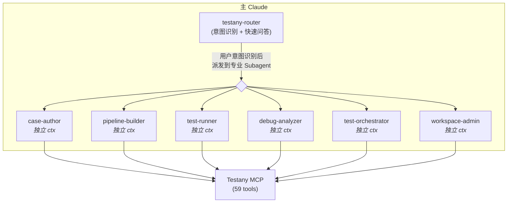

# Testany Bot for Claude - Claude Code 专用版

Testany 测试平台智能助手，采用 Subagent 架构，支持测试用例管理、流水线编排、执行监控、故障诊断、CI/CD 集成。

## 兼容性

| 平台 | 支持状态 | 说明 |
|------|---------|------|
| Claude Code | ✅ | 完整支持所有特性 |
| 其他平台 | ❌ | 使用 [testany-bot](../testany-bot) 通用版 |

本插件使用 Claude Code 专用特性（`context: fork`、`agent:`、`disallowedTools:` 等），仅适用于 Claude Code。

## 前置要求

- Claude Code CLI 已安装
- Testany MCP Server 已配置并运行
- 已获取 Testany 平台访问权限

## 目录结构

```
testany-bot-for-claude/
├── .claude-plugin/
│   └── plugin.json
├── commands/              # 命令入口（提供 /command 补全）
│   ├── case.md
│   ├── pipeline.md
│   ├── tests.md
│   ├── debug.md
│   ├── trigger.md
│   └── workspace.md
├── skills/                # 技能定义
│   ├── testany-guide/     # 参考知识库（Subagent 预加载）
│   │   ├── SKILL.md
│   │   └── references/
│   │       ├── concepts.md
│   │       ├── executors.md
│   │       └── pipeline-yaml.md
│   ├── testany-router/    # 意图路由（Claude 自动加载）
│   │   └── SKILL.md
│   ├── case/SKILL.md      # Entry Skill → case-author
│   ├── pipeline/SKILL.md  # Entry Skill → pipeline-builder
│   ├── tests/SKILL.md     # Entry Skill → test-runner
│   ├── debug/SKILL.md     # Entry Skill → debug-analyzer
│   ├── trigger/SKILL.md   # Entry Skill → test-orchestrator
│   └── workspace/SKILL.md # Entry Skill → workspace-admin
└── agents/                # Subagent 定义
    ├── case-author.md
    ├── pipeline-builder.md
    ├── test-runner.md
    ├── debug-analyzer.md
    ├── test-orchestrator.md
    └── workspace-admin.md
```

## 架构

### Subagent + Router 架构



### 优势

| 特性 | 说明 |
|------|------|
| **Context 隔离** | 每个 Subagent 在独立 Context 工作，不污染主对话 |
| **专业化** | 每个 Agent 有专属 System Prompt 和领域知识 |
| **结果聚焦** | 用户只看到结果摘要，不看中间 MCP 调用细节 |
| **简单问答不损耗** | Router 直接回答格式/概念问题，无需启动 Agent |

## Subagent 列表

| Subagent | 描述 | 工具权限 |
|----------|------|---------|
| **case-author** | 测试用例创建专家 | 全部（需要 Write 创建脚本） |
| **pipeline-builder** | 流水线编排专家 | 禁用 Write/Edit |
| **test-runner** | 测试执行专家 | 禁用 Write/Edit |
| **debug-analyzer** | 故障诊断专家 | 禁用 Write/Edit |
| **test-orchestrator** | 测试编排专家 | 禁用 Write/Edit |
| **workspace-admin** | 工作空间管理专家 | 禁用 Write/Edit |

所有 Subagent 自动预加载 `testany-guide` 技能以获取参考知识。

## 使用方式

### 命令触发（写入操作需用户显式调用）

```
/case 创建一个 Python API 测试
/pipeline 把登录和查询用例组成流水线
/trigger 创建质量门禁
/workspace 添加成员
```

### 自然语言（只读操作 Claude 可自动调用）

```
执行回归测试流水线
这个测试为什么失败了？
看看 Y2K-0601-00001 的执行状态
```

### 简单问答（Router 直接回答）

```
Case Key 的格式是什么？
有哪些 Executor 类型？
执行状态码 3 代表什么？
```

## Entry Skill 配置

| Skill | Agent | 操作类型 | `disable-model-invocation` |
|-------|-------|---------|---------------------------|
| `/case` | case-author | 写入 | ✅ true |
| `/pipeline` | pipeline-builder | 写入 | ✅ true |
| `/tests` | test-runner | 只读 | 不设置 |
| `/debug` | debug-analyzer | 只读 | 不设置 |
| `/trigger` | test-orchestrator | 写入 | ✅ true |
| `/workspace` | workspace-admin | 写入 | ✅ true |

## 安全说明

### 日志获取安全验证

使用 `testany_log_sign` 获取日志时，返回的 `curlCommand` 需要验证：

1. **域名验证**：仅允许 `*.testany.io` / `*.testany.com.cn`
2. **协议验证**：仅允许 HTTPS
3. **参数验证**：禁止危险参数（`-o`, `|`, `;`, `$(`）

### 工具权限控制

- 只有 `case-author` 保留 Write/Edit 权限（用于创建测试脚本）
- 其他 Subagent 通过 `disallowedTools: Write, Edit` 禁用文件修改

## 注意事项

1. **Pipeline 执行**：Testany 只支持执行 Pipeline，不支持直接执行单个 Case
2. **Relay 配置**：配置变量传递前需验证源/目标 Case 的环境变量类型
3. **Runtime 选择**：推荐使用 `cloudprime` runtime
4. **意图路由**：Router 支持中英文混合表达，冲突意图会询问用户

## 与通用版的区别

| 特性 | Claude 专用版 (testany-bot-for-claude) | 通用版 (testany-bot) |
|------|---------------------------------------|---------------------|
| 架构 | Subagent + Router | 自包含 Skills |
| Context 隔离 | ✅ | ❌ |
| 兼容性 | 仅 Claude Code | 跨平台 |
| 意图路由 | ✅ testany-router | ❌ |
| 工具权限控制 | ✅ disallowedTools | ❌ |

如果您使用其他 AI 平台，请使用 [testany-bot](../testany-bot) 通用版。

## Claude Code 专用字段说明

本插件使用以下 Claude Code 专用 frontmatter 字段：

| 字段 | 用途 |
|------|------|
| `context: fork` | 在独立 Context 中执行 Skill |
| `agent: xxx` | 指定派发的 Subagent |
| `disable-model-invocation: true` | 禁止 Claude 自动调用，需用户显式触发 |
| `user-invocable: false` | 对用户隐藏，仅供 Claude 内部加载 |
| `skills:` (in agent) | Subagent 预加载的技能列表 |
| `disallowedTools:` (in agent) | Subagent 禁用的工具列表 |

## 许可证

MIT License

## 相关链接

- [Testany 官方文档](https://docs.testany.io)
- [Testany MCP](https://github.com/TestAny-io/testany-mcp)
- [Claude Code 文档](https://docs.anthropic.com/en/docs/claude-code)
- [Claude Code Skills 文档](https://docs.anthropic.com/en/docs/claude-code/skills)
- [Claude Code Subagents 文档](https://docs.anthropic.com/en/docs/claude-code/sub-agents)
