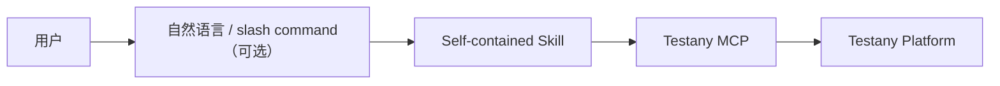

# Testany Bot - 通用版

Testany 测试平台智能助手，支持 platform case 编写与注册、pipeline 编排、执行监控、故障诊断、CI/CD 集成。它既可以直接消费自然语言测试需求，也可以消费 `testany-eng` 产出的 approved Test Spec 与 `Testany Automation Handoff`。

## 兼容性

通用版的含义是：**Skill 格式、MCP workflow 和领域知识可跨平台复用**；宿主是否提供结构化提问、slash command 等交互增强能力，则取决于具体平台。

| 能力层 | 兼容性说明 |
|--------|-----------|
| Skill 发现与加载 | 使用公共 `name` / `description`；部分入口另含 Claude `argument-hint` 扩展，不能宣称所有严格公共字段校验器均接受原文件 |
| MCP 工具调用 | ✅ 只要宿主支持 MCP，即可执行核心 Testany workflow |
| 结构化提问工具（如 AskUserQuestion） | 可选增强，视宿主能力而定 |
| Slash command / router | 可选增强，视宿主能力而定 |

Claude Code、VS Code Copilot、GitHub Copilot 等宿主的加载、补全及 MCP 能力需分别验证；不能由公共字段或本地静态检查推导所有宿主均已通过。参数提示是可选 UI 增强，不改变正文授权边界。维护时使用[分层 frontmatter 校验](../../docs/plugin-development.md#frontmatter-校验范围)，不为消除误报直接删除合法提示。

本插件保留父级 `skills/SKILL.md` 同步技能及其资源路径。Claude Code 2.1.224 的实装发现不会在找到该父级入口后继续自动发现嵌套子技能，因此 manifest 同时列出 `./skills` 和九个具体子目录；新增子技能时同步维护此数组。隔离安装对照已验证该配置可发现 10 个 skill，8 个 command 另计，不能将命令包装器计为完整技能发现。Codex 的去重发现不受此追加列表影响；安装/发现通过不代表真实平台执行或 Claude hook 已验收。

## 前置要求

- 平台操作需要 Testany MCP Server 及对应访问权限；仅本地包生成/静态检查不要求连接平台。
- 是否执行、等待、取消或重试以本次授权为准，不从“配置/验证”字样自动推导。

## 整体目标与完成标准

按 [整体目标交接](skills/testany-guide/references/task-handoff.md) 在 case-writing → case → pipeline → trigger → execution 间传递方案、授权、路径、真实 key 与状态。完整目标已授权时在当前对话继续，不要求用户逐个发命令；仅要本地包、注册、配置或当前状态时在对应目标停止。

按 [交付验证](skills/testany-guide/references/delivery-verification.md) 分开报告本地生成、静态检查、平台受理、配置读回和执行终态。新增离线 ZIP/JSON metadata 校验器，不解压执行脚本或安装依赖；检查缺口不是实测通过。写入后读回相关字段；上传失败、读回不一致或工作区待审批均如实报告，保留已建对象，不自动重建或删除回滚。

## 推荐上游输入

如果你已经使用 `testany-eng` 走完文档主线，推荐按以下顺序进入 `testany-bot`：

```text
approved Test Spec (+ Testany Automation Handoff)
  -> /case-writing
  -> /case
  -> /pipeline
  -> /trigger
  -> /execution
```

推荐原因：

- `Testany Automation Handoff` 已把 `source_case_ids`、executor 建议、split hints、relay / dependency 信息显式化
- `/case-writing` 不必从整篇 Test Spec 重新猜测如何拆成 platform cases
- 这样可以减少 `testany-eng` 与 `testany-bot` 之间的语义漂移

## 目录结构

```
testany-bot/
├── .claude-plugin/
│   └── plugin.json
├── commands/              # 命令入口（提供 /command 补全）
│   ├── case.md
│   ├── case-writing.md
│   ├── pipeline.md
│   ├── execution.md
│   ├── debug.md
│   ├── trigger.md
│   └── workspace.md
└── skills/                # 技能定义（自包含知识）
    ├── testany-guide/     # 参考知识库
    │   ├── SKILL.md
    │   └── references/
    │       ├── concepts.md
    │       ├── executors.md
    │       └── pipeline-yaml.md
    ├── testany-case/SKILL.md
    ├── testany-case-writing/SKILL.md
    ├── testany-pipeline/SKILL.md
    ├── testany-execution/SKILL.md
    ├── testany-debug/SKILL.md
    ├── testany-trigger/SKILL.md
    └── testany-workspace/SKILL.md
```

## 技能列表

| 技能 | 描述 | 主要操作 |
|------|------|---------|
| **testany-case** | Platform Case 注册与管理 | 注册 case package、更新 metadata、上传脚本、管理生命周期 |
| **testany-case-writing** | Platform Case 编写 | 将传统测试场景拆解为 Testany platform cases，并生成可注册 case packages；优先消费 approved Test Spec + handoff |
| **testany-pipeline** | 流水线编排 | 基于 decomposition 或 case keys 创建 Pipeline，配置依赖、Relay 和分支 |
| **testany-execution** | Execution 管理 | 查看进度、查历史、刷新状态、取消未开始执行 |
| **testany-debug** | 故障诊断 | 分析失败原因，查看日志 |
| **testany-trigger** | 测试触发 | 为 Pipeline 配置 Plan、Manual Trigger、Gatekeeper，或立即执行一次 |
| **testany-workspace** | 工作空间管理 | 成员管理、权限配置 |
| **testany-guide** | 参考知识 | 核心概念、Executor 配置、YAML 语法 |

## 使用方式

### 命令触发（宿主支持 slash command 时）

```
/case 把这些 ZIP 和 metadata 注册成 Testany cases
/case-writing 根据 approved test spec 的 Testany Automation Handoff 生成可上传到 Testany 的 cases
/pipeline 根据 decomposition 把登录和查询 cases 组成流水线
/trigger 立即执行 Y2K-0601
/execution 查看 Y2K-0601-0000B
/debug Y2K-0601-00001
/trigger 创建手动触发或 Gatekeeper
/workspace 添加成员
```

### 自然语言

```
根据 approved test spec 里的 handoff 帮我生成 Testany cases
帮我把这些自动化脚本注册成 Testany cases
现在立刻执行一次回归测试流水线
看看刚才那次 execution 跑到哪了
这个测试为什么失败了？
```

如果宿主不支持 slash command，直接使用自然语言触发对应 workflow 即可。

## 架构特点

**按需资源架构**：skill 根文件包含入口与核心决策，相关知识和跨 skill 交接使用本次安装目录中的 references/scripts；不强制依赖外部 Subagent。



优点：
- Skill 格式与 MCP workflow 跨平台复用
- 交互原语按宿主能力适配
- 简单直接
- 无需复杂调度

## 安全说明

### 日志获取安全验证

`testany_log_sign` / dry run 日志工具返回的是请求数据，不能执行原始 `curlCommand`。
使用 [安全日志读取流程](./skills/testany-debug/references/log-fetch.md) 和随 skill 提供的解析器，绑定已核对 runtime 的精确 HTTPS 主机及日志路径。默认只校验，下载需明确启用；拒绝命令链、未知选项和重定向，不展示签名或认证值。未知签名格式应报告不支持，不回退 eval。

### 执行与完成边界

- 注册、上传、补配置不自动授权 dry run；明确授权且环境/副作用已知的一次验证可连续完成。
- 查询当前状态不自动长轮询；等待有截止时间，超时不等于远程取消或失败。
- UI 回退指导不是已配置，执行 key 不是成功证据；配置读回失败须标明未核验。
- Git sync/switch/relation 先取得当前差异或候选，按实际影响核对授权；意外删除/范围扩大不能沿用旧批准。详见 [同步授权决策表](./skills/testany-import-git/references/sync-authorization.md)。

## 注意事项

1. **Case vs Scenario**：Testany Case 是可复用原子步骤包，不等同于传统测试场景
2. **Pipeline 执行**：常规编排以 Pipeline 为单位；case dry run 是单独获授权的脚本验证，不替代编排验证
3. **Trigger 边界**：Plan / Manual Trigger / Gatekeeper 都是执行入口，不是编排层
4. **Relay 配置**：配置变量传递前需验证源/目标 Case 的环境变量类型
5. **Runtime 选择**：推荐使用 `cloudprime` runtime

## 与 Claude Code 专用版的区别

| 特性 | 通用版 (testany-bot) | Claude 专用版 (testany-bot-for-claude) |
|------|---------------------|---------------------------------------|
| 架构 | 自包含 Skills | Subagent + Router |
| Context 隔离 | ❌ | ✅ |
| 兼容性 | Skill 格式 + MCP workflow 跨平台 | 仅 Claude Code |
| Frontmatter | name/description，部分入口含可选 Claude argument-hint | 含 context/agent 等专用字段 |

如果您使用 Claude Code，推荐使用 [testany-bot-for-claude](../testany-bot-for-claude) 以获得更好的 Context 管理和专业化体验。

## 许可证

MIT License

## 相关链接

- [Testany 官方文档](https://docs.testany.io)
- [Testany MCP](https://github.com/TestAny-io/testany-mcp)
- [Agent Skills 规范](https://agentskills.io)
