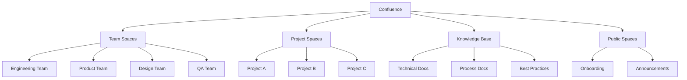

# 空间设计参考

## 前置条件

- 用户已确认空间类型（团队/项目/知识库）
- 用户已确认用户群体
- 用户已确认是否需要多语言支持

## 空间架构设计

### 标准空间架构



### 团队空间

**用途**：团队协作、会议记录、日常文档

| 空间名称 | 用途 | 典型内容 |
|-----------|------|-----------|
| Engineering Team | 开发团队协作 | 技术文档、代码规范、会议记录 |
| Product Team | 产品团队协作 | PRD、需求文档、用户研究 |
| Design Team | 设计团队协作 | 设计稿、设计规范、用户旅程 |
| QA Team | 测试团队协作 | 测试计划、测试用例、Bug 报告 |

**权限配置**：

| 角色 | 查看 | 添加 | 编辑 | 删除 | 管理 |
|------|------|------|------|------|------|
| 团队成员 | ✅ | ✅ | ✅ | ✅ | ❌ |
| 团队负责人 | ✅ | ✅ | ✅ | ✅ | ✅ |
| 外部协作 | ✅ | ✅ | ❌ | ❌ | ❌ |

### 项目空间

**用途**：项目文档、需求追踪、交付记录

| 空间名称 | 用途 | 典型内容 |
|-----------|------|-----------|
| Project A | 项目 A 文档 | PRD、HLD、测试报告 |
| Project B | 项目 B 文档 | PRD、HLD、测试报告 |
| Project C | 项目 C 文档 | PRD、HLD、测试报告 |

**权限配置**：

| 角色 | 查看 | 添加 | 编辑 | 删除 | 管理 |
|------|------|------|------|------|------|
| 项目成员 | ✅ | ✅ | ✅ | ✅ | ❌ |
| 项目负责人 | ✅ | ✅ | ✅ | ✅ | ✅ |
| 干系人 | ✅ | ✅ | ❌ | ❌ | ❌ |

### 知识库空间

**用途**：可复用知识、最佳实践、参考文档

| 空间名称 | 用途 | 典型内容 |
|-----------|------|-----------|
| Technical Knowledge Base | 技术知识库 | 架构文档、API 文档、运维手册 |
| Process Knowledge Base | 流程知识库 | 开发流程、发布流程、应急响应 |
| Best Practices | 最佳实践 | 代码规范、设计规范、测试规范 |

**权限配置**：

| 角色 | 查看 | 添加 | 编辑 | 删除 | 管理 |
|------|------|------|------|------|------|
| 全员 | ✅ | ❌ | ❌ | ❌ | ❌ |
| 知识管理员 | ✅ | ✅ | ✅ | ✅ | ✅ |

### 公开空间

**用途**：对外发布、新员工入职、公告

| 空间名称 | 用途 | 典型内容 |
|-----------|------|-----------|
| Onboarding | 新员工入职 | 入职指南、工具使用、团队介绍 |
| Announcements | 公司公告 | 公司新闻、活动通知、政策更新 |

**权限配置**：

| 角色 | 查看 | 添加 | 编辑 | 删除 | 管理 |
|------|------|------|------|------|------|
| 全员 | ✅ | ❌ | ❌ | ❌ | ❌ |
| 内容管理员 | ✅ | ✅ | ✅ | ✅ | ✅ |

## 页面模板

### PRD 模板

```markdown
# [产品名称] PRD

## 元信息
- 产品经理：[姓名]
- 创建日期：[日期]
- 版本：[版本号]

## 业务背景
[背景描述]

## 用户故事
[用户故事列表]

## 功能需求
[功能需求列表]

## 非功能需求
- 性能：[性能要求]
- 安全：[安全要求]

## 验收标准
- [ ] 验收标准 1
- [ ] 验收标准 2
```

### 会议记录模板

```markdown
# [会议名称]

## 基本信息
- 日期：[日期]
- 时间：[时间]
- 参与者：[参与人员]
- 会议类型：[Daily/Sprint Review/Retro]

## 议题
- [议题 1]
- [议题 2]

## 讨论内容
[讨论内容]

## Action Items
| 任务 | 负责人 | 截止日期 |
|------|--------|---------|
| [任务 1] | [负责人] | [日期] |
| [任务 2] | [负责人] | [日期] |
```

## 配置步骤

### 1. 创建空间

使用 MCP 工具：`confluence_create_space`

```json
{
  "name": "Engineering Team",
  "key": "ENG",
  "description": "Engineering Team 协作空间",
  "type": "global"
}
```

### 2. 配置权限

使用 MCP 工具：`confluence_set_space_permissions`

```json
{
  "space_key": "ENG",
  "permissions": [
    {
      "type": "group",
      "group": "engineering",
      "operations": ["view", "add", "edit"]
    },
    {
      "type": "user",
      "user": "team-lead@company.com",
      "operations": ["view", "add", "edit", "delete", "administrate"]
    }
  ]
}
```

### 3. 创建主页

使用 MCP 工具：`confluence_create_page`

```json
{
  "space_key": "ENG",
  "title": "Home",
  "content": "# Engineering Team\n\n这里是 Engineering Team 的协作空间"
}
```

### 4. 设置主页

使用 MCP 工具：`confluence_set_space_home`

```json
{
  "space_key": "ENG",
  "page_id": 12345
}
```

## 多语言支持

### 语言变体配置

```json
{
  "space_key": "ENG",
  "languages": ["en", "zh"],
  "default_language": "en"
}
```

**页面命名规范**：

- 英文：`PRD-Feature-Name`
- 中文：`PRD-Feature-Name-CN`

## 验证检查

- [ ] 空间创建成功
- [ ] 权限配置正确
- [ ] 主页设置正确
- [ ] 页面模板可用
- [ ] 多语言配置正确（如需要）
- [ ] 测试用户可以正常访问

## 最佳实践

1. **层级清晰**：空间命名清晰，层级结构合理
2. **权限最小化**：只授予必要的权限
3. **模板标准化**：使用统一模板，保持一致性
4. **标签体系**：建立标签体系，便于内容检索
5. **定期清理**：定期归档或删除过期内容
6. **版本控制**：重要文档保留版本历史
