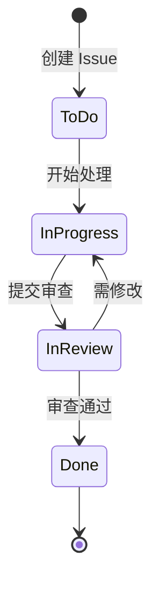
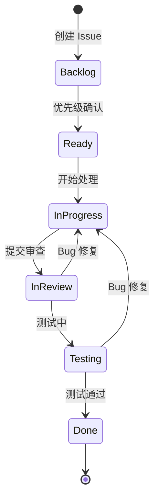
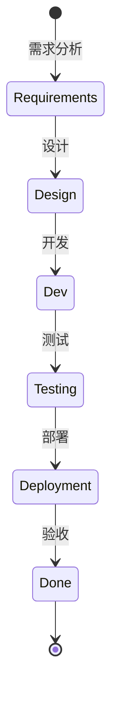

# 工作流设计参考

## 前置条件

- 用户已确认项目类型（Scrum/Kanban/瀑布）
- 用户已确认团队规模
- 用户已确认 Issue 类型需求

## 标准工作流模板

### Scrum 工作流

**适用场景**：固定周期迭代，Sprint Planning/Daily/Review/Retro



**状态定义**：

| 状态 | 说明 | 适用角色 |
|------|------|---------|
| To Do | 待处理，未开始 | 所有角色 |
| In Progress | 正在处理 | 开发人员 |
| In Review | 代码/设计审查中 | 开发人员、代码审查者 |
| Done | 已完成 | 所有角色 |

**状态流转规则**：

| 从 | 到 | 条件 | 验证器 | 后置操作 |
|----|----|------|--------|----------|
| To Do | In Progress | 必须分配人员 | 必填字段检查 | 自动更新开始时间 |
| In Progress | In Review | 必须填写工作日志 | 评论不为空 | 通知审查者 |
| In Review | Done | 审查通过 | 无 | 更新完成时间 |
| In Review | In Progress | 需修改 | 无 | 通知开发人员 |

### Kanban 工作流

**适用场景**：持续交付，看板管理，WIP 限制



**WIP 限制建议**：

| 状态 | WIP 限制 | 依据 |
|------|---------|------|
| In Progress | 团队人数 × 0.75 | 避免并行工作过多 |
| In Review | 2-3 人 | 加速代码审查 |
| Testing | 团队人数 × 0.5 | 根据 QA 团队规模 |

### 瀑布模式工作流

**适用场景**：传统瀑布开发，阶段明确



**阶段交付物**：

| 阶段 | 交付物 | 关联 Issue 类型 |
|------|--------|---------------|
| Requirements | 需求文档、原型图 | Story, Epic |
| Design | 设计文档、API 定义 | Technical Task |
| Dev | 代码、单元测试 | Task, Bug |
| Testing | 测试报告、Bug 列表 | Bug |
| Deployment | 发布说明、版本日志 | Release |

## 配置步骤

### 1. 创建工作流

使用 MCP 工具：`jira_create_workflow`

```json
{
  "name": "Scrum Workflow",
  "description": "标准 Scrum 工作流，4 个状态",
  "statuses": ["To Do", "In Progress", "In Review", "Done"]
}
```

### 2. 添加状态流转

使用 MCP 工具：`jira_add_transition`

```json
{
  "from": "To Do",
  "to": "In Progress",
  "conditions": {
    "assignee_required": true
  },
  "validators": {
    "required_fields": ["assignee"]
  }
}
```

### 3. 配置条件和验证器

**常用验证器**：

| 验证器 | 用途 | 配置示例 |
|--------|------|---------|
| 字段必填 | 确保 key 字段已填写 | 必填：assignee, summary, description |
| 正则表达式 | 验证字段格式 | 版本号格式：v\d+\.\d+\.\d+ |
| 数值范围 | 确保故事点在合理范围 | 故事点：1-13 |

**常用条件**：

| 条件 | 用途 | 配置示例 |
|------|------|---------|
| 用户在项目角色 | 只有特定角色可执行 | 开发人员才能移到 In Progress |
| 字段值满足条件 | 基于字段值的条件 | 优先级为 High 时需要审批 |

### 4. 配置后置操作

**常用后置操作**：

| 操作 | 用途 | 配置示例 |
|------|------|---------|
| 更新字段 | 自动设置字段值 | 状态变为 Done 时更新完成时间 |
| 发送通知 | 通知相关人员 | 移到 In Review 时通知审查者 |
| 创建 Issue | 自动创建关联 Issue | Story 创建后自动创建 Sub-task |
| 触发 Webhook | 集成外部系统 | 状态变更时触发 CI/CD |

## 验证检查

- [ ] 状态数量合理（5-9 个）
- [ ] 状态名称清晰（使用团队通用术语）
- [ ] 流转逻辑无歧义
- [ ] 避免不必要的循环
- [ ] 条件和验证器配置正确
- [ ] 后置操作测试通过

## 最佳实践

1. **状态数量适中**：5-9 个状态，避免状态过多导致混乱
2. **状态名称统一**：使用团队通用术语，避免缩写
3. **流转逻辑清晰**：每个状态的去向明确，避免"死状态"
4. **避免循环跳转**：减少不必要的回退，提高流程效率
5. **条件合理**：不要设置过于严格的条件，影响灵活性
6. **测试覆盖**：配置完成后，测试所有可能的流转路径
