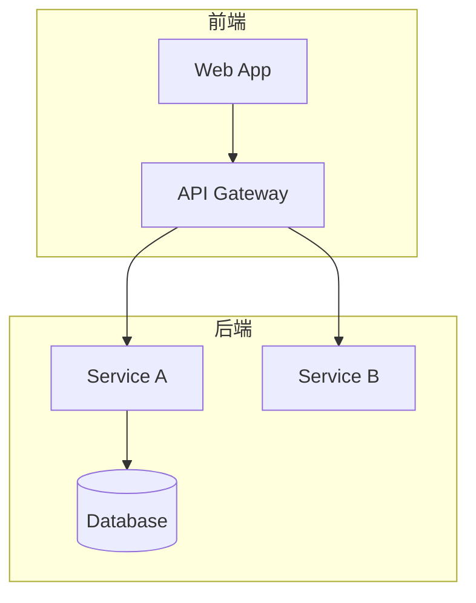
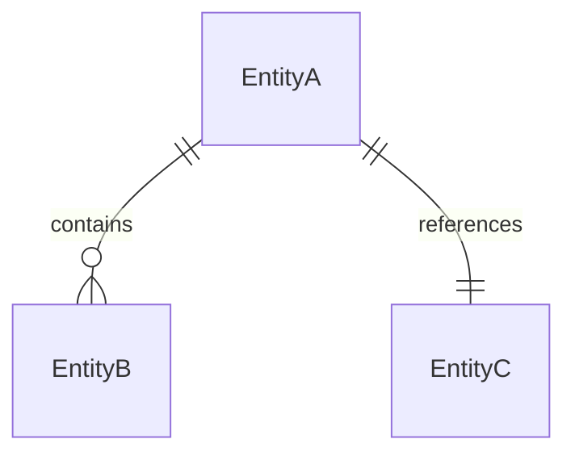
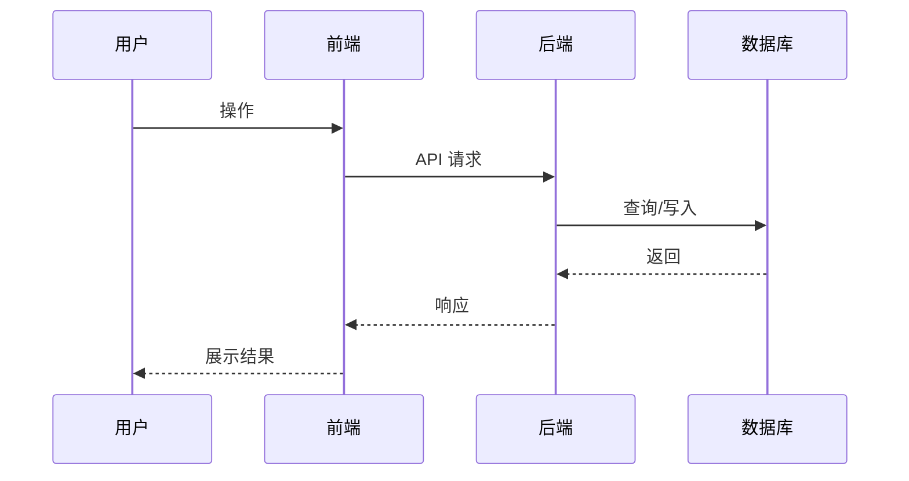

# HLD 模板：新功能（有 UI）

> 以下为模板内容，复制后根据实际情况填写。

---

# [功能名称] 技术设计文档

## 元信息

| 项目 | 内容 |
|------|------|
| 关联 PRD | [PRD 文档链接] |
| 版本 | v1.0 |
| 作者 | [作者] |
| 创建日期 | [日期] |
| 状态 | 草稿/评审中/已批准 |

## PRD↔HLD 需求映射表

| PRD 条目 | 验收标准 | HLD 章节 | 状态 |
|----------|---------|---------|------|
| [FR-XXX] | [验收标准] | [对应章节] | ✓/进行中/待定 |

## 1. 背景与目标

### 1.1 业务背景
[简要描述业务背景，引用 PRD]

### 1.2 技术目标
- [技术目标 1]
- [技术目标 2]

### 1.3 非功能目标
| 指标 | 目标值 | 来源 |
|------|--------|------|
| 响应时间 | < Xms | PRD 约束 |
| 并发量 | X QPS | PRD 约束 |

## 2. 技术架构

### 2.1 整体架构



### 2.2 复用盘点

| 能力需求 | 候选方案 | 评估结论 |
|---------|---------|---------|
| [能力1] | 内部模块 A / 第三方 B / 自研 | [选择及理由] |
| [能力2] | 共享服务 X / 自研 | [选择及理由] |

> 说明：优先复用内部模块/共享服务/第三方成熟方案，自研需给出充分理由

### 2.3 技术选型

| 组件 | 选型 | 理由 |
|------|------|------|
| 前端框架 | [选型] | [理由] |
| 后端框架 | [选型] | [理由] |
| 数据库 | [选型] | [理由] |
| 缓存 | [选型] | [理由] |

## 3. 前端设计

### 3.1 页面结构
[页面层级、路由设计]

### 3.2 状态管理
[状态管理策略]

### 3.3 与后端交互
[API 调用方式、错误处理策略]

## 4. API 设计

### 4.1 接口列表

| 接口 | 方法 | 路径 | 说明 |
|------|------|------|------|
| [接口1] | POST | /api/v1/xxx | [说明] |
| [接口2] | GET | /api/v1/xxx | [说明] |

### 4.2 认证授权
[认证方式、权限控制策略]

### 4.3 接口详情

#### POST /api/v1/xxx

**请求体**：
```json
{
  "field1": "string",
  "field2": "number"
}
```

**响应体**：
```json
{
  "code": 0,
  "data": {}
}
```

## 5. 数据设计

### 5.1 数据模型（概念级）



| 实体 | 说明 | 核心属性（概念） |
|------|------|-----------------|
| EntityA | [实体说明] | ID、名称、创建时间 |
| EntityB | [实体说明] | ID、关联A、状态 |

> 注意：此处为概念模型，具体字段类型、长度等属于 LLD

### 5.2 索引策略
| 实体 | 索引策略 | 用途 |
|------|---------|------|
| [实体] | [策略描述] | [用途] |

### 5.3 数据迁移策略
[是否需要迁移、迁移策略]

## 6. 关键流程

### 6.1 [核心流程名称]



## 7. 非功能设计

### 7.1 性能策略
- 缓存策略：[策略描述]
- 分页策略：[策略描述]

### 7.2 安全策略
- 认证：[策略]
- 数据脱敏：[策略]

### 7.3 可观测性
- 日志：[策略]
- 监控：[关键指标]
- 告警：[告警规则]

## 8. 部署架构

### 8.1 部署拓扑
[部署图或描述]

### 8.2 环境配置
| 环境 | 配置差异 |
|------|---------|
| 开发 | [配置] |
| 测试 | [配置] |
| 生产 | [配置] |

## 9. 风险与依赖

### 9.1 技术风险
| 风险 | 影响 | 缓解措施 |
|------|------|---------|
| [风险] | [影响] | [措施] |

### 9.2 外部依赖
| 依赖 | 负责团队 | 状态 |
|------|---------|------|
| [依赖] | [团队] | [状态] |

## 10. 里程碑

| 阶段 | 交付物 | 负责人 |
|------|--------|--------|
| 阶段 1 | [交付物] | [负责人] |
